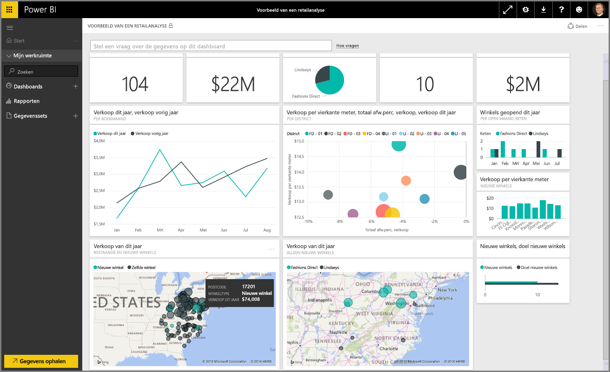

Welkom bij de sectie **Gegevens verkennen** van de cursus **Begeleide training** voor Power BI. Nu u enigszins bekend bent met Power BI Desktop en weet hoe u gegevens ophaalt en visualiseert, bent u klaar om gegevens te verkennen in de Power BI-service.

Er valt in deze sectie van alles te leren, maar er is met name aandacht voor de fascinerende interactiviteit en deelmogelijkheden van Power BI. Bereid u dus voor op een enerverende en interessante sectie.

## Inleiding tot de Power BI-service
*Ontdek wat de Power BI-service voor uw organisatie kan betekenen*

De Power BI-service is het logische verlengstuk van **Power BI Desktop** en bevat onder meer functies waarmee u rapporten kunt uploaden, dashboards kunt maken en in natuurlijke taal vragen over gegevens kunt stellen. U kunt de service gebruiken om vernieuwingstijden voor uw gegevens in te stellen, gegevens te delen met uw organisatie te delen en om aangepaste servicepacks te maken.

In de volgende onderwerpen wordt de Power BI-service verkend en wordt uitgelegd hoe u uw bedrijfsgegevens kunt omzetten in gegevensinzichten en een omgeving kun creëren waar op basis van samenwerking beslissingen worden genomen.

