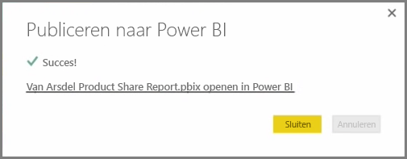
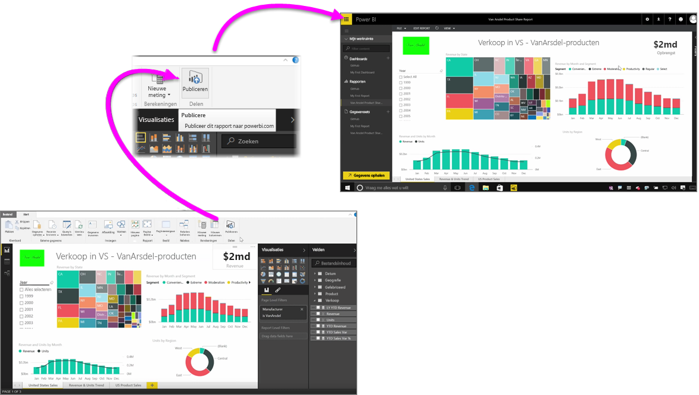

U kunt uw rapporten snel en eenvoudig publiceren naar de Power BI-service.

Nadat u uw rapport in **Power BI Desktop** hebt ontworpen, selecteert u de knop **Publiceren** in het tabblad **Start** van Power BI Desktop. Dat is alles.

Uw rapport en gegevens, inclusief visualisaties, query's en aangepaste metingen, worden als een pakket naar de Power BI-service geüpload.

> [!NOTE]
> U kunt naar de Power BI Desktop-rapporten verwijzen als **.pbix**-bestanden. Dit is de extensie die deze rapporten krijgen in Windows.
> 

Nadat het uploaden is voltooid, verschijnt een dialoogvenster met de melding dat het publicatieproces is voltooid en een koppeling waarmee u met een webbrowser rechtstreeks naar uw rapport in de Power BI-service gaat.

Dat is alles. Meer hoeft u niet te doen om rapporten van Power BI Desktop naar de Power BI-service te publiceren.

