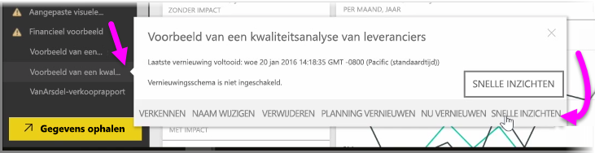
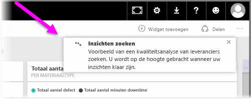
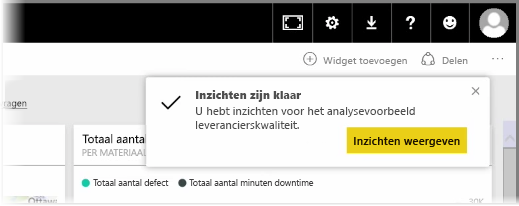
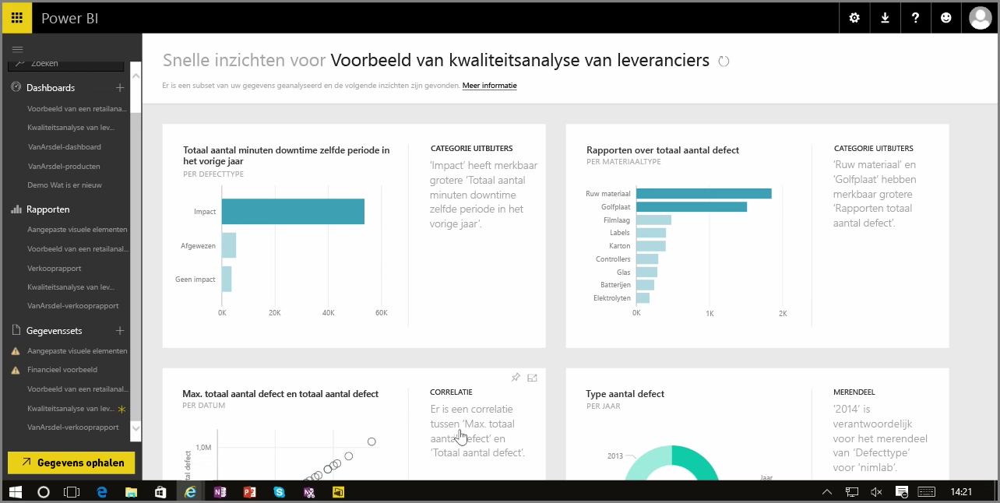

Wanneer u in de Power BI-service met een dashboard, rapport of gegevensset werkt, kunt u met Power BI snel inzicht krijgen in uw gegevens. Selecteer in het gedeelte **Gegevenssets** in het linkerdeelvenster van Power BI het *weglatingsteken* (de drie puntjes) naast de betreffende gegevensset. Een verschijnt een menu met opties en helemaal rechts ziet u de optie **Snelle inzichten**.

Als u deze optie selecteert, voert Power BI enkele machine learning-bewerkingen uit en wordt gezocht naar de gegevens, zodat deze kunnen worden geanalyseerd voor een snel inzicht. In de rechterbovenhoek van de service verschijnt een melding die aangeeft dat Power BI bezig is met de inzichten.

Na circa vijftien seconden verandert de melding om te laten u weten dat Power BI een aantal inzichten heeft gevonden.

Als u de knop **Inzichten weergeven** in de melding selecteert, verschijnt een pagina van de visualisaties met de inzichten die Power BI heeft gevonden. Dit ziet er ongeveer uit zoals in de volgende afbeelding. Er worden meerdere inzichten aangeboden en u kunt door de pagina schuiven om ze te bekijken.

U kunt de visualisaties op de pagina Snelle inzichten gebruiken als alle andere visualisaties. U kunt ze bijvoorbeeld vastmaken aan een dashboard of verder filteren op een visualisatie (of op meerdere visualisaties) om te zoeken naar meer inzichten.

Met **Snelle inzichten** kunt u Power BI het werk laten doen om uitschieters en trends in uw gegevens op te sporen en uw bevindingen vervolgens te gebruiken in uw dashboards, of verder verfijnen en filteren om de inzichten te krijgen die voor u het belangrijkst zijn.

