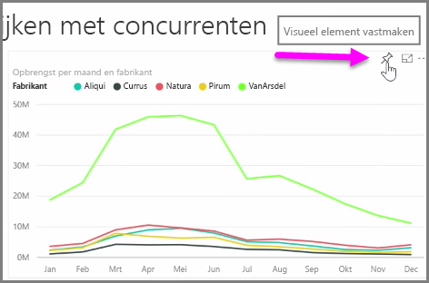
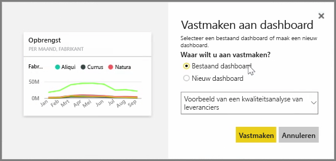
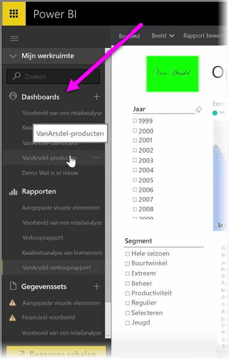
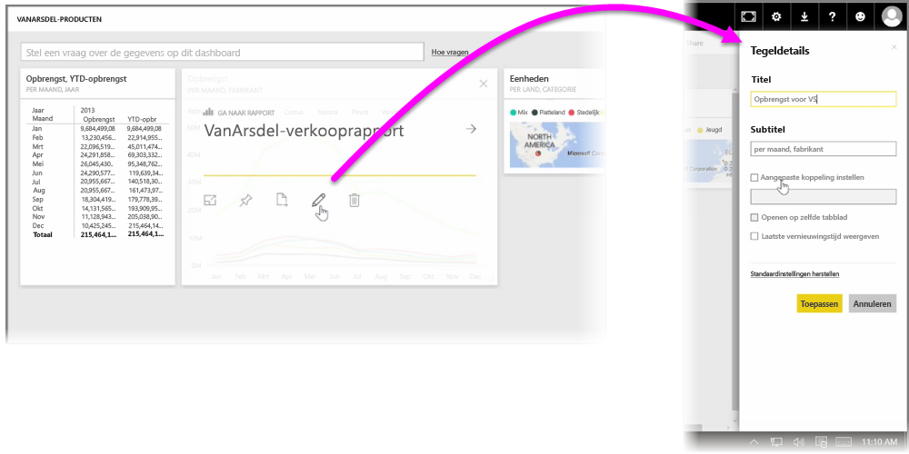

**Dashboards** in Power BI zijn verzamelingen visualisaties van één pagina die zijn gemaakt in de Power BI-service. U kunt dashboards maken door visualisaties uit rapporten **vast te maken** die u hebt geautoriseerd en gepubliceerd met Power BI Desktop of visualisaties die u hebt gemaakt in de Power BI-service. Het **vastmaken** van een visueel element aan een dashboard is vergelijkbaar met het vastprikken van een afbeelding op een prikbord. De visual wordt vastgemaakt op een bepaalde plaats, zodat anderen de afbeelding kunnen bekijken. Als u een visual wilt vastmaken, opent u het rapport in de Power BI-service. Beweeg de muisaanwijzer over de visual die u wilt vastmaken en selecteer het **punaisepictogram**.

Er wordt een dialoogvenster weergegeven waarin u een bestemmingsdashboard voor de visual in de vervolgkeuzelijst kunt. U kunt ook een nieuw dashboard maken. Ook krijgt u een voorbeeld van hoe de vastgemaakte visual er in het dashboard uitziet. U kunt visualisaties uit meerdere rapporten en pagina's aan één dashboard vastmaken. Zodoende kunt u verschillende gegevenssets en gegevensbronnen op één pagina met inzichten combineren.

U kunt elk soort visualisatie aan **Dashboards** toevoegen, zoals diagrammen, kaarten, afbeeldingen en vormen, door ze 'vast te maken'. Zodra een visual is vastgemaakt aan een dashboard, wordt dit een **tegel** genoemd.

Uw dashboards, inclusief eventuele nieuwe dashboards, worden weergegeven in de sectie Dashboards aan de linkerkant van de Power BI-service. Selecteer een dashboard in de lijst om het dashboard weer te geven.

U kunt de indeling van visuals op een dashboard naar wens wijzigen. Als u het formaat van een tegel wilt wijzigen, sleept u de grepen naar binnen of buiten. Voor het verplaatsen van een tegel klikt u op de tegel en sleept u deze naar een andere locatie op het dashboard. Beweeg de muisaanwijzer over een tegel en klik op het **potloodpictogram** om het venster **Tegelgegevens** te openen, waarin u de **Titel** of **Subtitel** kunt wijzigen.

Klik op een dashboardtegel om het rapport weer te geven waaruit deze afkomstig is. Hiermee kunt u snel de onderliggende gegevens voor een visual te bekijken. U kunt die koppeling ook wijzigen met behulp van het veld **Aangepaste koppeling instellen** in **Tegelgegevens**.

U kunt de tegels in het ene dashboard vastmaken aan een ander dashboard, bijvoorbeeld als u meerdere dashboards hebt en een overzichtsdashboard wilt maken. Het proces is hetzelfde: beweeg de muisaanwijzer over de tegel en selecteer het **punaisepictogram**. Dashboards kunnen gemakkelijk worden gemaakt en gewijzigd. En u kunt zodanig aanpassen dat precies datgene op het dashboard van één pagina wordt weergegeven wat moet worden weergegeven.

