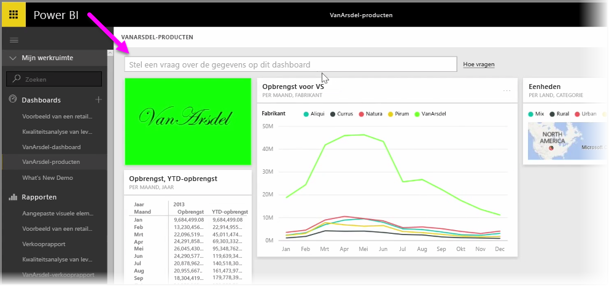
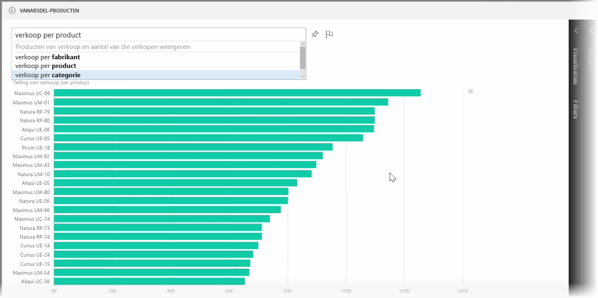
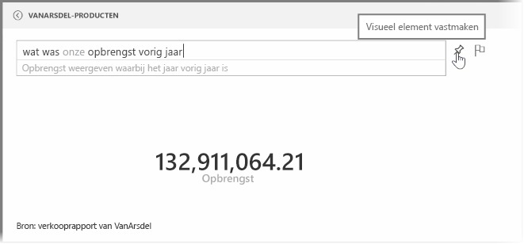
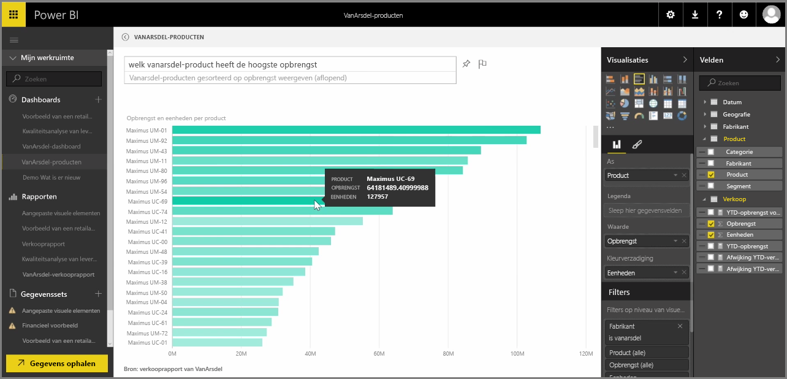

Power BI bevat een krachtige taalherkenningsengine waarmee u vragen over uw gegevens met behulp van zinnen en vragen kunt stellen. Met Power BI kunt u dus niet alleen rapporten en visualisaties bouwen, u kunt ook diagrammen en grafieken maken door eenvoudige vragen te stellen.

Als u een vraag over uw gegevens wilt stellen, opent u een dashboard in Power BI. Boven in het scherm ziet u een invoervak waarin u vragen over de weergegeven gegevens kunt stellen. Deze functie wordt aangeduid als *Vragen en antwoorden* of **Q & A**.

Wanneer u in het vak klikt, worden meldingen met een aantal voorgestelde termen weergegeven op basis van de gegevens, bijvoorbeeld 'Inkomsten tot het huidige jaar'. U kunt op een voorgestelde term klikken om het resultaat te bekijken, meestal in de vorm van een eenvoudige tabel of kaart. Wanneer u een van de voorgestelde zinnen selecteert, wordt automatisch in real time een visualisatie van uw selectie gemaakt.

U kunt ook vragen stellen met behulp van natuurlijke taal, zoals 'Wat was onze omzet vorig jaar?'. of 'Welk product had de hoogste omzet in maart 2014?'. Power BI geeft de interpretatie van uw vraag weer en de visualisatie die het best past. U kunt deze visualisatie **vastzetten** op het dashboard van uw keuze door het **speld**pictogram te selecteren.

U kunt de visualisatie die is gemaakt op basis van natuurlijke taal op elk moment wijzigen. Hiervoor gebruikt u de deelvensters **Visualisaties** en **Velden** aan de rechterkant van het scherm. Net zoals bij alle andere visualisaties in Power BI kunt u de indeling wijzigen, de filters aanpassen en de veldinvoer wijzigen.

Zodra de visualisatie geheel naar wens is, kunt u deze naar een dashboard opslaan door het **speld**pictogram naast het invoervak van de vraag te selecteren.

