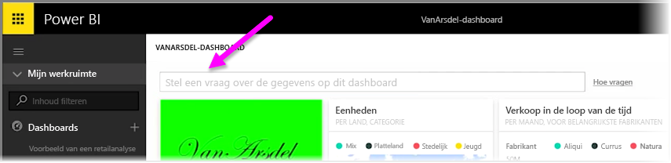
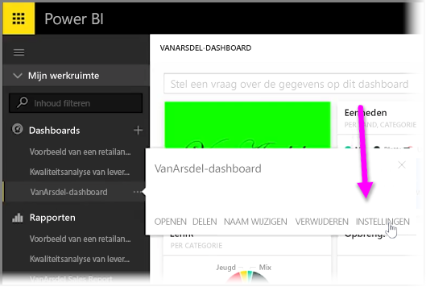
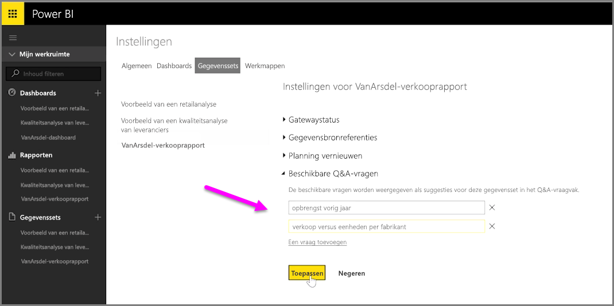

Met Power BI kunt u uw eigen voorgestelde vragen toevoegen voor andere gebruikers die het vak voor query's in natuurlijk taal voor een dashboard gebruikt. Dit vak wordt ook vaak aangeduid als het **Q&A**-vak. Deze voorgestelde vragen krijgen gebruikers te zien wanneer ze bovenaan het dashboard op het invoervak klikken.

Als u zelf vragen wilt toevoegen, selecteert u de weglatingstekens (de drie punten ...) naast de naam van het dashboard dat u wilt gebruiken, en selecteert u **Instellingen** in het menu.

 Hiermee opent u de pagina **Instellingen** voor het dashboard en de onderliggende gegevenssets of werkmappen. U kunt het Q&A-zoekvak in de sectie **Dashboards** van de pagina **Instellingen** volledig uitschakelen, maar aangezien we vragen willen toevoegen, selecteren we de sectie **Gegevenssets**.

In de sectie **Gegevenssets** worden alle gegevenssets weergegeven die zijn gekoppeld aan het Dashboard. Selecteer in de lijst de gegevensset die aan uw dashboard is gekoppeld, selecteer **Aanbevolen Q&A-vragen** en selecteer vervolgens de koppeling **Een vraag toevoegen**. Geef uw vraag op prompt op in het invoervak en selecteer **Toepassen**.

Wanneer er nu iemand in het zoekvak op het geselecteerde dashboard klikt, worden uw voorgestelde vragen boven aan de lijst weergegeven. Wanneer een van deze vragen wordt geselecteerd, wordt de betreffende persoon rechtstreeks omgeleid naar het Q&A-antwoord. Dit is een waardevolle manier om dashboardgebruikers n te laten denken over het type beschikbare gegevens en hoe ze deze gegevens het beste kunnen gebruiken.

