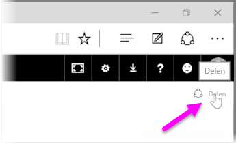
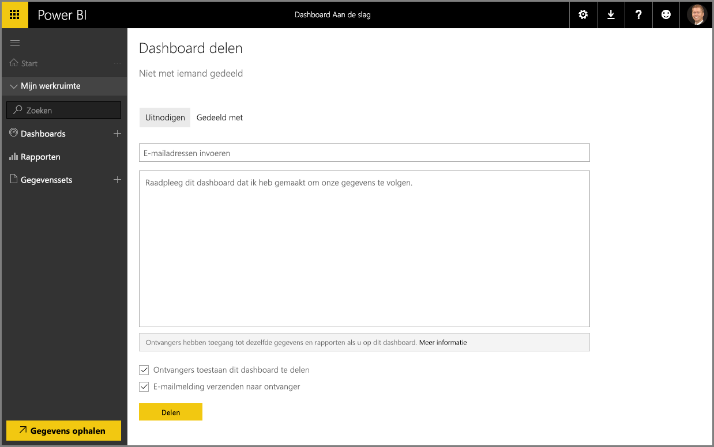

We hebben al gezien hoe u met Power BI gegevens kunt zoeken en verzamelen in een gegevensmodel om op basis van deze gegevens rapporten en visualisaties kunt maken. We hebben ook gezien hoe u deze rapporten kunt publiceren naar de Power BI-service en dashboards kunt maken om uw informatie in de loop van de tijd te controleren. Al deze functies zijn nog krachtiger wanneer u uw inzichten deelt met anderen in uw organisatie. Gelukkig kunt u uw dashboards eenvoudig delen.

Als u een dashboard wilt delen, opent u het dashboard in de Power BI-service en selecteert u in de rechterbovenhoek de koppeling **Delen**.

De pagina **Dashboard delen** wordt weergegeven. Hier kunt u de sectie **Uitnodigen** selecteren en vervolgens in het invoervak **E-mailadres** personen opgeven die u toegang tot uw dashboard wilt geven. Terwijl u typt controleert Power BI of de e-mailadressen voorkomen voor accounts in uw domein en Office 365-domein, en vult indien mogelijk automatisch aan. U kunt de e-mailadressen ook kopiëren en in dit vak plakken of een distributielijst, beveiligingsgroep of Office 365-groep gebruiken om meerdere personen tegelijkertijd te bereiken.

Als u het selectievakje *E-mailmelding verzenden naar ontvanger* (aan de onderkant) hebt ingeschakeld, ontvangen uw geadresseerden een e-mailbericht met een koppeling naar het dashboard om ze te informeren dat u een dashboard met hen hebt gedeeld. U kunt een opmerking toevoegen aan het e-mailbericht dat ze ontvangen of de opmerking versturen die Power BI voor u heeft gemaakt (in het vak direct onder het vak waarin u de e-mailadressen opgeeft).

>[!NOTE]
>Ontvangers zonder een bestaand Power BI-account worden eerst door het aanmeldingsproces geleid voordat ze uw dashboard kunnen weergeven.
> 
> 

Iedereen met wie u een dashboard deelt, kan het dashboard op dezelfde manier weergeven en gebruiken zoals u. Ze hebben echter *alleen-lezentoegang* tot de onderliggende rapporten en ze hebben *geen toegang* tot de onderliggende gegevenssets.

U kunt ook het tabblad **Gedeeld met** op de pagina Dashboard delen selecteren om te zien met welke personen u dit dashboard eerder hebt gedeeld.

