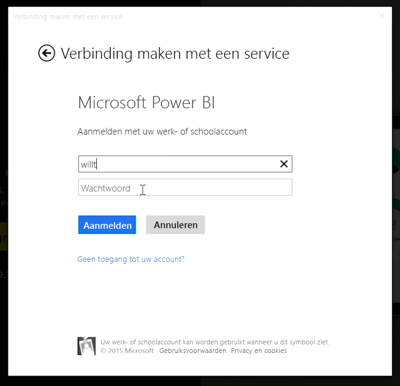
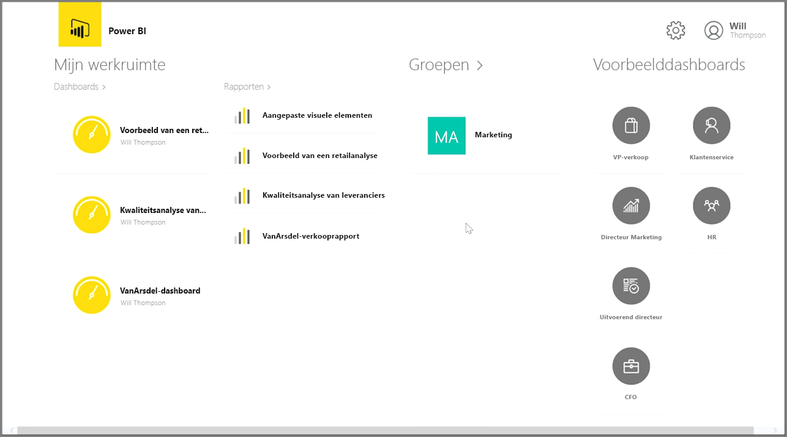
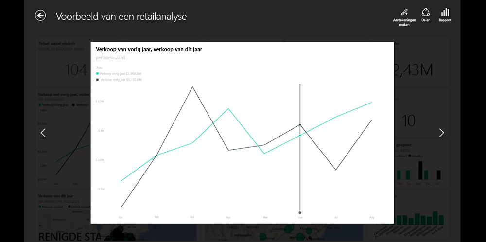
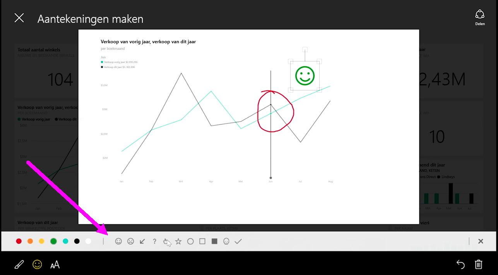

Als u uw gegevens wilt bijhouden terwijl u onderweg bent, kunt u een Power BI - Mobiel-toepassing gebruiken voor iOS-, Android- en Windows-apparaten.

Als u de Power BI-app gebruikt, meldt u zich eerst aan bij uw account met uw accountgegevens voor de Power BI-service. Op een mobiel Windows-apparaat (in dit geval een tablet) ziet het aanmeldsymbool er als volgt uit.

In het eerste scherm dat verschijnt wordt alle inhoud weergegeven waartoe u toegang hebt, zoals rapporten, dashboards en groepen. Er zijn ook voorbeelddashboards die u gebruiken kunt om inspiratie op te doen of de mogelijkheden met Power BI te bekijken. De app is uiterst gebruiksvriendelijk. Als u op een dashboard of rapport tikt, kunt u dit in volledig scherm bekijken en met uw vinger door de inhoud schuiven.

U opent een dashboard door op het dashboard te tikken. In een dashboard kunt u op een dashboardtegel tikken om deze groter weer te geven.

Ook kunt u aantekeningen toevoegen door in de rechterbovenhoek op de knop **Aantekeningen** te tikken. Vervolgens kunt u op een tegel tekenen om bepaalde gebieden te markeren. U vindt de hulpmiddelen voor aantekeningen onder in het scherm.

U kunt uw tegel met aantekeningen delen door op de koppeling **Delen** in de rechterbovenhoek te tikken.

Tik op de koppeling **Rapport** in de rechterbovenhoek om het onderliggende rapport voor een tegel weer te geven. Hiermee geeft u de exacte visualisatie weer die u ook zou zien in een webbrowser of in Power BI Desktop. Ook kunt u hier met het rapport werken door te tikken op werkbalken, in te zoomen of segmenten te gebruiken.

