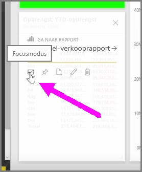
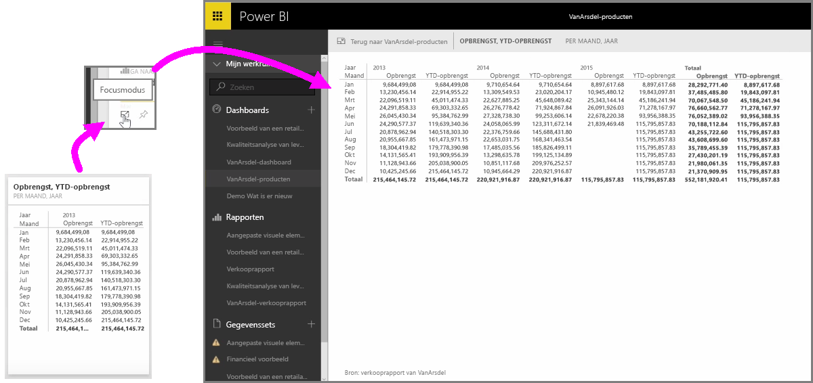

Wanneer u Power BI-dashboards of rapporten in de service bekijkt, kunt u zich richten op een afzonderlijke diagram of visualisatie. U kunt dat op twee verschillende manieren doen.

Wanneer u een dashboard hebt geopend, houdt u de muisaanwijzer boven een tegel. In de rechterbovenhoek verschijnen een aantal verschillende pictogramopties. Wanneer u het weglatingsteken (drie puntjes) selecteert, verschijnt een verzameling pictogrammen waarmee u acties op de tegel kunt uitvoeren.

Het meest linkse pictogram heet **Focusmodus**. Als u dit pictogram selecteert, wordt de tegel uitgevouwen over de gehele grootte van het dashboard.

Met **Focusmodus** kunt u veel meer details in uw visualisaties en legenda's zien. Als u bijvoorbeeld het formaat van een tegel in Power BI aanpast, worden sommige kolommen mogelijk niet weergegeven omdat deze niet in de tegel passen.

In **Focusmodus** ziet u alle gegevens. U kunt de visualisatie ook rechtstreeks vanuit Focusmodus aan een ander dashboard vastmaken door het **speld**pictogram te selecteren. Als u **Focusmodus** wilt afsluiten, selecteert u het pictogram **Terug naar...**  in de linkerbovenhoek van **Focusmodus**.

Het proces is vergelijkbaar als het bekijken van een rapport. Beweeg de muisaanwijzer over een visualisatie om de drie pictogrammen in de rechterbovenhoek weer te geven en selecteer het pictogram **Focusmodus**. Als u dit pictogram selecteert, wordt de visualisatie uitgevouwen over de gehele grootte van het rapportcanvas. De visualisatie is nog steeds interactief in deze modus. Kruisfiltereffecten tussen visualisaties gaan echter tijdelijk verloren.

Houd de muis boven een uitgevouwen tegel of rapport en selecteer het pictogram **Terug naar...**  in de linkerbovenhoek om terug te keren naar de vorige weergave.

