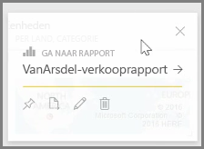
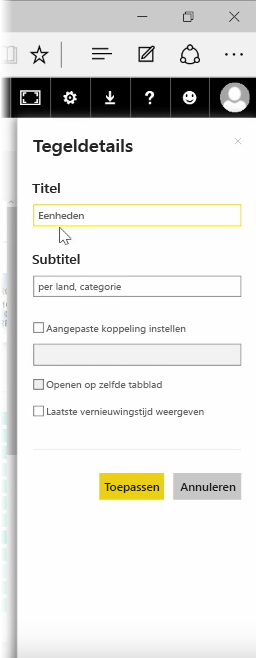
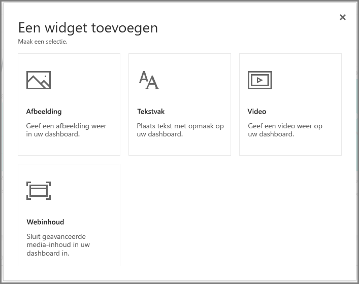
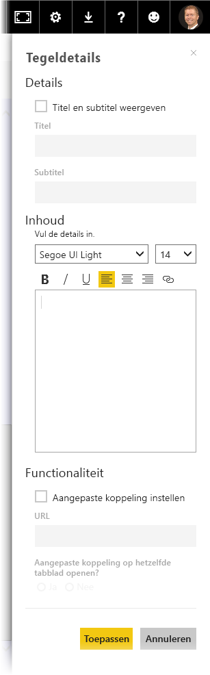

Zodra u een dashboard hebt gebouwd, kunt u de bijbehorende **tegels* in de Power BI-service bewerken om enkele wijzigingen in de opmaak aan te brengen.

Als u een tegel wilt wijzigen, beweegt u de muisaanwijzer over een tegel en selecteert u de weglatingstekens (drie punten) om een verzameling van pictogrammen weer te geven waarmee wijzigingen kunt aanbrengen op de tegel.

Selecteer het **penpictogram** om het deelvenster **Tegelgegevens** te openen. Hier kunt u de **titel** en **subtitel** van de tegel wijzigen, de laatst vernieuwingstijd, datum en andere gegevens toevoegen, zoals een aangepaste koppeling.

Als u op een dashboardtegel klikt, wordt u omgeleid naar het rapport waaruit deze afkomstig is. Als u dit gedrag wilt wijzigen, gebruikt het veld **Aangepaste koppeling instellen** in het deelvenster **Tegelgegevens**. Deze functie wordt vaak toegepast om gebruikers die op het logo van een organisatie klikken, om te leiden naar de startpagina van de organisatie.

## Widgets toevoegen aan uw dashboard
U kunt ook widgets toevoegen aan uw dashboard. Een **widget** is een speciale dashboardtegel die in plaats van een visualisatie andere item s bevat, zoals een afbeelding, een onlinevideo, een tekstvak of webinhoud met opmaak.

Als u in de rechterbovenhoek van een dashboard de koppeling Widget toevoegen selecteert, wordt het dialoogvenster **Een widget toevoegen** weergegeven.

Wanneer u bijvoorbeeld een tekstvak toevoegt, wordt het deelvenster **Tegelgegevens** weergegeven aan de rechterkant, waarin u min of meer dezelfde gegevens kunt bewerken als voor elke andere tegel. Maar met widgets beschikt u ook over een sectie waarin u de widgetinhoud kunt definiëren of wijzigen, zoals een RTF-editor voor een tekstvak.

Met widgets en de mogelijkheid om gegevens van de tegel te bewerken, kunt u de weergave van uw dashboard naar wens aanpassen.

