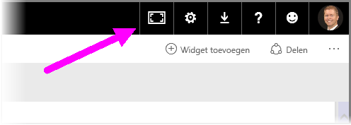
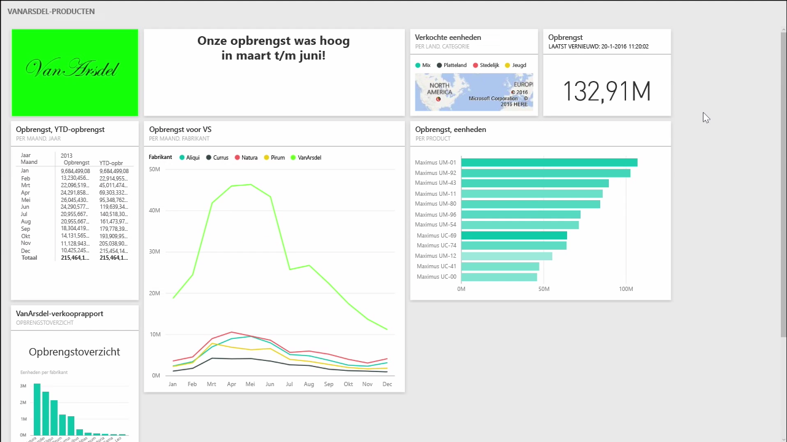
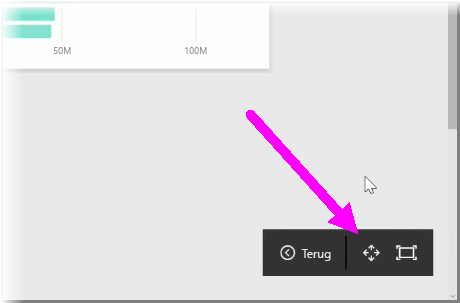
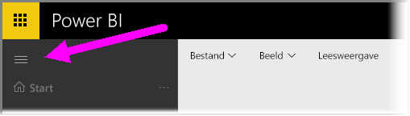

Wanneer u dashboards maakt, kan het af en toe voorkomen dat u meer inhoud hebt dan op het canvas past. Er zijn een aantal oplossingen waarmee u kunt beheren hoe uw dashboardruimte wordt weergegeven, zodat u een volledig overzicht van de dashboardinhoud hebt.

De eenvoudigste methode om het volledige dashboard op één scherm weer te geven, is om in de rechterbovenhoek van het dashboard de knop **Volledig scherm** te selecteren.

Als u de knop **Volledig scherm** selecteert, wordt uw browser weergegeven op het volledige scherm en worden alle Chrome-elementen rond het dashboard verwijderd, waardoor u over meer weergaveruimte beschikt.

In de modus **Volledig scherm** kunt u de optie **Aanpassen aan scherm** gebruiken om de tegels kleiner weer te geven, zodat ze op één scherm passen en u niet hoeft te schuiven. Dit wordt doorgaans de *Tv-modus* genoemd. Deze modus is met name handig wanneer u presentaties met dashboards geeft of een dashboard weergeeft op hallwaymonitoren.

U kunt de dashboardruimte ook beheren door het navigatiedeelvenster aan de linkerkant van de pagina samen te vouwen door het hamburgerpictogram te selecteren. Als u het navigatiedeelvenster weer wilt uitvouwen, klikt u nogmaals op het pictogram.

U kunt ervoor zorgen dat de navigatiebalk van een dashboard altijd samengevouwen wordt weergegeven door aan het eind van de URL het volgende toe te voegen:

> ?collapseNavigation=true
> 
> 

Gebruikers die de koppeling volgen, openen het dashboard met een samengevouwen navigatiebalk.

