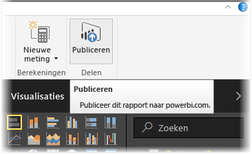
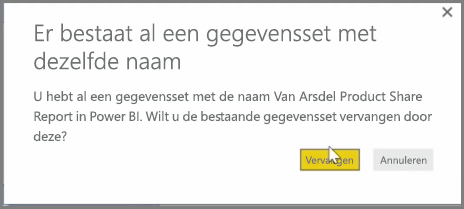
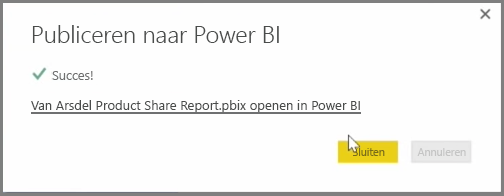

U kunt rapporten en gegevenssets die u al hebt gepubliceerd met Power BI Desktop bijwerken naar de Power BI-service. Hiervoor selecteert u **Publiceren** in het tabblad **Start** van het lint.

Wanneer u een rapport publiceert dat al bestaat in de Power BI-service, moet u bevestigen dat u de vorige gegevensset en rapporten wilt vervangen door de bewerkte versie die u zojuist hebt gekozen.

Wanneer u **Vervangen** selecteert, worden de gegevenssets en rapporten in de Power BI-service overschreven met de gegevenssets en rapporten in de meest recente Power BI Desktop-versie van het bestand.

En net als bij elke andere **publicatie**gebeurtenis in Power BI Desktop verschijnt een dialoogvenster met de melding dat de publicatie is voltooid en wordt een koppeling weergegeven naar het rapport in de Power BI-service.

Dit is een manier om uw gegevens handmatig te vernieuwen. U kunt gegevenssets en rapporten ook automatisch bijwerken. Dit proces wordt in een ander onderwerp nader omschreven.

