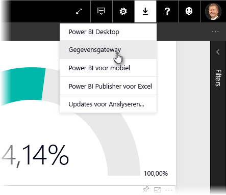
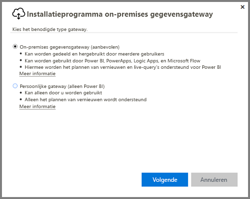
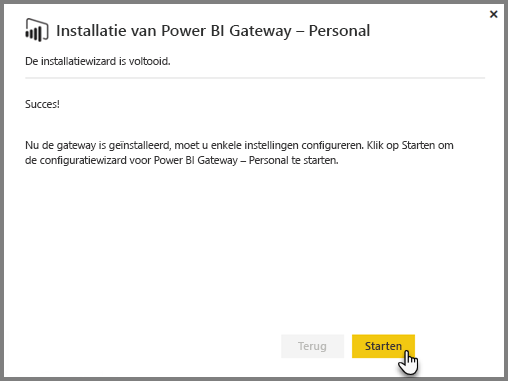
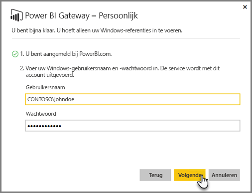
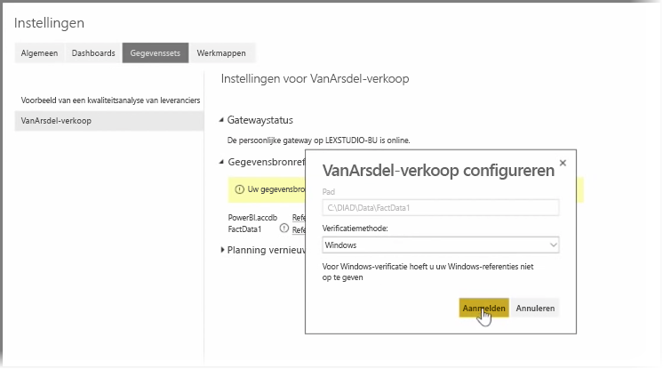
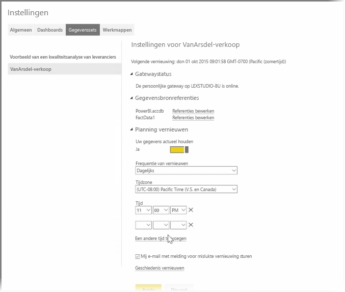

In de vorige onderwerpen is uitgelegd hoe u Power BI gebruikt om verbinding te maken met gegevensbronnen en hoe u uw gegevenssets op de Power BI-service handmatig vernieuwt. U wilt echter niet telkens handmatig vernieuwen wanneer uw gegevens worden gewijzigd. Daarom kunt u in Power BI een geplande vernieuwing instellen zodat er verbinding met uw gegevens wordt gemaakt en deze automatisch naar de Power BI-service worden gepubliceerd. Dit biedt u ook de mogelijkheid om de service te verbinden met on-premises gegevensbronnen, inclusief Excel-bestanden, Access-databases, SQL-databases en meer.

Het systeem waarmee u de on-premises gegevensbronnen met de Power BI-service verbindt, wordt de **gegevensgateway** genoemd. Deze kleine toepassing die wordt uitgevoerd op uw computer, maakt gebruik van een vooraf opgesteld schema om verbinding te maken met uw gegevens, updates te verzamelen en ze naar de Power BI-service te pushen. De **persoonlijke gateway** is een versie van de **gegevensgateway** die kan worden gebruikt zonder beheerdersconfiguratie.

>[!NOTE]
>De computer waarop de persoonlijke gateway van Power BI wordt uitgevoerd, *moet* zijn ingeschakeld en verbinding met internet hebben. Alleen dan werkt de **persoonlijke gateway** naar behoren.
> 

Als u een **persoonlijke gateway** wilt instellen, meldt u zich eerst aan bij de Power BI-service. Selecteer in de rechterbovenhoek van het scherm het pictogram **Downloaden** en selecteer in het menu vervolgens de optie **Gegevensgateways**.

Vervolgens wordt u omgeleid naar een webpagina waarop u, zoals hieronder wordt weergegeven, **Power BI Gateway - Personal** kunt selecteren.

Zodra de toepassing is gedownload, voert u deze uit en voltooit u de installatiewizard.

Vervolgens wordt u gevraagd de configuratiewizard te starten om uw gateway in te stellen.

U wordt eerst gevraagd u aan te melden bij uw Power BI-serviceaccount. Vervolgens wordt u gevraagd u aan te melden bij het Windows-account van de computer, omdat de gatewayservice wordt uitgevoerd onder uw account.

Keer terug naar de Power BI-service. Selecteer naast de gegevensset die u wilt vernieuwen het menu met de weglatingsteken (drie punten). Selecteer vervolgens **Planning vernieuwen**. Hiermee opent u de pagina **Instellingen vernieuwen**. Via Power BI wordt gedetecteerd dat u een **persoonlijke gateway** hebt geïnstalleerd en kunt u de status van de gateway aflezen.

Selecteer **Referenties bewerken** naast elke toepasselijke gegevensbron en stel verificatie in.

Stel tot slot de opties onder **Planning vernieuwen** in om automatische updates te activeren. Stel daarnaast in hoe vaak er een update moet worden uitgevoerd.

Dat is alles. Er wordt op geplande tijden verbinding met de gegevensbronnen via Power BI gemaakt om de rapporten en gegevenssets op basis van uw planning bij te werken. Hiervoor wordt gebruikgemaakt van de referenties die u hebt opgegeven en de verbinding met de computer waarop uw **persoonlijke gateway** wordt uitgevoerd. De volgende keer dat u naar Power BI gaat, weerspiegelen deze dashboards, rapporten en gegevenssets de gegevens vanaf de meest recente geplande vernieuwing.

## Volgende stappen
**Gefeliciteerd.** U hebt de sectie **Gegevens verkennen** van de cursus **Begeleide training** voor Power BI voltooid. De Power BI-service biedt tal van interessante manieren om gegevens te verkennen, inzichten te delen en visuals te gebruiken. Alle gegevens zijn toegankelijk via een browser, via een service waarmee u overal en altijd verbinding kunt maken.

Een krachtige en bekende partner van Power BI is **Excel**. Power BI en Excel zijn zodanig ontworpen dat ze goed samenwerken. U kunt uw werkmappen eenvoudig overzetten naar Power BI en hier gebruiken.

Hoe eenvoudig? In de volgende sectie **Power BI en Excel** wordt dit uitgelegd.

Tot ziens in de volgende sectie.

