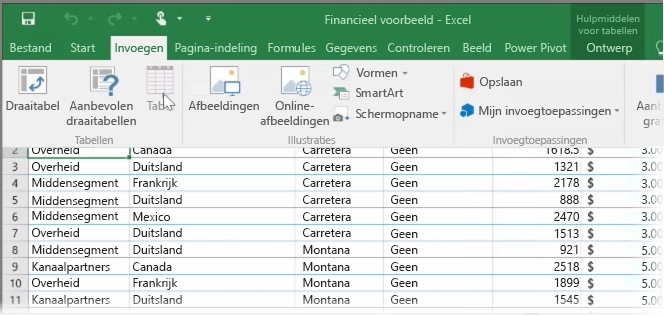
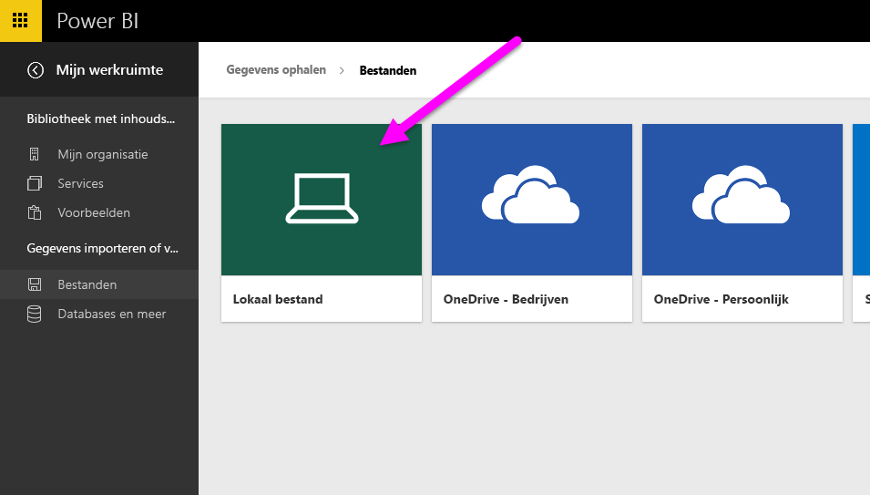
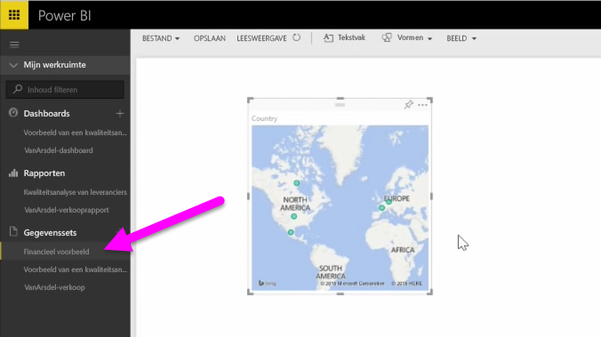

In dit onderwerp gaan we eerst kijken hoe u een Excel-werkmap met een eenvoudige **tabel** vanaf een lokaal station importeert in Power BI. Vervolgens leert u hoe u de gegevens van de tabel in Power BI kunt verkennen door een rapport te maken.

## Zorg ervoor dat uw gegevens zijn opgemaakt als een tabel
Om de gegevens van uw werkmap in Power BI te kunnen importeren, moeten de gegevens zijn **opgemaakt als een tabel**. Dat is heel eenvoudig. U markeert een celbereik in Excel, klikt op het tabblad **Invoegen** van het Excel-lint en klikt vervolgens op **Tabel**.

U moet ervoor zorgen dat elke kolom een goede naam heeft. Hierdoor kunt u uw gegevens eenvoudiger terugvinden bij het maken van uw rapporten in Power BI.

## Importeren vanaf een lokaal station
Met Power BI kunt u uw bestanden eenvoudig importeren, waar u deze ook bewaart. Kies in Power BI **Gegevens ophalen** > **Bestanden** > **Lokaal bestand** om het gewenste Excel-bestand te vinden.

Zodra het bestand in Power BI is geïmporteerd, kunt u rapporten maken.

Uw bestanden hoeven natuurlijk niet per se op een lokaal station te staan. U kunt uw bestanden ook bewaren in OneDrive of in SharePoint Team Site. Dit wordt in een ander onderwerp nader besproken.

## Rapporten maken
Zodra uw gegevens van uw werkmap zijn geïmporteerd, wordt in Power BI een gegevensset gemaakt. Deze wordt weergegeven onder **Gegevenssets**. U kunt uw gegevens verkennen door rapporten en dashboards te maken. Klik op het pictogram **Menu openen** naast de gegevensset en klik vervolgens op **Verkennen**. Er wordt een nieuw, leeg rapportcanvas weergegeven. Aan de rechterkant onder **Velden** ziet u de tabellen en kolommen. Selecteer de velden waarvan u een visualisatie op het canvas wilt maken.

U kunt het type visualisatie wijzigen en **filters** en andere eigenschappen toepassen onder **Visualisaties**.

