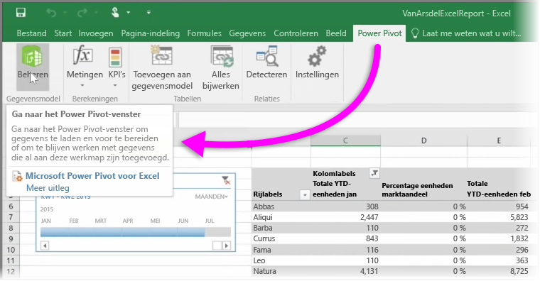

Als u een van de geavanceerde BI-functies van Excel gebruikt, zoals **Power Query** (**Ophalen en transformeren** in Excel 2016) om gegevens te zoeken en te laden, **Power Pivot** om krachtige gegevensmodellen te maken en **Power View** om dynamische rapporten te maken, kunt u deze ook in Power BI importeren.

Als u **Power Pivot** gebruikt om geavanceerde gegevensmodellen te maken, zoals modellen met meerdere gerelateerde tabellen, metingen, berekende kolommen en hiërarchieën, worden deze modellen ook in Power BI geïmporteerd.

Bevat uw werkmap **Power View-bladen**? Geen probleem. Deze worden in Power BI opnieuw gemaakt als **rapporten**. U meteen visualisaties aan dashboards vastmaken.

Hier volgt een van de handige functies van Power BI: als u Power Query of Power Pivot gebruikt om verbinding met gegevens van een externe gegevensbron te maken en hierin te zoeken of deze te laden, kunt u, zodra u uw werkmap in Power BI hebt geïmporteerd, een **geplande vernieuwing** instellen. Wanneer u een geplande vernieuwing gebruikt, worden de verbindingsgegevens van uw werkmap in Power BI gebruikt om rechtstreeks verbinding met de gegevensbron te maken om de gewijzigde gegevens te zoeken en te laden. De visualisaties in rapporten worden ook automatisch bijgewerkt.

