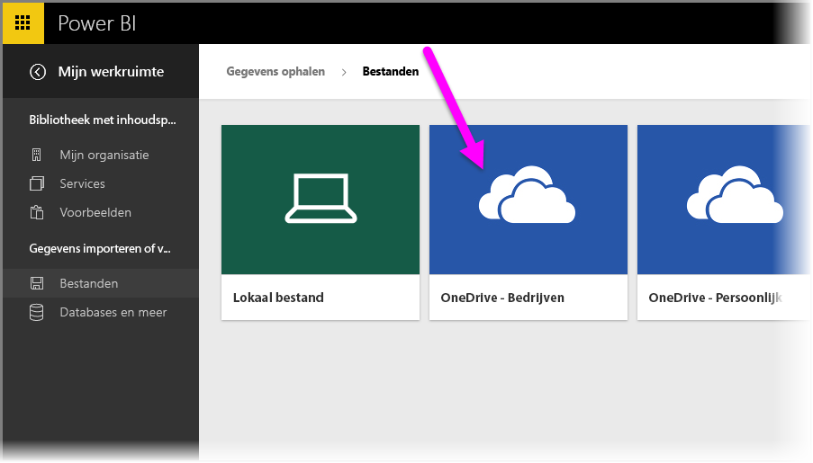
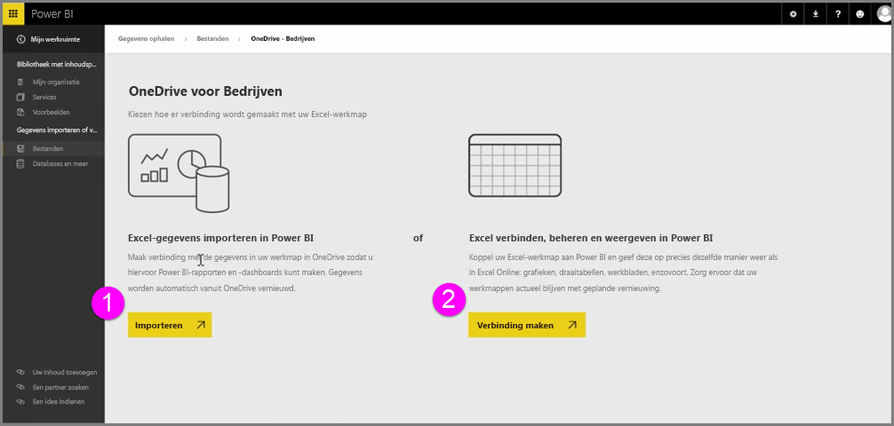
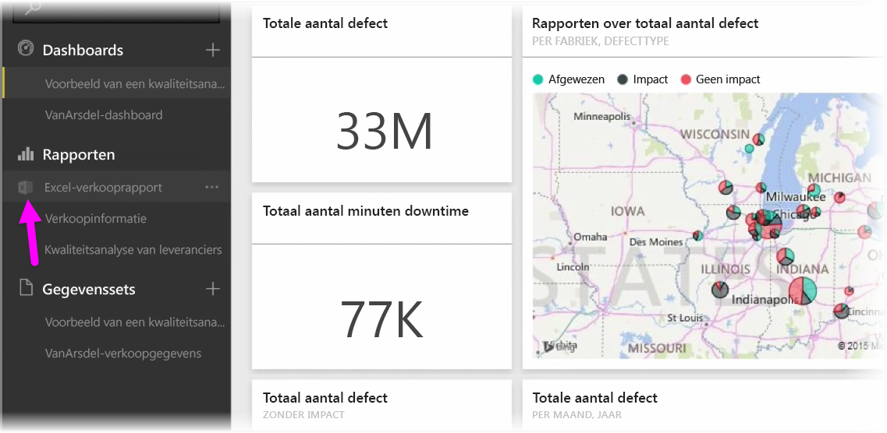
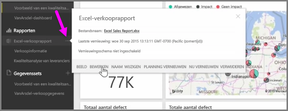

Naadloze integratie tussen Power BI en Excel wanneer u uw Excel-werkmappen opslaat in OneDrive.

Omdat OneDrive zich net als Power BI in de cloud bevindt, wordt er een liveverbinding gemaakt tussen Power BI en OneDrive. Als u wijzigingen in uw werkmap in OneDrive aanbrengt, worden die wijzigingen *automatisch gesynchroniseerd* met Power BI. Uw visualisaties in rapporten en dashboards worden up-to-date gehouden. Als u met uw werkmap verbinding maakt met externe gegevensbronnen, zoals een database of een OData-feed, kunt u Power-BI-functie **Planning vernieuwen** gebruiken om te controleren op updates. Moet u vragen over gegevens in uw werkmap stellen? Geen probleem. Hiervoor kunt u de **Q&A**-functies van Power BI gebruiken.

Er zijn twee manieren om verbinding met uw Excel-bestanden in OneDrive voor Bedrijven te maken:

1. Excel-gegevens importeren in Power BI
2. Excel verbinden, beheren en weergeven in Power BI

### Excel-gegevens importeren in Power BI
Als u ervoor kiest om Excel-gegevens in Power BI te importeren, worden de tabelgegevens uit uw werkmap in een nieuwe gegevensset in Power BI geladen. Als de werkmap **Power View**-werkbladen bevat, worden deze ook geïmporteerd en worden er automatisch nieuwe rapporten in Power BI gemaakt.

Power BI handhaaft de verbinding met het werkmapbestand in OneDrive voor Bedrijven. Als u wijzigingen aanbrengt in uw werkmap en deze opslaat, worden deze wijzigingen doorgaans binnen een uur *automatisch gesynchroniseerd** met Power BI. Als uw werkmap verbinding maakt met externe gegevensbronnen, kunt u een vernieuwingsschema instellen, zodat de gegevensset in Power BI up-to-date wordt gehouden. Aangezien de visualisaties in rapporten en dashboards in Power BI de gegevens uit de gegevensset gebruiken, zijn de query's die u ter verkenning uitvoert supersnel.

### Excel verbinden, beheren en weergeven in Power BI
Als u ervoor kiest om verbinding met de Excel-werkmap te maken, kunt u zonder problemen zowel in Excel als Power BI met uw werkmap werken. Als u op deze manier verbinding maakt, wordt er een klein Excel-pictogram naast het rapport van de werkmap weergegeven.

Uw Excel-werkmap wordt in het rapport in Power BI op dezelfde manier weergegeven als in **Excel Online**. U kunt uw werkbladen in Excel Online verkennen en bewerken door in het menu met de weglatingstekens (de drie puntjes) de optie Bewerken te selecteren. Wanneer u wijzigingen aanbrengt, worden alle visualisaties die u hebt vastgemaakt aan dashboards, automatisch bijgewerkt.

Er is geen gegevensset gemaakt in Power BI. Alle gegevens blijven in de werkmap in OneDrive. Een van de vele voordelen van deze benadering is dat u een **geplande vernieuwing** kunt instellen als uw werkmap verbinding maakt met externe gegevensbronnen. U kunt elementen zoals draaitabellen en diagrammen selecteren en deze **vastmaken** aan dashboards in Power BI. Als u wijzigingen aanbrengt, worden deze automatisch weerspiegeld in Power BI. En kunt u de handige **Q&A**-functies van Power-BI gebruiken om vragen over de gegevens in uw werkmap stellen.  

