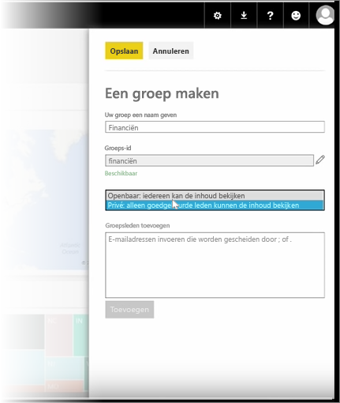
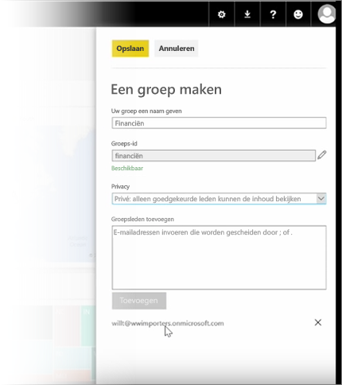

In deze les beginnen we met het maken van een *groep*. Een **groep** definieert een reeks gebruikers die toegang heeft tot specifieke dashboards, rapporten en gegevens.

Groepen in Power BI zijn gebaseerd op groepen in Office 365. Als u Office 365-groepen hebt gebruikt voor het beheren van e-mail, agenda en documenten van de groep, zult u zien dat Power BI dezelfde functies en nog meer biedt. Wanneer u een groep in Power BI maakt, maakt u in feite een Office 365-groep.

In deze module wordt een nieuwe groep voor financiën gemaakt. U ziet hoe u de groep instelt, dashboards, rapporten en gegevenssets deelt in de groep en leden toevoegt die toegang hebben tot de onderdelen in de groep.

We beginnen hier in Mijn werkruimte. Dit zijn de dashboards, rapporten en gegevenssets die zijn gemaakt of die door iemand zijn gedeeld.

Als u Mijn werkruimte wilt uitbreiden, selecteert u **Een groep maken**.

Hier kunt u een naam voor de groep opgeven. We maken gebruik van het scenario van een groep voor financiën, dus we geven de naam Financiën op. Power BI controleert of de naam nog niet bestaat in het domein.

U kunt het privacyniveau instellen door te bepalen of iemand anders in de organisatie de inhoud van de groep mag zien, of dat alleen de leden dat mogen.

Hier typt u de e-mailadressen, beveiligingsgroepen en distributielijsten. Selecteer **Toevoegen** zodat deze gebruikers lid van de groep worden en sla de groep vervolgens op.

Tot ziens in de volgende les!

