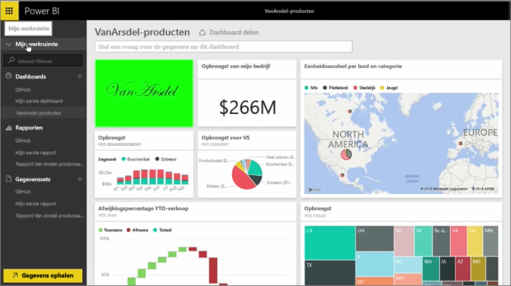
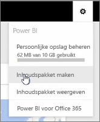
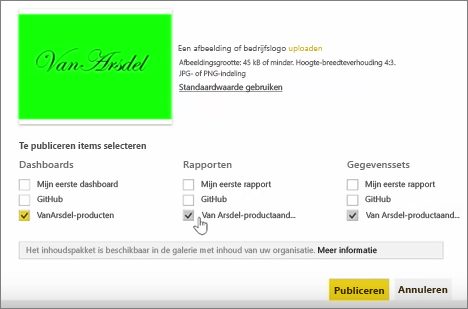

In deze les maken we een *inhoudspakket* met bestaande artefacten in Power BI en delen we dit vervolgens met collega's.

In **Mijn werkruimte** hebben we een dashboard met daaronder het rapport en de gegevensset. We willen dit delen als een pakket met anderen in de organisatie, zodat het opnieuw kan worden gebruikt.

Wanneer we het pictogram **Instellingen** selecteren, (het tandwielpictogram in de rechterbovenhoek van de service), kunnen we zien hoeveel opslagruimte al is gebruikt en kunnen we een inhoudspakket maken.

In het dialoogvenster dat wordt weergegeven, kunnen we kiezen of we het pakket willen distribueren naar specifieke personen of groepen en kunnen we het een naam geven. Het is verstandig om in het vak **Beschrijving** een gedetailleerde beschrijving op te geven, zodat gebruikers die zoeken naar een inhoudspakket direct kunnen zien wat dit pakket bevat.

Onder in het dialoogvenster kunt u een afbeelding uploaden voor het inhoudspakket. De belangrijkste stap is het selecteren van het dashboard dat u in het inhoudspakket wilt opnemen. Als u dit doet, worden automatisch het rapport en de gegevensset geselecteerd die zijn gebruikt in het dashboard. U kunt de selectie van het rapport of de gegevensset niet opheffen, omdat deze zijn vereist voor het dashboard dat u in het inhoudspakket wilt opnemen.

U kunt ook andere dashboards, rapporten en gegevenssets selecteren, maar dat doen we hier niet.

Wanneer u het pakket publiceert, wordt het inhoudspakket toegevoegd aan de galerie met inhoud van de organisatie.

Tot ziens in de volgende les!

