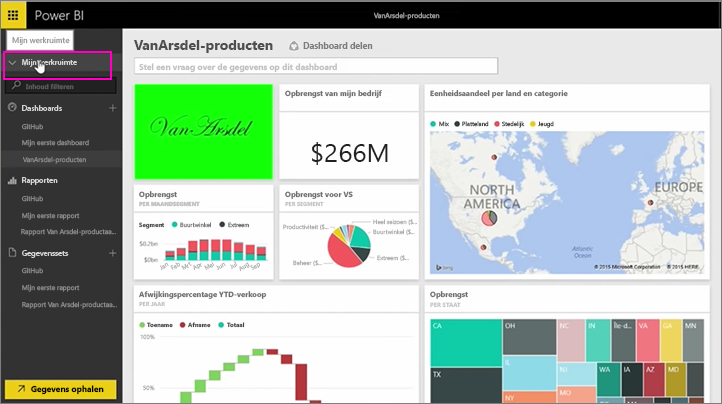
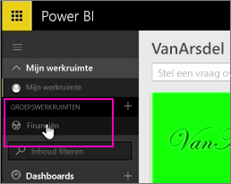
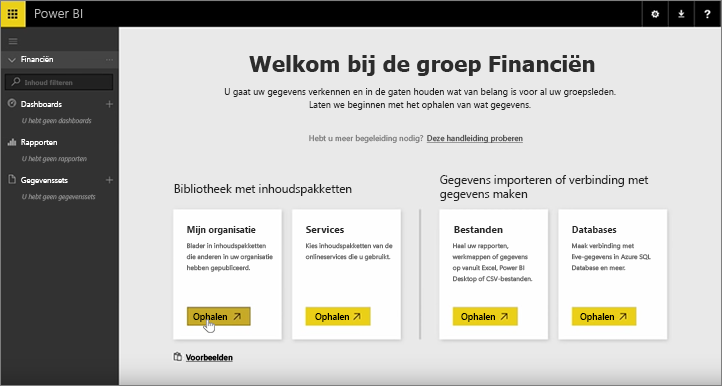
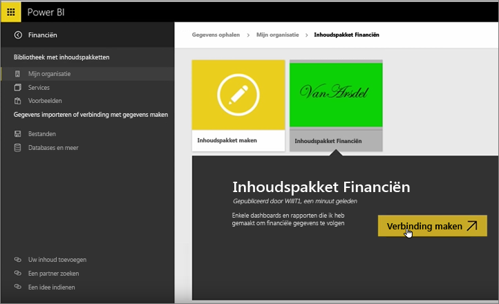
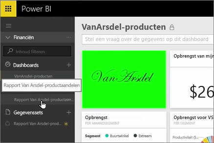
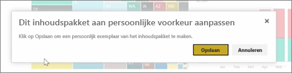
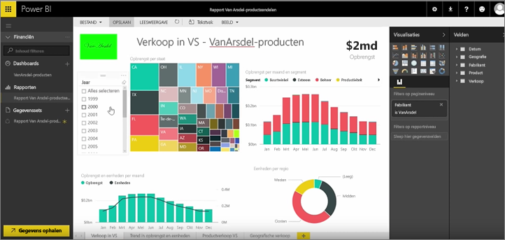

In vorige lessen hebben we al een inhoudspakket en een groep gemaakt. In deze les gaan we een instantie van het inhoudspakket maken voor iedereen in de groep.

We beginnen hier in Mijn werkruimte...

... en gaan terug naar de groep Financiën die we in een eerdere les hebben gemaakt.

De groep heeft nog geen dashboards, rapporten of gegevenssets. We gebruiken het inhoudspakket dat we hebben gemaakt. We bladeren door de inhoudspakketten voor onze organisatie, niet door de inhoudspakketten van services van derden.

Hier is het inhoudspakket dat we een minuut geleden hebben gemaakt. Het is belangrijk dat het pakket een goede titel, beschrijving en afbeelding heeft, zodat iedereen het gemakkelijk kan vinden. We maken verbinding met het pakket.

Power BI importeert de dashboards, rapporten en gegevenssets in het inhoudspakket.

Wanneer we de gegevensset selecteren, wordt gevraagd of we het inhoudspakket willen personaliseren.

We maken een kopie van het inhoudspakket waarin we wijzigingen kunnen aanbrengen en verbreken de verbinding met de gepubliceerde versie van het inhoudspakket. Als de maker van het inhoudspakket wijzigingen aanbrengt in de gepubliceerde versie, worden deze updates niet automatisch opgehaald.

Maar we kunnen eventueel het dashboard, het rapport en zelfs de gegevensset wijzigen.

Inhoudspakketten zijn dus een eenvoudige manier om inhoud die door iemand anders in uw organisatie is gemaakt, opnieuw te gebruiken.

Tot ziens in de volgende les!

