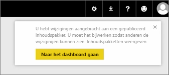
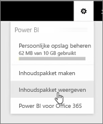
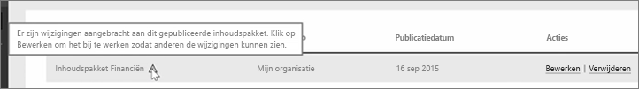
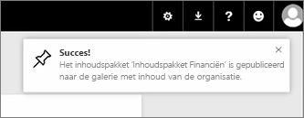

In deze les bewerken we het oorspronkelijke inhoudspakket dat we eerder hebben gemaakt om te kijken hoe andere gebruikers die verbinding hebt gemaakt, worden bijgewerkt.

Ik ben terug in mijn werkruimte om mijn oorspronkelijke dashboard te bewerken.

Telkens wanneer ik een wijziging in het dashboard aanbreng, wordt er een herinnering weergegeven dat ik iets heb gewijzigd dat via een inhoudspakket wordt gedeeld met anderen en word ik gevraagd de gedeelde versie bij te werken.

Ik ga terug naar het instellingenpictogram en selecteer **Inhoudspakket weergeven** om de inhoudspakketten weer te geven die ik al heb gepubliceerd.

Ik zie het inhoudspakket dat ik heb gemaakt. Dit kleine pictogram geeft aan dat ik iets in het inhoudspakket heb gewijzigd en dat ik het inhoudspakket moet bewerken zodat anderen mijn wijzigingen kunnen zien.

Wanneer ik **Bewerken** selecteer, kom ik weer in het scherm waar ik de titel en beschrijving kan bewerken, maar deze keer is ook de knop **Bijwerken** beschikbaar en selecteer ik die.

De wijzigingen worden in Power BI verwerkt en het bijgewerkt inhoudspakket wordt gepubliceerd naar de Inhoudspakketgalerie.

Iedereen die verbinding heeft gemaakt met mijn inhoudspakket, ontvangt een bericht dat het inhoudspakket is gewijzigd en wordt gevraagd of ze de wijzigingen willen accepteren of dat ze de oudere versie willen behouden.

Als eigenaar van het inhoudspakket kunt u beheren welke versies uw collega's gebruiken.

