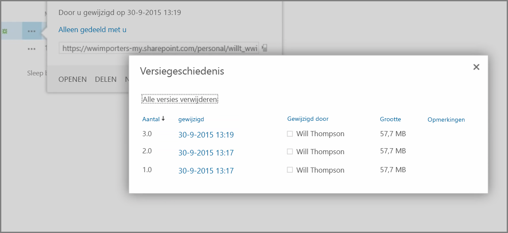
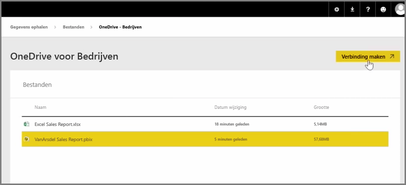
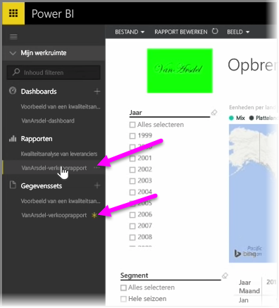

In een eerder artikel hebben we gezien hoe uw organisatie met groepen gegevens kan beheren en kan samenwerken met inhoud in Power BI. U kunt uw Power BI-/Office365-groepen ook gebruiken om samen te werken en te delen met **OneDrive voor bedrijven**.

Met OneDrive voor bedrijven als bron voor uw inhoud in Power BI beschikt u over een aantal nuttige hulpmiddelen, zoals versiegeschiedenis. U kunt uw bestanden ook delen met een Office 365-groep in OneDrive voor Bedrijven om meerdere mensen toegang te geven en te laten werken aan dezelfde Power BI- of Excel-bestanden.

Als u verbinding wilt maken met een PBIX-bestand (Power BI Desktop) in OneDrive voor Bedrijven, meldt u zich aan bij de Power BI-service en selecteert u **Gegevens ophalen**. Kies **Bestanden** onder Importeren of Verbinding maken met gegevens en selecteer vervolgens **OneDrive - Bedrijven**. Markeer het gewenste bestand en selecteer **Verbinding maken**.

Uw inhoud wordt weergegeven in de navigatiebalk aan de linkerkant.

Wijzigingen die u hebt aangebracht in het bestand in **OneDrive voor bedrijven** worden automatisch weergegeven in de Power BI-omgeving en vastgelegd in de versiegeschiedenis.

