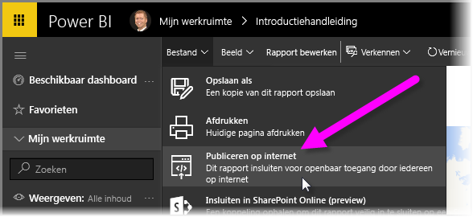
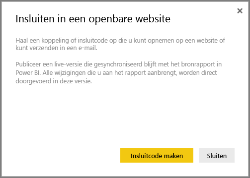
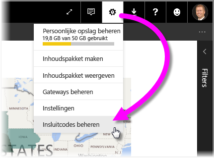
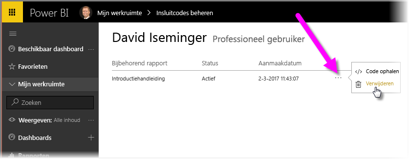

In deze les ziet u hoe u een Power BI-rapport met een paar eenvoudige stappen op een webpagina of via e-mail kunt delen. Deze functie van Power BI wordt vaak aangeduid als **Publiceren op internet** en is eenvoudig te gebruiken en te beheren.

Selecteer in Power BI het rapport dat u wilt delen, zodat het wordt weergegeven op het canvas. Selecteer vervolgens in het menu **Bestand > Publiceren op internet**.

U ziet een dialoogvenster waarin wordt uitgelegd dat u een *invoegcode* ontvangt waarmee u het rapport op een website of in een e-mail kunt opnemen.

Als u **Invoegcode maken** selecteert, wordt een ander dialoogvenster weergegeven waarin wordt vermeld dat u op het punt staat uw gegevens te delen met iedereen op het internet. Controleer of dat juist is.

Er wordt een dialoogvenster weergegeven met twee koppelingen:

* Een koppeling die u kunt delen via e-mail, waarin het rapport als een webpagina wordt weergegeven
* Een HTML-code (een koppeling plus in een iframe) waarmee u het rapport direct op een webpagina kunt opnemen

Voor de HTML-koppeling kunt u kiezen uit een vooraf gedefinieerde grootte voor het ingesloten rapport, of u kunt de iframe-code wijzigen en de grootte ervan aanpassen.

U kunt de e-mailkoppeling gewoon in een browser plakken, zodat uw rapport als een webpagina wordt weergegeven. U kunt deze webpagina vervolgens op dezelfde manier als in Power BI bewerken. In de volgende afbeeldingen wordt een pagina **Publiceren op internet** weergegeven waarvoor de koppeling rechtstreeks vanuit het dialoogvenster in een browser is gekopieerd:

U kunt de iframe-koppeling ook in een blogbericht, een website of in Sway insluiten.

Wilt u een ingesloten code verwijderen die u hebt gemaakt? Geen enkel probleem. U selecteert in Power BI het **tandwiel**pictogram in de rechterbovenhoek en vervolgens **Invoegcodes beheren**.

De Power BI-werkruimte toont de invoegcodes u hebt gemaakt (in de onderstaande afbeelding is er slechts één invoegcode). Als u op het weglatingsteken klikt, kunt u vervolgens de code ophalen voor de ingesloten code of de ingesloten code geheel verwijderen.

Meer hoeft u niet te doen om uw Power BI-rapport op het internet te publiceren en met de rest van de wereld te delen. Eenvoudiger kan niet!

