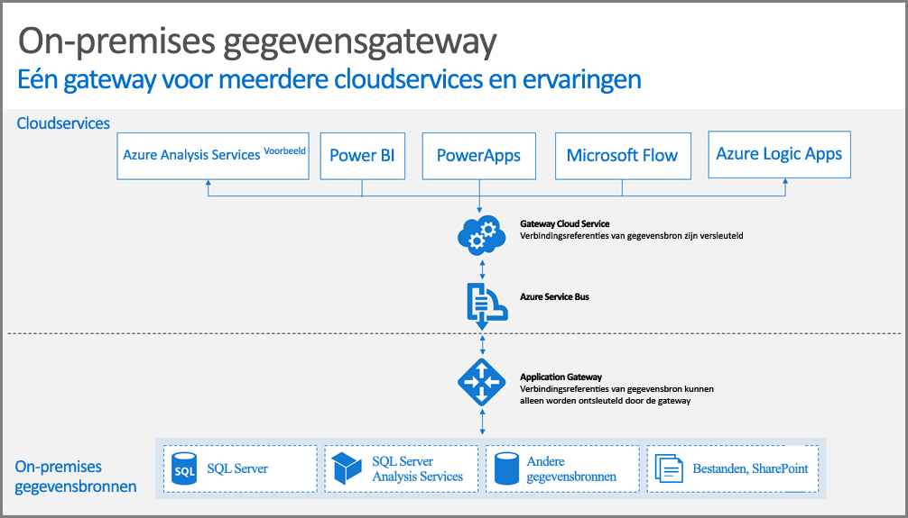

## Hoe de gateway werkt

Laten we eerst kijken naar wat er gebeurt wanneer een gebruiker een interactie uitvoert met een element dat is verbonden met een on-premises gegevensbron. 

> [!NOTE]
> Voor Power BI moet u een gegevensbron voor de gateway configureren.
> 
> 

1. De cloudservice maakt een query, samen met de versleutelde referenties voor de on-premises gegevensbron, en verzendt deze naar de wachtrij om door de gateway te worden verwerkt.
2. De gatewaycloudservice analyseert de query en stuurt de aanvraag naar [Azure Service Bus](https://azure.microsoft.com/documentation/services/service-bus/).
3. De on-premises gegevensgateway peilt [Azure Service Bus](https://azure.microsoft.com/documentation/services/service-bus/) om te kijken of er aanvragen klaarstaan.
4. De gateway haalt de query op, ontsleutelt de referenties en maakt met behulp hiervan verbinding met de gegevensbron(nen).
5. De gateway stuurt de query voor uitvoering naar de gegevensbron.
6. De resultaten worden vanuit de gegevensbron teruggezonden naar de gateway en vervolgens naar de cloudservice. De service gebruikt vervolgens de resultaten.

