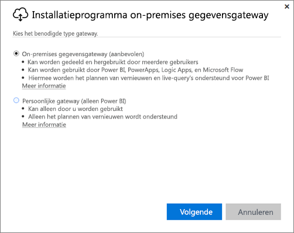
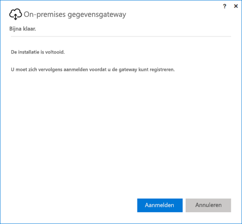
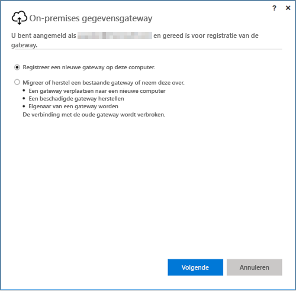
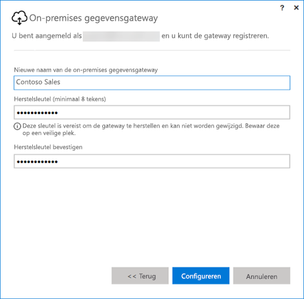

## De on-premises gegevensgateway installeren
De gegevensgateway wordt op uw computer geïnstalleerd en uitgevoerd. Het is raadzaam om de gateway te installeren op een computer die voortdurend aan kan blijven.

> [!NOTE]
> De gateway wordt alleen ondersteund op 64-bits Windows-besturingssystemen.
> 
> 

Voor Power BI is de modus van de gateway de eerste keuze die u moet maken.

* **On-premises gegevensgateway:** In deze modus kunnen meerdere gebruikers een gateway delen en opnieuw gebruiken. Deze gateway kan worden gebruikt door Power BI, PowerApps, Flow of Logic Apps. Voor Power BI omvat dit ondersteuning voor zowel het vernieuwen van planningen als DirectQuery
* **Persoonlijk:** Deze modus is alleen beschikbaar in Power BI en kan afzonderlijk worden gebruikt zonder beheerdersconfiguratie. De modus kan alleen worden gebruikt voor vernieuwing op aanvraag en voor het vernieuwen van planningen. Met deze selectie wordt de installatie van de persoonlijke gateway gestart.

Houd rekening met de volgende aspecten met betrekking tot de installatie van beide gatewaymodi:

* Beide gateways vereisen een 64-bits Windows-besturingssysteem.
* Gateways kunnen niet worden geïnstalleerd op een domeincontroller.
* U kunt maximaal twee on-premises gegevensgateways installeren op dezelfde computer, één in beide modi (persoonlijk en standaard). 
* U kunt niet meer dan één gateway in dezelfde modus op dezelfde computer uitvoeren.
* U kunt meerdere on-premises gegevensgateways op verschillende computers installeren en deze allemaal beheren vanuit één Power BI-gatewaybeheerinterface (dit geldt niet voor de persoonlijke modus; zie het volgende punt).
* Voor elke Power BI-gebruiker kunt u slechts één gateway in de persoonlijke modus uitvoeren. Als u voor dezelfde gebruiker een andere gateway in de persoonlijke modus installeert, wordt, zelfs op een andere computer, de bestaande voorgaande installatie vervangen door de meest recente installatie.

Hier volgt een aantal zaken waar u rekening mee moet houden voordat u de gateway installeert.

* Als u de gateway op een laptop installeert en deze is uitgeschakeld, in de slaapstand staat of geen verbinding met internet heeft, werkt de gateway niet en worden de gegevens in de cloudservice niet gesynchroniseerd met uw on-premises gegevens.
* Als uw computer is verbonden met een draadloos netwerk, werkt de gateway mogelijk langzamer, waardoor deze er langer over doet om de gegevens in de cloudservice te synchroniseren met uw on-premises gegevens.

Nadat de gateway is geïnstalleerd, moet u zich aanmelden met uw werk- of schoolaccount.

Nadat u bent aangemeld, hebt u de mogelijkheid om een nieuwe gateway te configureren of een bestaande gateway te migreren, te herstellen of over te nemen.

## Een nieuwe gateway configureren
1. Geef een **naam** op voor de gateway
2. Geef een **herstelsleutel** op. De sleutel moet minimaal acht tekens bevatten.
3. Selecteer **Configureren**.

> [!NOTE]
> De herstelsleutel is nodig voor het geval u een gateway moet migreren, herstellen of overnemen. Zorg ervoor dat u deze sleutel op een veilige plaats bewaart.
> 
> 

### Een bestaande gateway migreren, herstellen of overnemen
Selecteer de gateway die u wilt herstellen en geef de herstelsleutel op die u hebt gebruikt bij het maken van de gateway.

### Verbonden on-premises gegevensgateway
Nadat de gateway is geconfigureerd, kunt u deze gebruiken om verbinding te maken met on-premises gegevensbronnen.

Als de gateway is bestemd voor Power BI, moet u binnen de Power BI-service gegevensbronnen aan de gateway toevoegen. Dit doet u in het gedeelte **Gateways beheren**. Zie voor meer informatie de artikelen over het beheren van gegevensbronnen.

Voor PowerApps moet u een gateway selecteren voor een gedefinieerde verbinding met ondersteunde gegevensbronnen. Voor Flow en Logic Apps is deze gateway direct gereed voor gebruik met on-premises verbindingen.

