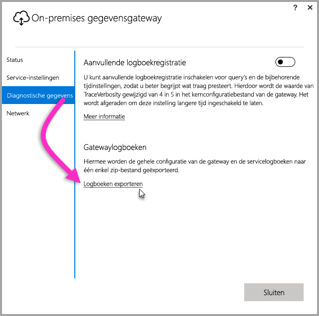
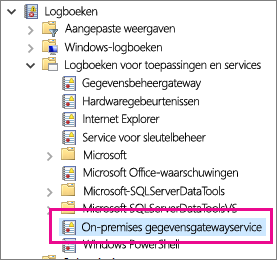

## Hulpmiddelen voor probleemoplossing
<a name="logs" />

### Logboeken van de gatewayconfigurator verzamelen
U kunt voor de gateway verschillende logboeken verzamelen. Begin altijd hiermee. De eenvoudigste manier om na de installatie van de gateway logboeken te verzamelen, is via de gebruikersinterface. Selecteer in de gebruikersinterface van de **on-premises gegevensgateway** de optie **Diagnostische gegevens** en klik vervolgens op de link **Logboeken exporteren** onderaan de pagina, zoals wordt weergegeven in de volgende afbeelding.

**Logboeken van installatieprogramma**

    %localappdata%\Temp\On-premises_data_gateway_*.log

**Configuratielogboeken**

    %localappdata%\Microsoft\On-premises Data Gateway\GatewayConfigurator*.log

**Logboeken van de on-premises gegevensgateway**

    C:\Users\PBIEgwService\AppData\Local\Microsoft\On-premises Data Gateway\Gateway*.log

### Gebeurtenislogboeken
De gebeurtenislogboeken van de **on-premises gegevensgatewayservice** vindt u onder **Logboeken voor toepassingen en services**.

<a name="fiddler" />

### Traceren met Fiddler
[Fiddler](http://www.telerik.com/fiddler) is een gratis hulpprogramma van Telerik dat HTTP-verkeer bewaakt.  U kunt hiermee het verkeer tussen de Power BI-service en de clientcomputer bekijken. Het programma kan fouten en aanverwante informatie weergeven.

