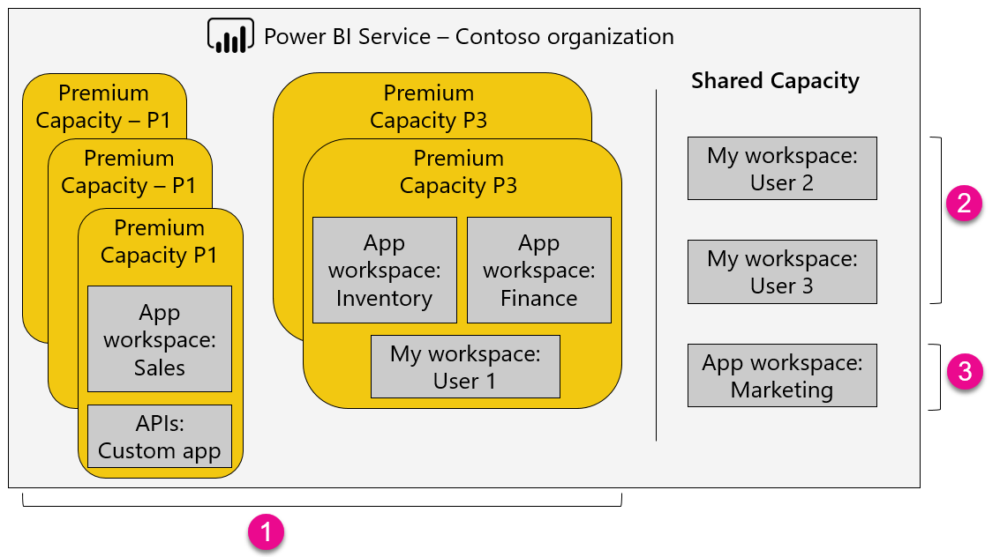

1. Items binnen een Premium-capaciteit
   
   * Voor de toegang tot app-werkruimten (als leden of beheerders) en het publiceren van apps is Power BI Pro-licentie vereist.
   * App-lezers kunnen zowel gebruikers van Power BI Pro of de gratis versie Power BI zijn.
   * Voor delen is een Power BI Pro-licentie nodig, maar de geadresseerden kunnen zowel gebruikers van Power BI Pro als gebruikers van de gratis versie zijn.
   * REST-API's voor insluiten maken gebruik van een serviceaccount, met een Power BI Pro-licentie, in plaats van een gebruiker.
2. Mijn werkruimte in Gedeelde capaciteit
   
   * Voor delen is een Pro-licentie vereist. Geadresseerden hebben ook een Pro-licentie nodig.
3. App-werkruimten Gedeelde capaciteit
   
   * Voor het gebruik van de apps is een Pro-licentie vereist.

