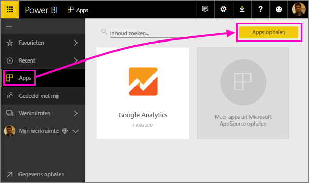
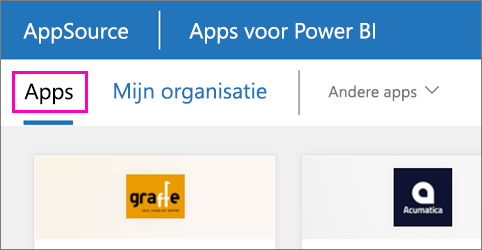

1. Selecteer in het linkernavigatievenster **Apps** en selecteer in de rechterbovenhoek vervolgens **Apps downloaden**.
   
     
2. Selecteer in AppSource het tabblad **Apps** en zoek de gewenste service.
   
    

