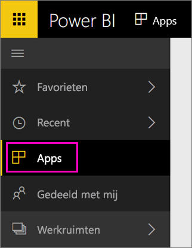

Zodra het importeren is voltooid, wordt de nieuwe app weergegeven op de pagina Apps.

1. Selecteer in het linkernavigatievenster de optie **Apps** en selecteer vervolgens de app.
   
     
2. U kunt een vraag stellen door te typen in een vak Q&A of op een tegel klikken om het onderliggende rapport te openen. 

