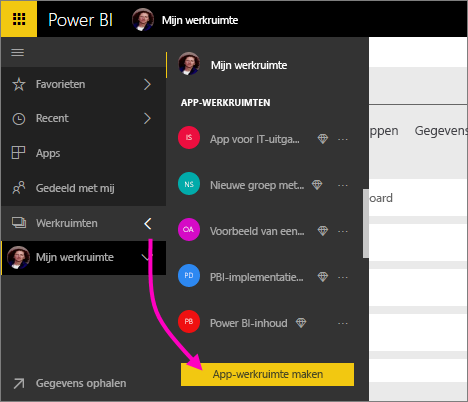
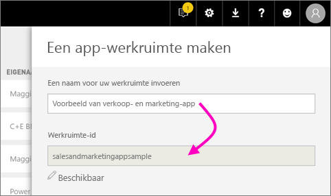
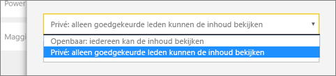
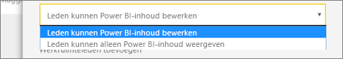
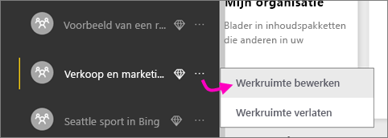

1. Maak eerst de werkruimte. Selecteer **Werkruimten** > **App-werkruimte maken**.
   
     
   
    Dit is de plek voor het plaatsen van inhoud waaraan u en uw collega's samenwerken.

2. Geef een naam op voor de werkruimte. Als de corresponderende **werkruimte-id** niet beschikbaar is, kunt u deze bewerken tot een unieke aanduiding.
   
     Dit wordt ook de naam van de app.
   
     

3. U moet een aantal opties instellen. Als u **Openbaar** kiest, is de inhoud van de werkruimte zichtbaar voor iedereen in de organisatie. Als u **Privé** kiest, is de inhoud alleen zichtbaar voor leden van de werkruimte.
   
     
   
    U kunt de instelling Openbaar/Privé niet meer wijzigen nadat u de groep hebt gemaakt.

4. U kunt ook kiezen of leden van de werkruimte rechten voor **bewerken** of **alleen-lezen** krijgen.
   
     
   
     Voeg alleen personen toe aan de app-werkruimte als u wilt dat ze de inhoud kunnen bewerken. Als ze de inhoud alleen hoeven te kunnen bekijken, voeg hen dan niet toe aan de werkruimte. In plaats daarvan neemt u hen op wanneer u de app publiceert.

5. Voeg de e-mailadressen toe van de personen die u toegang tot de werkruimte wilt geven, en selecteer **Toevoegen**. U kunt geen groepsaliassen toevoegen, alleen personen.

6. Bepaal per persoon of deze een lid of een beheerder is.
   
     
   
    Beheerders kunnen de werkruimte zelf bewerken, en bijvoorbeeld ook andere leden toevoegen. Leden kunnen de inhoud in de werkruimte bewerken, tenzij ze alleen leesrechten hebben. Zowel beheerders als leden kunnen de app publiceren.

7. Selecteer **Opslaan**.

De werkruimte wordt gemaakt en in Power BI geopend. De werkruimte wordt weergegeven in de lijst met werkruimten waarvan u lid bent. Omdat u een beheerder bent, kunt u het weglatingsteken (...) selecteren om terug te gaan en wijzigingen aanbrengen, bijvoorbeeld nieuwe leden toevoegen of machtigingen van leden wijzigen.

