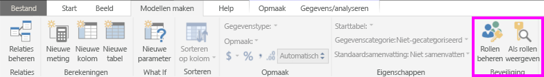
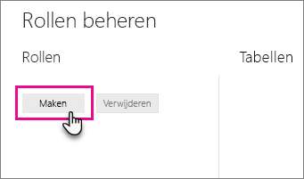
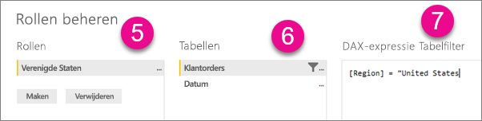
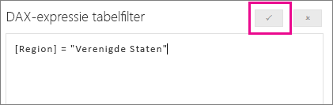

## Rollen en regels definiëren binnen Power BI Desktop
U kunt rollen en regels definiëren binnen Power BI Desktop. Wanneer u naar Power BI publiceert, worden ook de roldefinities gepubliceerd.

Voor het definiëren van rollen kunt u het volgende doen.

1. Gegevens importeren in uw Power BI Desktop-rapport of een DirectQuery-verbinding configureren.
   
   > [!NOTE]
   > U kunt geen rollen binnen Power BI Desktop definiëren voor live verbindingen met Analysis Services. U moet dat doen binnen het Analysis Services-model.
   > 
   > 
2. Selecteer het tabblad **Modellering**.
3. Selecteer **Rollen beheren**.
   
   
4. Selecteer **Maken**.
   
   
5. Geef een naam op voor de rol. 
6. Selecteer de tabel waarop u een DAX-regel wilt toepassen.
7. Voer de DAX-expressies in. De expressie moet waar of onwaar retourneren. Bijvoorbeeld: [Entiteit-id] = “Waarde”.
   
   > [!NOTE]
   > U kunt *username()* binnen deze expressie gebruiken. Let op: *username()* heeft de indeling *DOMAIN\username* binnen Power BI Desktop. Binnen de Power BI-service heeft dit de indeling van de UPN van de gebruiker. U kunt ook *userprincipalname()* gebruiken waarmee altijd de gebruiker wordt geretourneerd in de indeling van zijn/haar user principal name.
   > 
   > 
   
   
8. Nadat u de DAX-expressie hebt gemaakt, kunt u het vakje boven de expressie inschakelen om de expressie te valideren.
   
   
9. Selecteer **Opslaan**.

U kunt geen rol toewijzen aan gebruikers binnen Power BI Desktop. Dit moet binnen de Power BI-service worden gedaan. U kunt dynamische beveiliging inschakelen binnen Power BI Desktop door gebruik te maken van de DAX-functies voor *username()* of *userprincipalname()* en het configureren van de juiste relaties.

