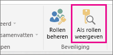
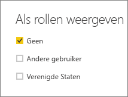
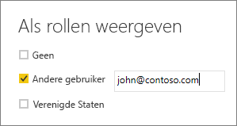

## De rol binnen Power BI Desktop valideren
Nadat u uw rol hebt gemaakt, kunt u de resultaten van de rol testen binnen Power BI Desktop. Selecteer hiervoor **Als rollen weergeven**.

Met het dialoogenster **Als rollen weergeven** kunt u de weergave aanpassen van wat u ziet voor die specifieke gebruiker of rol. U kunt de rollen die u gemaakt hebt zien.

Selecteer de rol die u hebt gemaakt en selecteer vervolgens **OK** om de rol toe te passen op wat u aan het bekijken bent. De rapporten geven alleen de gegevens weer die relevant zijn voor die rol.

U kunt ook **Andere gebruiker** selecteren en een bepaalde gebruiker opgeven. Het is het beste om de User Principal Name (UPN) op te geven omdat deze door de Power BI-services wordt gebruikt. Selecteer **OK**. De rapporten worden weergegeven op basis van wat de gebruiker kan zien. 

> [!NOTE]
> Binnen Power BI Desktop worden hiermee alleen verschillende resultaten weergegeven wanneer u dynamische beveiliging gebruikt op basis van uw DAX-expressies.
> 
> 

