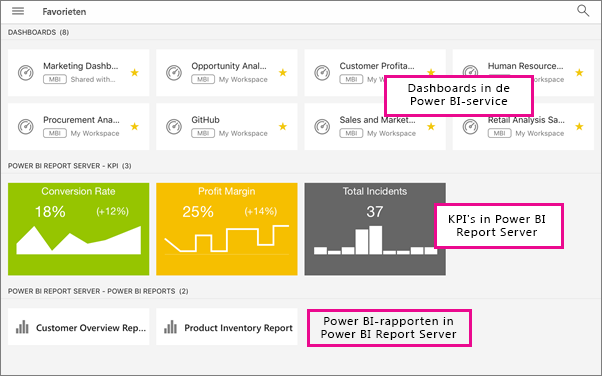

# On-premises rapportserverrapporten en KPI's weergeven in de mobiele Power BI-apps
Van toepassing op:

|  |  |  |  |
|:--- |:--- |:--- |:--- |
| iPhones |iPads |Android-telefoons |Android-tablets |

Met de mobiele Power BI-apps hebt u live en mobiel via aanraking toegang tot uw on-premises bedrijfsgegevens in Power BI Report Server en SQL Server 2016 Reporting Services (SSRS). 

 

## Om te beginnen
**In de mobiele apps geeft u Power BI-inhoud weer. U maakt de inhoud daar niet.**

* U en andere rapportmakers in uw organisatie [maken Power BI-rapporten met Power BI Desktop. Vervolgens publiceert u deze naar de webportal van Power BI Report Server](report-server/quickstart-create-powerbi-report.md). 
* U kunt [rechtstreeks in de webportal KPI's maken](https://docs.microsoft.com/sql/reporting-services/working-with-kpis-in-reporting-services), deze ordenen in mappen en uw favorieten markeren, zodat u ze eenvoudig kunt terugvinden. 
* U kunt [mobiele Reporting Services-rapporten maken](https://docs.microsoft.com/sql/reporting-services/mobile-reports/create-mobile-reports-with-sql-server-mobile-report-publisher) met SQL Server 2016 Enterprise Edition Mobile Report Publisher en deze publiceren naar de [Reporting Services-webportal](https://docs.microsoft.com/sql/reporting-services/web-portal-ssrs-native-mode).  

Vervolgens kunt u in de mobiele Power BI-apps verbinding maken met maximaal vijf rapportservers om de Power BI-rapporten en -KPI's weer te geven, geordend in mappen of verzameld als favorieten. 

## De voorbeelden in de mobiele apps verkennen zonder serververbinding
Ook als u geen toegang hebt tot een Reporting Services-webportal, kunt u de functies van mobiele Reporting Services-rapporten en -KPI's bekijken. 

1. Tik op de knop voor globale navigatie  in de linkerbovenhoek en tik vervolgens op het tandwielpictogram in de rechterbovenhoek .
2. Tik op **Reporting Services-voorbeelden** en blader om de voorbeeld-KPI's en de voorbeelden van mobiele rapporten te gebruiken.
   
   

## Verbinding maken met een on-premises server
Met de mobiele Power BI-apps kunt u on-premises Power BI-rapporten, mobiele Reporting Services-rapporten en KPI's weergeven in de mobiele Power BI-apps. 

1. Open de Power BI-app op uw mobiele apparaat.
2. Als u zich nog niet hebt aangemeld bij Power BI, tikt u op **Report Server**.
   
   
   
   Als u zich al hebt aangemeld bij de Power BI-app, tikt u op de knop voor globale navigatie en vervolgens op het tandwielpictogram  in de rechterbovenhoek.
3. Tik op **Verbinding maken met server**.
   
    

     De mobiele app moet op een bepaalde manier toegang hebben tot de server. Dit kan op een aantal manieren worden verkregen:

    - Het is het gemakkelijkst door hetzelfde netwerk/VPN te gebruiken.
    - Het is mogelijk een Web Application Proxy te gebruiken om verbinding te maken van buiten de organisatie. Zie [OAuth gebruiken om verbinding met Reporting Services te maken](mobile-oauth-ssrs.md) voor meer informatie. 
    - Open een verbinding (poort) in de firewall.

1. Vul het adres van de server en uw gebruikersnaam en wachtwoord in. Gebruik deze notatie voor het adres van de server:
   
     `http://<servername>/reports`
   
     OF
   
     `https://<servername>/reports`
   
   Voeg **http** of **https** toe aan het begin van de verbindingsreeks.
   
    
5. (Optioneel) U kunt bij **Geavanceerde opties** desgewenst een beschrijvende naam opgeven voor de server.
6. De server (in dit voorbeeld power bi report server genoemd) wordt nu weergegeven in de linkernavigatiebalk.
   
   

## Power BI-rapporten en -KPI's weergeven in de Power BI-app
Power BI-rapporten en mobiele Reporting Services-rapporten worden weergegeven in de mappen waarin ze zijn opgeslagen op de Reporting Services-webportal. 

* Tik op een Power BI-rapport . Het rapport wordt geopend in de liggende stand. U kunt met het rapport werken in de Power BI-app.
  
    
* In Power BI Desktop kunnen rapporteigenaren [een rapport optimaliseren](desktop-create-phone-report.md) voor de mobiele Power BI-apps. Geoptimaliseerde rapporten hebben een speciaal pictogram, , en een speciale indeling.
  
    
* Tik op een KPI om deze weer te geven in de focusmodus.
  
    

## Uw favoriete KPI's en rapporten weergeven
U kunt KPI's en rapporten op het webportal markeren als favorieten en ze vervolgens weergeven in één handige map op uw mobiele apparaat, samen met uw favoriete Power BI-dashboards en -rapporten.

* Tik op **Favorieten**.
  
   
  
   Uw favoriete KPI's en rapporten van de webportal bevinden zich allemaal op deze pagina, samen met de Power BI-dashboards in de Power BI-service:
  
   

## Een verbinding met een rapportserver verwijderen
1. Tik onder aan de linkernavigatiebalk op **Instellingen**.
2. Tik op de naam van de server waarmee u geen verbinding wilt maken.
3. Tik op **Server verwijderen**.

## Volgende stappen
* [Aan de slag met Power BI](service-get-started.md)  
* Vragen? [Misschien dat de Power BI-community het antwoord weet](http://community.powerbi.com/)

