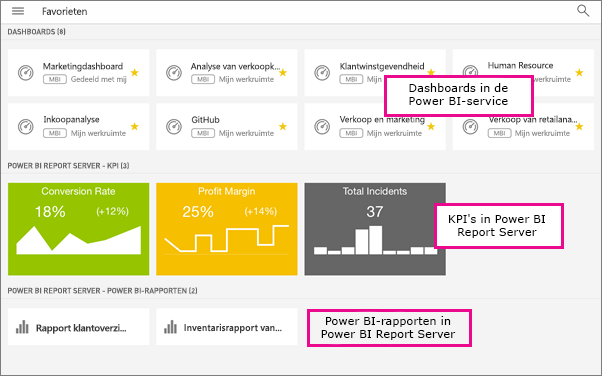

# Favorieten maken en bekijken in de mobiele Power BI-apps
Van toepassing op:

|  |  |  |  |  |
|:--- |:--- |:--- |:--- |:--- |
| iPhones |iPads |Android-telefoons |Android-tablets |Windows 10-apparaten |

Meer informatie over het maken en bekijken van uw favoriete Power BI-dashboards, -rapporten en -apps, samen met uw favoriete KPI's en rapporten van on-premises Power BI Report Server en Reporting Services in de mobiele apps.

Wanneer u iets aan uw favorieten toevoegt in de mobiele Power BI-apps, ziet u deze op de pagina Favorieten van de Power BI-service ([https://powerbi.com](https://powerbi.com)) en op al uw mobiele apparaten. 

U kunt ook [Power BI-dashboards en -apps markeren als favoriet in de Power BI-service](service-dashboard-favorite.md). Deze ziet u dan op de pagina Favorieten in de mobiele app.

U kunt KPI's en rapporten markeren als favorieten op een Power BI Report Server of de Reporting Services-webportal en ze vervolgens weergeven in één handige map op uw mobiele apparaat, samen met uw favoriete Power BI-dashboards.

## Uw Power BI-favorieten weergeven
* Tik op het bovenste navigatiemenu  en tik vervolgens op **Favorieten**.
  
  
  
  Op deze pagina worden al uw favorieten weergegeven:
  
  

## Een app markeren als favoriet
1. Tik op de mobiele app in de lijst met apps op het weglatingsteken (...) naast de app > **Favoriet**.
   
    
   
    De app wordt nu weergegeven bij uw andere favoriete dashboards en apps.
   
    

## Een dashboard of rapport aan uw favorieten toevoegen in mobiele iOS- en Windows 10-apps
U kunt een Power BI-dashboard of -rapport aan uw favorieten toevoegen vanuit de lijst met dashboards of rapporten, of vanuit het dashboard of rapport zelf.

* Tik in de lijst met dashboards of rapporten in de mobiele app op de lege ster naast de naam . De ster wordt geel .
  
    
* Tik in het dashboard of rapport op de lege ster op het lint . De ster wordt geel .
  
    

## Een dashboard of rapport toevoegen aan uw favorieten in mobiele Android-apps
U kunt een dashboard of rapport aan uw favorieten toevoegen vanuit de lijst met dashboards of rapporten, of vanuit het dashboard of rapport zelf.

* Tik in de lijst met dashboards of rapporten in de mobiele app op de verticale puntjes (...) naast de naam en tik vervolgens op **Favoriet**. U ziet een gele ster naast de naam .
  
    
* Tik in het dashboard of rapport op de lege ster op het lint . De ster wordt donkergrijs .
  
    

## Favoriete Power BI Report Server- en Reporting Server-rapporten en -KPI's maken
U kunt uw favoriete Power BI Report Server- en Reporting Server-rapporten en -KPI's bekijken in de mobiele Power BI-apps. U kunt deze echter niet als favoriet markeren in de mobiele apps. U [labelt ze als favorieten in de webportal](report-server/tutorial-explore-report-server-web-portal.md#tag-your-favorites). 

## Volgende stappen
* [Favoriete dashboards in de Power BI-service](service-dashboard-favorite.md) 
* Vragen? [Misschien dat de Power BI-community het antwoord weet](http://community.powerbi.com/)

