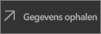
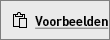

# Snelstartgids: dashboards en rapporten verkennen in de mobiele Power BI-apps
In deze snelstartgids verkent u een voorbeelddashboard en -rapport in de mobiele Power BI-app op een Android-telefoon. U kunt deze stappen ook volgen in de andere mobiele apps. 

Van toepassing op:

|  |  |  |  |
|:--- |:--- |:--- |:--- |
| iPhone | iPad | Android | Windows 10 |

Dashboards zijn een verzamelplek voor de levenscyclus en processen van uw bedrijf. Een dashboard is een overzicht, één plaats waarop u de huidige status van het bedrijf bewaakt. Rapporten zijn een interactieve weergave van uw gegevens met visuals die verschillende bevindingen en inzichten van die gegevens aangeven. 

## Vereisten

### Registreren voor Power BI
Als u zich niet hebt geregistreerd voor Power BI, kunt u zich hier [aanmelden voor een gratis proefversie](https://app.powerbi.com/signupredirect?pbi_source=web) voordat u begint.

### De app Power BI voor Android installeren
[Download de app Power BI voor Android](http://go.microsoft.com/fwlink/?LinkID=544867) vanuit de Google Play Store.

Power BI kan worden uitgevoerd op Android-apparaten waarop het besturingssysteem Android 5.0 of hoger is geïnstalleerd. U controleert dit op uw apparaat door naar **Instellingen** > **Over het apparaat** > **Android-versie** te gaan.

### Het voorbeeld van een retailanalyse downloaden
De eerste stap in de snelstartgids is het downloaden van het voorbeeld van een retailanalyse in de Power BI-service.

1. Open de Power BI-service (app.powerbi.com) in uw browser en meld u aan.

1. Selecteer het pictogram voor globale navigatie om het linkernavigatievenster te openen.

    

2. Selecteer **Werkruimten** > **Mijn werkruimte** in het linkernavigatievenster.

    

3. Selecteer in de linkerbenedenhoek **Gegevens ophalen**.
   
    

3. Selecteer het pictogram **Voorbeelden** op de pagina Gegevens ophalen.
   
   

4. Selecteer **Voorbeeld van een retailanalyse**.
 
    
 
8. Selecteer **Verbinding maken**.  
  
   
   
5. Het voorbeeld wordt geïmporteerd in Power BI en er wordt een nieuw dashboard, een nieuw rapport en een nieuwe gegevensset aan Mijn werkruimte toegevoegd.
   
   

U kunt het voorbeeld nu weergeven op uw Android-apparaat.

## Een dashboard weergeven op uw Android-apparaat
1. Open de Power BI-app op uw Android-apparaat en meld u aan met uw referenties voor het Power BI-account (dit zijn dezelfde referenties als die u gebruikt voor de Power BI-service in de browser).

1.  Tik op de knop voor globale navigatie .

2.  Tik op **Werkruimten** > **Mijn werkruimte**.

    

3. Tik op het voorbeelddashboard voor retailanalyse om dit te openen.
 
    
   
    De notatie onder elke dashboardnaam (in dit geval de letter C) geeft aan hoe de gegevens in elk dashboard worden geclassificeerd. Lees meer over [gegevensclassificatie in Power BI](service-data-classification.md).

    Power BI-dashboards zien er enigszins anders uit op uw Android-telefoon. Alle tegels hebben dezelfde breedte en ze zijn achter elkaar van boven naar beneden gesorteerd.

4. Tik op het sterpictogram  in de titelbalk om dit dashboard in te stellen als favoriet dashboard.

    Wanneer u een dashboard in de mobiele app als favoriet instelt, wordt het dashboard ook als favoriet in de Power BI-service ingesteld (en omgekeerd).

4. Schuif omlaag en tik op het gevulde lijndiagram 'This Year's Sales, Last Year's Sales'.

    

    De tegel wordt geopend in de focusmodus.

7. Tik in de focusmodus op 'Apr' in het diagram. De waarden voor april worden boven in het diagram weergegeven.

    

8. Tik op het pictogram Rapport  in de rechterbovenhoek. Het rapport dat betrekking heeft op deze tegel, wordt geopend in de liggende modus.

    

9. Tik op de gele bel '040 - Juniors' in het bellendiagram. U ziet dat de verwante waarden in de andere diagrammen worden gemarkeerd. 

    

10. Veeg omhoog om de werkbalk aan de onderkant weer te geven en tik op het potloodpictogram.

    

11. Tik op het pictogram met het lachebekje op de werkbalk Aantekening en voeg enkele lachebekjes aan uw rapportpagina toe.
 
    

12. Tik op **Delen** in de rechterbovenhoek.

1. Vul indien gewenst de e-mailadressen en een bericht in.  

    

    U kunt deze momentopname met iedereen delen, zowel binnen als buiten uw organisatie. Als u de momentopname deelt met iemand in uw organisatie die een eigen Power BI-account heeft, kan deze persoon ook het voorbeeldrapport voor de retailanalyse openen.

## Resources opschonen

Als u deze snelstartgids hebt voltooid, kunt u het voorbeelddashboard, het voorbeeldrapport en de voorbeeldgegevensset verwijderen.

1. Open de Power BI-service (app.powerbi.com) en meld u aan.

2. Selecteer **Werkruimten** > **Mijn werkruimte** in het linkernavigatievenster.

    Met de gele ster wordt aangegeven dat het een favoriet dashboard betreft.

3. Selecteer op het tabblad **Dashboards** het pictogram **Verwijderen** (prullenbak) naast het dashboard voor de retailanalyse.

    

4. Selecteer het tabblad **Rapporten** en doe hetzelfde voor het rapport voor de retailanalyse.

5. Selecteer het tabblad **Gegevenssets** en doe hetzelfde voor het rapport voor de retailanalyse.

## Volgende stappen

In deze snelstartgids verkent u een voorbeelddashboard en -rapport op uw Android-apparaat. Lees meer over het werken in de Power BI-service. 

> [!div class="nextstepaction"]
> [Snelstart: navigeren in de Power BI-service](service-the-new-power-bi-experience.md)

