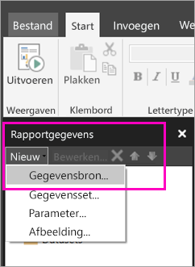

# Een ingesloten gegevensbron voor gepagineerde rapporten maken in de Power BI-service (preview)
In dit artikel leert u hoe u een ingesloten gegevensbron maakt en wijzigt voor een gepagineerd rapport in de Power BI-service. U definieert een ingesloten gegevensbron in een specifiek rapport en gebruikt de bron vervolgens alleen in dat rapport. Momenteel zijn voor rapporten die in de Power BI-service zijn gepubliceerd, ingesloten gegevenssets en ingesloten gegevensbronnen nodig. Gepagineerde rapporten kunnen worden verbonden met deze gegevensbronnen:

- Azure SQL Database en Data Warehouse
- SQL Server
- SQL Server Analysis Services 

Gepagineerde rapporten maken via een gateway verbinding met on-premises gegevensbronnen. U stelt de gateway in nadat u het rapport naar de Power BI-service hebt gepubliceerd. Lees meer over [Power BI-gateways](service-gateway-getting-started.md). 

## Een ingesloten gegevensbron maken
  
1. Open Report Builder.

1. Selecteer **Nieuw** > **Gegevensbron** op de werkbalk in het deelvenster Rapportgegevens. Het dialoogvenster **Eigenschappen van gegevensbron** wordt geopend.

    
  
2.  Typ in het tekstvak **Naam** een naam voor de gegevensbron of accepteer de standaardwaarde.  
  
3.  Selecteer **Een ingesloten verbinding in mijn rapport gebruiken**.  
  
1.  Selecteer een type gegevensbron in de lijst **Verbindingstype selecteren**. 

1.  Geef op een van de volgende manieren een verbindingsreeks op:  
  
    -   Typ de verbindingsreeks rechtstreeks in het tekstvak **Verbindingsreeks**. 
  
    -   Selecteer de expressieknop (**fx)** om een expressie te maken die een verbindingsreeks oplevert. Typ de expressie in het deelvenster Expressie van het dialoogvenster **Expressie**. Selecteer **OK**. 
  
    -   Selecteer **Bouwen** om het dialoogvenster **Verbindingseigenschappen** te openen voor de gegevensbron die u hebt gekozen in stap 2.  
  
        Vul de velden in het dialoogvenster **Verbindingseigenschappen** in op basis van het type gegevensbron. Voorbeelden van eigenschappen van de verbinding zijn het type van de gegevensbron, de naam van de gegevensbron en de te gebruiken referenties. Nadat u waarden hebt opgegeven in dit dialoogvenster, selecteert u **Verbinding testen** om te controleren of de gegevensbron beschikbaar is en of de opgegeven referenties juist zijn.  
  
4.  Selecteer **Referenties**.  
  
     Geef de referenties op die u wilt gebruiken voor deze gegevensbron. De eigenaar van de gegevensbron kiest welke typen referenties worden ondersteund. Zie [Specify Credential and Connection Information for Report Data Sources](https://docs.microsoft.com/sql/reporting-services/report-data/specify-credential-and-connection-information-for-report-data-sources) (Referentie en verbindingsgegevens opgeven voor rapportgegevensbronnen) voor meer informatie.
  
5.  Selecteer **OK**.  
  
     De gegevensbron wordt weergegeven in het deelvenster Rapportgegevens.  

## Volgende stappen

- [Een ingesloten gegevensset maken voor een gepagineerd rapport in de Power BI-service](paginated-reports-create-embedded-dataset.md)
- [Wat zijn gepagineerde rapporten in Power BI Premium? (Preview)](paginated-reports-report-builder-power-bi.md)