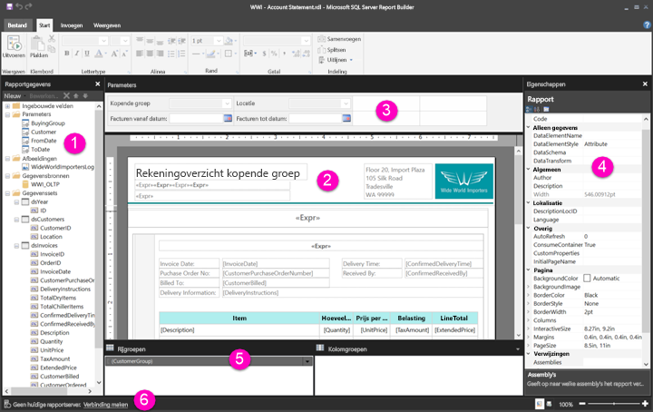

# Navigeren in de ontwerpweergave voor rapporten voor gepagineerde rapporten (preview)

De ontwerpweergave voor rapporten in Report Builder is het ontwerpoppervlak voor het maken van gepagineerde rapporten die u kunt publiceren in de Power BI-service. Het ontwerpoppervlak bevindt zich in het midden van Report Builder, met het lint en deelvensters eromheen. Het ontwerpoppervlak is waar u rapportitems toevoegt en ordent. In dit artikel worden de deelvensters beschreven die u gebruikt voor het toevoegen, selecteren en ordenen van de rapportbronnen, en voor het wijzigen van eigenschappen van rapportitems.  

1. [Deelvenster Rapportgegevens](#report-data-pane) 
2. [Ontwerpoppervlak voor rapporten](#report-design-surface)  
3. [Deelvenster Parameters](#parameters-pane) 
4. [Deelvenster Eigenschappen](#properties-pane) 
5. [Deelvenster Groeperen](#grouping-pane) 
6. [Statusbalk huidige rapport](#current-report-status-bar)  
  
## 1 Deelvenster Rapportgegevens  
 Gebruik het deelvenster Rapportgegevens voor het definiëren van de rapportgegevens en rapportbronnen die u nodig hebt voor een rapport voordat u de indeling van uw rapport gaat ontwerpen. Zo kunt u bijvoorbeeld gegevensbronnen, gegevenssets, berekende velden, rapportparameters en afbeeldingen toevoegen aan het deelvenster Rapportgegevens.  
  
 Nadat u items hebt toegevoegd aan het deelvenster Rapportgegevens, sleept u velden naar rapportitems in het ontwerpoppervlak om te bepalen waar gegevens in het rapport worden weergegeven.  
  
> [!TIP]  
>  Als u een veld rechtstreeks vanuit het deelvenster Rapportgegevens naar het ontwerpoppervlak van het rapport sleept in plaats van het veld in een gegevensgebied zoals een tabel of grafiek te plaatsen, ziet u bij het uitvoeren van het rapport alleen de eerste waarde van de gegevens in dat veld.  
  
 U kunt ook ingebouwde velden vanuit het deelvenster Rapportgegevens naar het ontwerpoppervlak van het rapport slepen. Wanneer deze velden vervolgens worden weergegeven, geven ze informatie over het rapport, zoals de naam van het rapport, het totale aantal pagina's in het rapport en het huidige paginanummer.  
  
 Sommige dingen worden automatisch toegevoegd aan het deelvenster Rapportgegevens wanneer u iets toevoegt aan het ontwerpoppervlak van het rapport. Als u bijvoorbeeld een afbeelding insluit in uw rapport, wordt deze toegevoegd aan de map Images in het deelvenster Rapportgegevens.  
  
> [!NOTE]  
>  Met de knop **Nieuw** kunt u een nieuw item toevoegen aan het deelvenster Rapportgegevens. U kunt meerdere gegevenssets uit dezelfde gegevensbron of uit andere gegevensbronnen toevoegen aan het rapport. Als u een nieuwe gegevensset uit dezelfde gegevensbron wilt toevoegen, klikt u met de rechtermuisknop op een gegevensbron > **Gegevensset toevoegen**.  
  
## 2 Ontwerpoppervlak voor rapporten  
 Het ontwerpoppervlak voor rapporten van Report Builder is het belangrijkste werkgebied voor het ontwerpen van uw rapporten. Als u rapportitems wilt opnemen in uw rapport, zoals gegevensgebieden, subrapporten, tekstvakken, afbeeldingen, rechthoeken en lijnen, voegt u het gewenste item vanaf het lint of vanuit de galerie met rapportonderdelen toe aan het ontwerpoppervlak voor het rapport. Daar kunt u groepen, expressies, parameters, filters, acties, zichtbaarheid en opmaak toevoegen aan uw rapportitems.  
  
 U kunt ook de volgende eigenschappen wijzigen:  
  
-   De eigenschappen van de rapporthoofdtekst, zoals de randkleur en opvullingskleur, door met de rechtermuisknop op het witte gedeelte van het ontwerpoppervlak te klikken, niet op een rapportitem, en **Eigenschappen van hoofdtekst** te selecteren.  
  
-   De eigenschappen van de kop- en voettekst, zoals de randkleur en opvullingskleur, door met de rechtermuisknop in het koptekst- of voettekstgebied op het witte gedeelte van het ontwerpoppervlak te klikken, niet op een rapportitem, en **Eigenschappen van koptekst** of **Eigenschappen van voettekst** te selecteren.  
  
-   De eigenschappen van het rapport zelf, zoals de pagina-instelling, door met de rechtermuisknop op het grijze gebied rond het ontwerpoppervlak te klikken en **Rapporteigenschappen** te selecteren.  
  
-   De eigenschappen van rapportitems door er met de rechtermuisknop op te klikken en **Eigenschappen** te selecteren.  
  
### Grootte en afdrukgebied van ontwerpoppervlak  
De grootte van het ontwerpoppervlak kan afwijken van het afdrukgebied van het paginaformaat dat u opgeeft voor het afdrukken van het rapport. Het wijzigen van de grootte van het ontwerpoppervlak heeft geen gevolgen voor het afdrukgebied van uw rapport. Ongeacht de grootte die u instelt voor het afdrukgebied van uw rapport, blijft de volledige grootte van het ontwerpoppervlak ongewijzigd. Zie Rendering Behaviors (Rendering-gedrag) voor meer informatie. 
  
- U kunt de liniaal weergeven door op het tabblad **Weergave** het selectievakje **Liniaal** in te schakelen.  
  
## 3 Deelvenster Parameters  
 Met behulp van rapportparameters kunt u rapportgegevens beheren, gerelateerde rapporten met elkaar verbinden en de presentatie van rapporten variëren. Het deelvenster Parameters biedt een flexibele lay-out voor de rapportparameters.  
  
 Lees meer over rapportparameters   
  
## 4 Deelvenster Eigenschappen
 Elk item in een rapport, waaronder gegevensregio's, afbeeldingen, tekstvakken en de hoofdtekst van het rapport zelf, heeft eigenschappen. Zo geeft bijvoorbeeld de eigenschap BorderColor voor een tekstvak de kleurwaarde van de rand van het tekstvak aan en de eigenschap PageSize voor het rapport de paginagrootte van het rapport.  
  
 Deze eigenschappen worden weergegeven in het deelvenster Eigenschappen. De eigenschappen in het deelvenster veranderen afhankelijk van het rapportitem dat u selecteert.  
  
- U kunt het deelvenster Eigenschappen weergeven door op het tabblad **Weergave** naar de groep **Weergeven/verbergen** te gaan en **Eigenschappen** te kiezen.  
  
### Waarden van eigenschappen wijzigen  
 In Report Builder kunt u de eigenschappen voor rapportitems op verschillende manieren wijzigen:  
  
-   Door knoppen en lijsten op het lint te selecteren.  
  
-   Door instellingen in dialoogvensters te wijzigen.  
  
-   Door waarden van eigenschappen te wijzigen in het deelvenster Eigenschappen.  
  
 De meest gebruikte eigenschappen zijn beschikbaar in de dialoogvensters en op het lint.  
  
 Afhankelijk van de eigenschap kunt u een waarde voor de eigenschap selecteren in een vervolgkeuzelijst, de waarde typen of `<Expression>` selecteren om een expressie te maken.  
  
### De weergave van het deelvenster Eigenschappen wijzigen  
 Eigenschappen in het deelvenster Eigenschappen worden standaard ingedeeld in categorieën, zoals Actie, Rand, Opvulling, Lettertype en Algemeen. Elke categorie is gekoppeld aan een set eigenschappen. De volgende eigenschappen worden bijvoorbeeld vermeld in de categorie Font: Color, FontFamily, FontSize, FontStyle, FontWeight, LineHeight en TextDecoration. Als u dat liever hebt, kunt u alle eigenschappen die worden vermeld in het deelvenster ook alfabetisch sorteren. Hiermee verwijdert u de categorieën en ziet u een lijst met alle eigenschappen in alfabetische volgorde, ongeacht de categorie.  
  
 Het deelvenster Eigenschappen heeft drie knoppen bovenaan het deelvenster: **Categorie**, **Alfabetisch sorteren** en **Eigenschappen**. Selecteer de knoppen Categorie en Alfabetiseren om te schakelen tussen de weergaven van het deelvenster Eigenschappen. Selecteer de knop **Eigenschappenblad** om het dialoogvenster Eigenschappen voor een geselecteerde rapportitem te openen.  
  
  
## 5 Deelvenster Groeperen

 Groepen worden gebruikt om uw rapportgegevens te ordenen in een visuele hiërarchie en om totalen te berekenen. U kunt de rij- en kolomgroepen in een gegevensgebied weergeven in het ontwerpoppervlak en ook in het deelvenster Groeperen. Het deelvenster Groeperen heeft twee deelvensters: Rijgroepen en Kolomgroepen. Wanneer u een gegevensgebied selecteert, worden in het deelvenster Groeperen alle groepen uit die gegevensregio weergegeven als een hiërarchische lijst: Onderliggende groepen worden ingesprongen weergegeven onder de bovenliggende groepen.  
  
 U kunt groepen maken door velden vanuit het deelvenster Rapportgegevens te slepen naar het ontwerpoppervlak of het deelvenster Groeperen. In het deelvenster Groeperen kunt u de bovenliggende, aangrenzende en onderliggende groepen toevoegen, groepseigenschappen wijzigen en groepen verwijderen.  
  
 Het deelvenster Groeperen wordt standaard weergegeven, maar u kunt het sluiten door het selectievakje Deelvenster Groeperen op het tabblad Weergave uit te schakelen. Het deelvenster Groeperen is niet beschikbaar voor de gegevensgebieden Grafiek en Meter.  
  
 Zie Grouping Pane (Het deelvenster Groeperen) en Understanding Groups (Wat zijn groepen) voor meer informatie.  
  
## 6 Statusbalk huidige rapport

De statusbalk voor het huidige rapport bevat de naam van de server waarmee het rapport is verbonden of er wordt "Geen huidige rapportserver" weergegeven. Selecteer **Verbinding maken** om verbinding te maken met een server.

## Volgende stappen

[Wat zijn gepagineerde rapporten in Power BI Premium? (Preview)](paginated-reports-report-builder-power-bi.md) 

  
  
