# De grootte van een rapportpagina wijzigen
In het [vorige artikel en de video](power-bi-report-display-settings.md) hebt u twee verschillende manieren gezien om de paginaweergave in Power BI-rapporten te bepalen: **Weergave** en **Paginagrootte**. Paginaweergave en paginagrootte zijn beschikbaar in Power BI-service en Power BI Desktop, welke bijna identiek zijn qua uiterlijk en functioneren, maar voor deze zelfstudie maken we gebruik van Power BI-service.

### Vereisten
- Power BI-service   
- [Voorbeeld van een retailanalyse](sample-retail-analysis.md)

## Laten we eerst de pagina Weergave-instelling wijzigen

1. Open het rapport in de lees- of bewerkweergave en selecteer het rapporttabblad voor **Nieuwe winkels**. Deze rapportpagina wordt standaard weergegeven met behulp van de instelling **Passend op pagina**.  In dit geval geeft Passend op pagina de rapportpagina weer zonder schuifbalken, maar sommige details en titels zijn te klein om te lezen.

   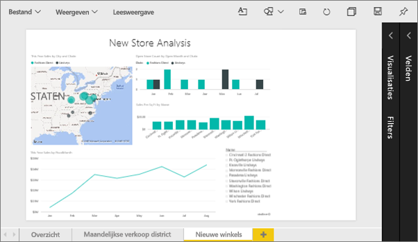
2. Zorg dat er geen visualisaties zijn ingeschakeld op het canvas. Selecteer **Weergave** en bekijk de weergaveopties.

   * In de Leesweergave ziet u dit.

     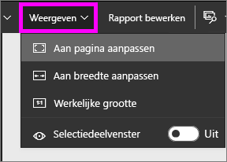
   * In de Bewerkweergave ziet u dit.

     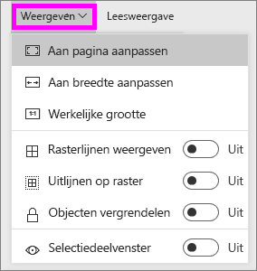

3. Laten we kijken hoe de pagina eruit ziet met de instelling **Ware grootte** .

   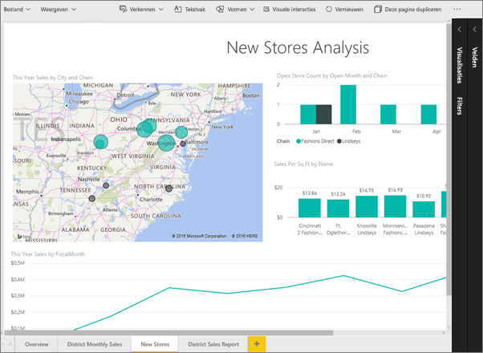

   Niet geweldig, het dashboard heeft nu dubbele schuifbalken.
4. Schakel over naar **Aan breedte aanpassen**.

   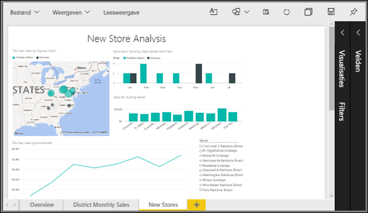

   Het ziet er beter uit nu we schuifbalken hebben, is het makkelijker om de details te lezen.

## De standaardweergave voor een rapportpagina wijzigen
Als u *auteur* van het rapport bent, kunt u de standaardweergave voor uw rapportpagina’s wijzigen. Wanneer u het rapport met anderen deelt, worden de rapportpagina's geopend met behulp van de weergave die u hebt ingesteld. *Gebruikers* van het rapport kunnen de weergave wijzigen, maar kunnen hun wijzigingen niet opslaan als ze het rapport afsluiten.

1. Op de pagina **Nieuwe winkels** van het rapport gaat u terug naar de weergave **Ware grootte**.

   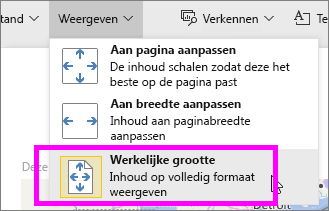

2. Stel op de rapportpagina **Maandelijkse verkoop per district** de weergave in op **Passend in breedte**.

3. Laat op de rapportpagina **Overzicht** de standaardinstelling voor de weergave ongewijzigd.

4. Sla nu het rapport op door **Bestand > Opslaan** te selecteren. De volgende keer dat u dit rapport opent worden de pagina's weergegeven met de nieuwe weergave-instellingen. Laten we eens kijken.

   
3. Selecteer de naam van de huidige werkruimte in de bovenste navigatiebalk om terug te keren naar deze werkruimte.  

   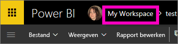
4. Selecteer het tabblad **Rapporten** en kies hetzelfde rapport (Voorbeeld van een retailanalyse).

    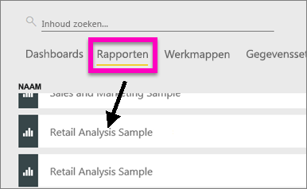
5. Open een pagina van het rapport om de nieuwe instellingen te bekijken.

   

## Nu gaan we de instelling *Paginaformaat* bekijken
De instellingen voor paginagrootte zijn alleen beschikbaar in de [bewerkweergave](service-interact-with-a-report-in-editing-view.md), dus moet u (*auteurs-* of) bewerkmachtigingen voor het rapport te wijzigen van de instellingen voor paginagrootte. Als u verbonden bent met een van onze [voorbeelden](sample-datasets.md), dan hebt u *auteursmachtigingen* voor deze rapporten.

1. Open de pagina Maandelijkse verkoop per district van het [Voorbeeld van een retailanalyse](sample-retail-analysis.md) in de bewerkweergave.
2. Zorg dat er geen visualisaties zijn ingeschakeld op het canvas.  Selecteer in het deelvenster **Visualisaties** het pictogram van de verfroller .
3. Selecteer **Paginaformaat** &gt; **Type** om de opties voor paginaformaat weer te geven.

   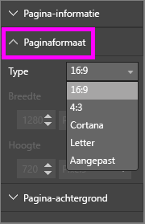
4. Selecteer **Letter**.  Op het canvas blijft alleen de inhoud die binnen 816 x 1056 pixels (lettergrootte) op het witte gedeelte van het canvas past zichtbaar.

   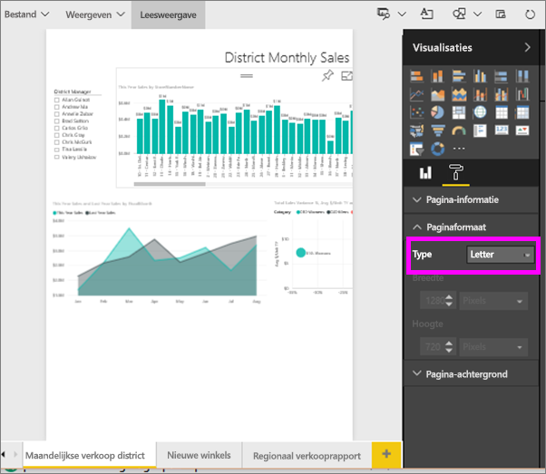
5. Selecteer **Paginaformaat** **16:9**-verhouding.

   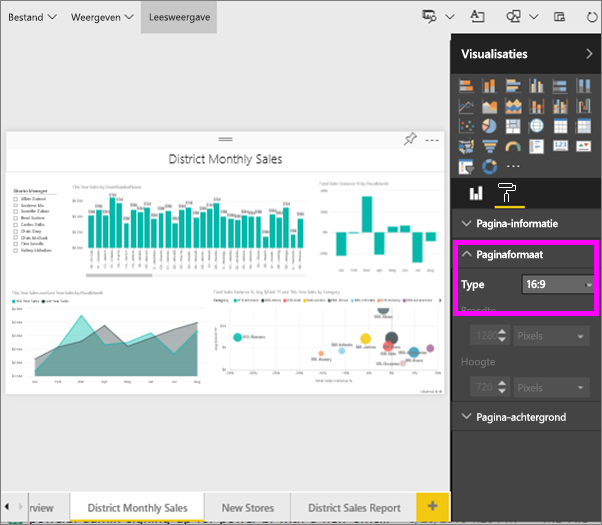

   De rapportpagina wordt weergegeven met een verhouding van 16 breed bij 9 hoog. Om de werkelijke pixelgrootte te zien die wordt gebruikt, kijkt u naar de velden met een grijze achtergrond Breedte en Hoogte (1280x720). Er is veel lege ruimte rond het rapportcanvas. Dit komt omdat we eerder de **Weergave** op Passend in breedte hebben ingesteld.
7. Ga verder met het verkennen van de opties voor **Paginaformaat**.

## Paginaweergave en paginagrootte samen gebruiken
Gebruik Paginaweergave en Paginagrootte samen om een rapport te maken dat het beste wordt weergegeven wanneer deze wordt gedeeld met collega’s of in een andere toepassing wordt opgenomen.

In deze oefening maakt u een rapportpagina die wordt weergegeven in een toepassing die ruimte heeft voor 500 pixels breed bij 750 pixels hoog.

Vergeet niet dat u in de vorige stap hebt gezien dat onze rapportpagina momenteel wordt weergegeven op 1280 breed bij 720 hoog. We weten dus dat we heel wat moeten vergroten/verkleinen en herschikken als we willen dat al onze visuele elementen passen.

1. Vergroot of verklein de visuele elementen zodat ze in minder dan de helft van het huidige tekengebied passen.

    
2. Selecteer **Paginaformaat** &gt; **Aangepast**.
3. Stel de breedte in op 500 en de hoogte op 750.

    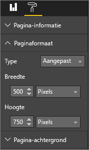
4. Wijzig de rapportagepagina totdat deze er het beste uitziet. Schakel tussen **Weergave > Ware grootte** en **Weergave > Passend op pagina** om wijzigingen door te voeren.

    

## Volgende stappen
[Rapporten voor Cortana maken](service-cortana-answer-cards.md)

Terug naar [Instellingen voor de paginaweergave in een Power BI-rapport](power-bi-report-display-settings.md)

Hebt u nog vragen? [Misschien dat de Power BI-community het antwoord weet](http://community.powerbi.com/)
