# Aangepaste visualisaties in Power BI

Bij het maken of bewerken van een Power BI-rapport kunt u kiezen uit allerlei verschillende soorten visualisaties. Deze visualisaties worden weergeven in het deelvenster **Visualisaties**. Wanneer u [Power BI Desktop](https://powerbi.microsoft.com/desktop/) downloadt of de [Power BI-service](https://app.powerbi.com) opent, ziet u standaard deze visuals.

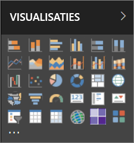

Maar u bent niet beperkt tot deze set visuals. Als u het beletselteken selecteert, krijgt u toegang tot een andere bron van rapportvisuals: *aangepaste visuals*.

Aangepaste visuals worden door ontwikkelaars gemaakt, met behulp van de SDK voor aangepaste visuals, zodat zakelijke gebruikers hun gegevens kunnen bekijken op de manier die het beste bij hun bedrijf past. Auteurs van rapporten kunnen de bestanden met aangepaste visuals vervolgens in hun rapporten importeren en op dezelfde manier gebruiken als alle andere Power BI-visuals. Aangepaste visuals zijn zeer belangrijke elementen in Power BI en kunnen worden gefilterd, gemarkeerd, bewerkt, gedeeld enzovoort.

Aangepaste visuals kunnen worden geïmplementeerd in drie verschillende vormen:

* Bestanden met aangepaste visuals
* Organisatievisuals
* Visuals uit de marketplace

## Bestanden met aangepaste visuals

Aangepaste visuals zijn pakketten met code voor het renderen van de gegevens die ze ontvangen. Iedereen kan een aangepaste visual maken en die inpakken als één `.pbiviz`-bestand dat in een Power BI-rapport kan worden geïmporteerd.

> [!WARNING]
> Een aangepaste visual kan code bevatten met beveiligings- of privacyrisico's. Ga na of u de auteur en de bron van de aangepaste visual vertrouwt voordat u de visual in uw rapport importeert.

## Organisatievisuals

Power BI-beheerders kunnen aangepaste visuals in hun organisatie implementeren, zodat auteurs van rapporten de aangepaste visuals die door de beheerder zijn goedgekeurd voor gebruik binnen de organisatie, gemakkelijk kunnen vinden en gebruiken. De beheerder heeft dan de controle om te kiezen welke specifieke aangepaste visuals in de organisatie worden geïmplementeerd, en tevens kan hij die visuals gemakkelijk beheren (bijvoorbeeld versie bijwerken, inschakelen/uitschakelen). De auteur van het rapport kan zo eenvoudig visuals vinden die uniek zijn voor de organisatie. Bovendien biedt deze mogelijkheid naadloze ondersteuning bij het bijwerken van die visuals.

[Raadpleeg de informatie over visuals voor organisaties](power-bi-custom-visuals-organization.md) als u meer wilt weten over aangepaste visuals voor organisaties.

## Visuals uit de marketplace

Microsoft en leden van de community hebben met hun aangepaste visuals een bijdrage geleverd ten behoeve van het algemeen belang en hebben deze gepubliceerd op de [AppSource](https://appsource.microsoft.com/marketplace/apps?product=power-bi-visuals)-marketplace. Deze visualisaties kunnen worden gedownload en toegevoegd aan Power BI-rapporten. Al deze aangepaste visuals zijn door Microsoft getest en goedgekeurd op het gebied van functionaliteit en kwaliteit.

Wat is [AppSource](developer/office-store.md)? Hier vindt u apps, invoegtoepassingen en uitbreidingen voor uw Microsoft-software. [AppSource](https://appsource.microsoft.com/) is de plek waar miljoenen gebruikers van producten zoals Office 365, Azure, Dynamics 365, Cortana en Power BI oplossingen vinden die hen helpen efficiënter, slimmer of netter te werken.

### Gecertificeerde visuals

Visuals die zijn gecertificeerd voor Power BI, komen uit de marketplace en zijn extra uitvoerig getest op kwaliteit en worden ondersteund in aanvullende scenario's, zoals [e-mailabonnementen](https://docs.microsoft.com/power-bi/service-report-subscribe) en [exporteren naar PowerPoint](https://docs.microsoft.com/power-bi/service-publish-to-powerpoint).
Zie [Getting a custom visual certified](https://docs.microsoft.com/power-bi/power-bi-custom-visuals-certified) (Aangepaste visualisaties insturen voor certificering) voor de lijst met gecertificeerde aangepaste visualisaties. Hier leest u ook hoe u uw eigen aangepaste visualisaties kunt insturen.

Bent u een webontwikkelaar en bent u geïnteresseerd in het maken van uw eigen visualisaties en wilt u deze toevoegen aan AppSource? Zie [Een aangepaste visual voor Power BI ontwikkelen](developer/custom-visual-develop-tutorial.md) als u wilt weten hoe u [aangepaste visuals naar AppSource kunt publiceren](https://appsource.microsoft.com/marketplace/apps?product=power-bi-visuals).

### Een aangepaste visual vanuit een bestand importeren

1. Selecteer het beletselteken (...) onder aan het deelvenster Visualisaties.

    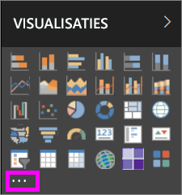

2. Selecteer **Importeren vanuit bestand** in de vervolgkeuzelijst.

    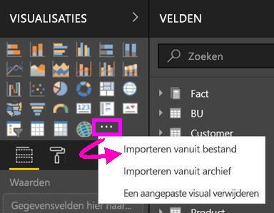

3. Selecteer in het menu Bestand openen het `.pbiviz`-bestand dat u wilt importeren en selecteer vervolgens Openen. Het pictogram voor de aangepaste visualisatie wordt toegevoegd aan de onderkant van het deelvenster Visualisaties en is nu beschikbaar voor gebruik in uw rapport.

    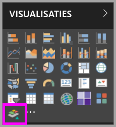

### Organisatievisuals importeren

1. Selecteer het beletselteken (...) onder aan het deelvenster Visualisaties.

    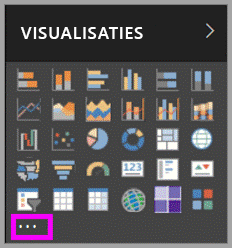

2. Selecteer Importeren uit de marketplace in de vervolgkeuzelijst.

    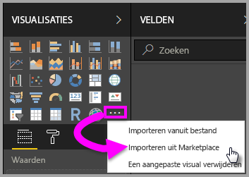

3. Selecteer **MIJN ORGANISATIE** in het menu met tabbladen bovenaan.

    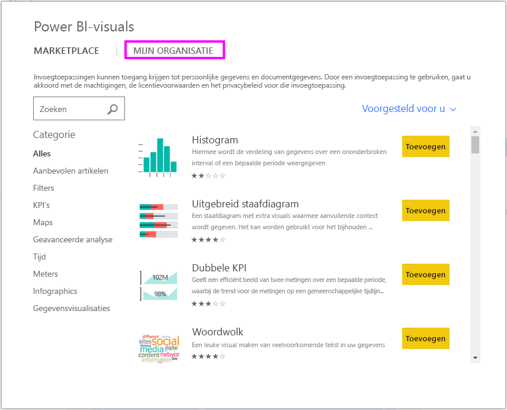

4. Blader door de lijst om de visualisatie te vinden die u wilt importeren.

    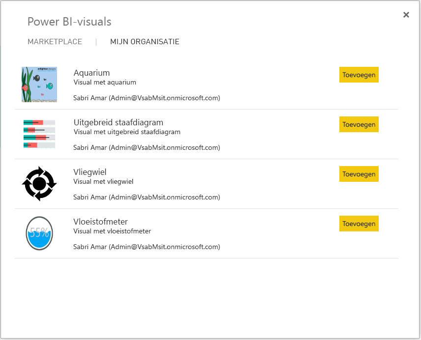

5. Importeer de aangepaste visualisatie door **Toevoegen** te selecteren. Het pictogram voor de aangepaste visualisatie wordt toegevoegd aan de onderkant van het deelvenster Visualisaties en is nu beschikbaar voor gebruik in uw rapport.

    

## Aangepaste visualisaties downloaden of importeren uit Microsoft AppSource

Er zijn twee manieren om aangepaste visualisaties te downloaden en te importeren; vanuit Power BI en vanaf de AppSource-website.

### Aangepaste visualisaties importeren vanuit Power BI

1. Selecteer het beletselteken (...) onder aan het deelvenster Visualisaties.

    

2. Selecteer **Importeren uit de marketplace** in de vervolgkeuzelijst.

    

3. Blader door de lijst om de visualisatie te vinden die u wilt importeren.

    

4. Als u meer wilt weten over een van de visualisaties, selecteert u deze.

    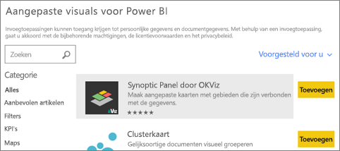

5. Op de detailpagina kunt u vervolgens schermafbeeldingen, video's, gedetailleerde beschrijvingen en meer bekijken.

    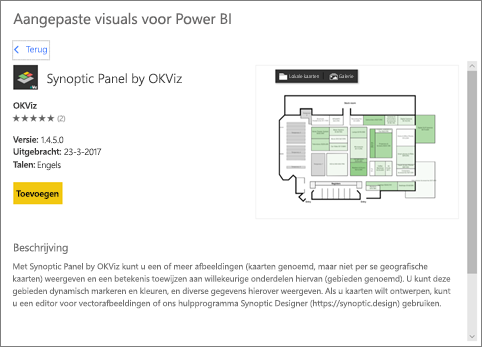

6. Schuif naar beneden om beoordelingen te bekijken.

    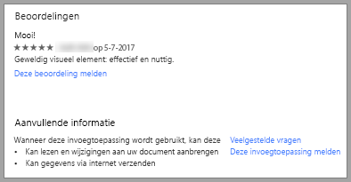

7. Importeer de aangepaste visualisatie door Toevoegen te selecteren. Het pictogram voor de aangepaste visualisatie wordt toegevoegd aan de onderkant van het deelvenster Visualisaties en is nu beschikbaar voor gebruik in uw rapport.

    

### Aangepaste visualisaties downloaden en importeren uit Microsoft AppSource

1. Ga naar [Microsoft AppSource](https://appsource.microsoft.com) en selecteer het tabblad **Apps**.

    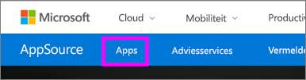

2. Ga naar de[overzichtspagina met apps](https://appsource.microsoft.com/marketplace/apps), waar de belangrijkste apps voor elke categorie worden weergegeven, inclusief *Power BI-apps*. Maar we zijn op zoek naar aangepaste visualisaties, dus verfijnen we de resultaten door in de lijst met invoegtoepassingen aan de linkerkant **Power BI visuals** te selecteren.

    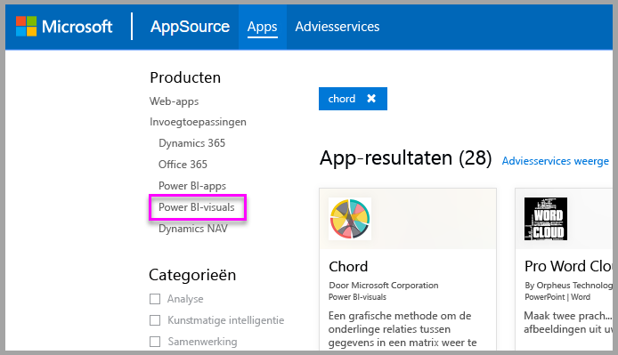

3. In AppSource ziet u nu een tegel voor elke aangepaste visualisatie.  Elke tegel bevat een momentopname van de aangepaste visualisatie, plus een korte beschrijving en een downloadkoppeling. Selecteer de tegel als u meer informatie wilt bekijken.

    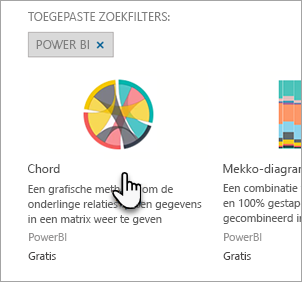

4. Op de detailpagina kunt u vervolgens schermafbeeldingen, video's, gedetailleerde beschrijvingen en meer bekijken. Download de aangepaste visual door **Nu downloaden** te selecteren en vervolgens akkoord te gaan met de gebruiksvoorwaarden.

    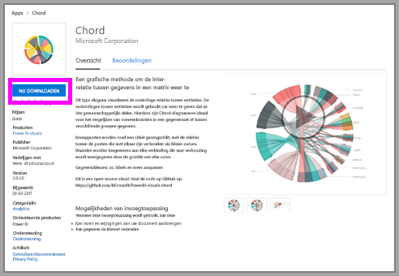

5. Selecteer de koppeling om de aangepaste visualisatie te downloaden.

    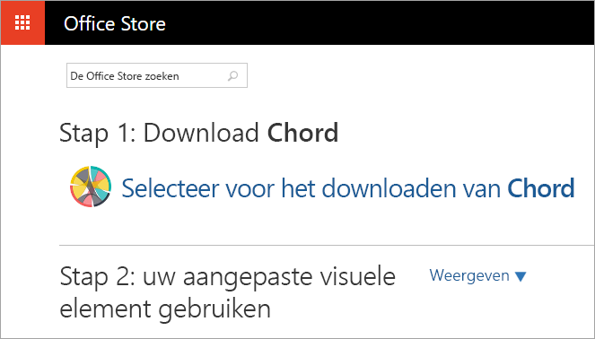

    De downloadpagina bevat ook instructies voor het importeren van de aangepaste visual in Power BI Desktop en de Power BI-service.

    U kunt ook een voorbeeldrapport downloaden waarin de mogelijkheden van de aangepaste visualisatie worden gedemonstreerd.

    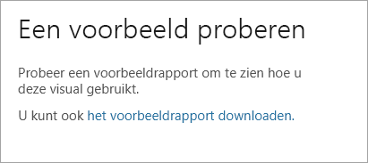

6. Sla het .pbiviz-bestand op en open vervolgens Power BI.

7. Importeer het .pbiviz-bestand in uw rapport (zie de sectie [Aangepaste visuals importeren vanuit een bestand](#import-a-custom-visuals-from-a-file) hierboven)

## Overwegingen en beperkingen

* Een aangepaste visualisatie wordt bij het importeren toegevoegd aan een specifiek rapport. Als u de visualisatie in een ander rapport wilt gebruiken, moet u de visualisatie ook in dat rapport importeren. Wanneer een rapport met een aangepaste visualisatie wordt opgeslagen met de optie **Opslaan als**, wordt er een kopie van de aangepaste visualisatie opgeslagen met het nieuwe rapport.

* Als u geen deelvenster **Visualisaties** ziet, betekent dit dat u niet bevoegd bent om het rapport te bewerken.  U kunt alleen aangepaste visualisaties toevoegen aan rapporten die u kunt bewerken, niet aan rapporten die met u zijn gedeeld.

## Problemen oplossen

Ga naar [Problemen met aangepaste visuals voor Power BI oplossen](power-bi-custom-visuals-troubleshoot.md) voor informatie over het oplossen van problemen.

## Veelgestelde vragen

Voor meer informatie en antwoorden op vragen gaat u naar [Veelgestelde vragen over aangepaste visuals voor Power BI](power-bi-custom-visuals-faq.md#organizational-custom-visuals).

## Volgende stappen

* [Visualisaties in Power BI](visuals/power-bi-report-visualizations.md)

Hebt u nog vragen? [Misschien dat de Power BI-community het antwoord weet](http://community.powerbi.com/).
