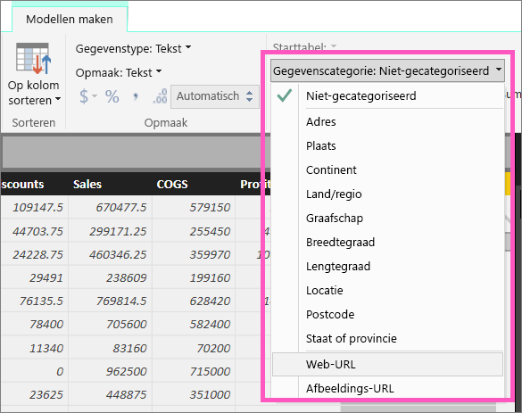
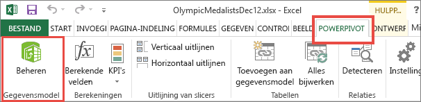
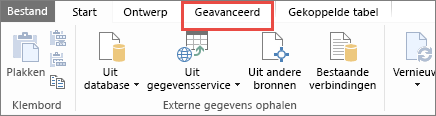
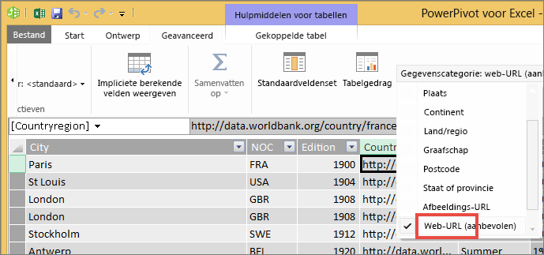

# Hyperlinks in tabellen
In dit onderwerp leert u hoe u met Power BI Desktop hyperlinks kunt maken. Zodra u een hyperlink hebt gemaakt, kunt u deze met Power BI Desktop of de Power BI-service toevoegen aan uw rapporttabellen en -matrices. 

> **OPMERKING**: Hyperlinks in [tegels op dashboards](service-dashboard-edit-tile.md) en [tekstvakken op dashboards](service-dashboard-add-widget.md) kunnen direct met de Power BI-service worden gemaakt. Hyperlinks in [tekstvakken in rapporten](service-add-hyperlink-to-text-box.md) kunnen direct worden gemaakt met de Power BI-service en Power BI Desktop.
> 
> 

## Een hyperlink maken in een tabel of matrix met Power BI Desktop
Hyperlinks in tabellen en matrices kunnen worden gemaakt met Power BI Desktop, niet met de Power BI-service. Hyperlinks kunnen ook worden gemaakt in Excel Power Pivot voordat de werkmap wordt geïmporteerd in Power BI. Beide methoden worden hieronder beschreven.

## Een hyperlink in een tabel of matrix maken in Power BI Desktop
De procedure voor het toevoegen van een hyperlink is afhankelijk van of u de gegevens hebt geïmporteerd of hiermee verbinding maakt met DirectQuery. Beide scenario's worden hieronder beschreven.

### Voor gegevens die zijn geïmporteerd in Power BI
1. Als de hyperlink niet al als een veld in uw gegevensset bestaat, gebruikt u Desktop om de hyperlink toe te voegen als een [aangepaste kolom](desktop-common-query-tasks.md).
2. Selecteer de kolom in de gegevensweergave en kies in het tabblad **Modellering** de vervolgkeuzelijst voor **Gegevenscategorie**.
   
    
3. Selecteer **Web-URL**.
4. Schakel over naar de rapportweergave en maak een tabel of matrix waarbij u het veld markeert als een Web-URL. De hyperlinks worden blauw en onderstreept.
    
> **OPMERKING**: de URL's moeten beginnen met **http://, https://** of **www**.
> 
>   
5. Als u geen lange URL in een tabel wilt weergeven, kunt u in plaats daarvan een hyperlinkpictogram  weergeven. Houd er rekening mee dat u pictogrammen niet in matrices kunt weergeven.
   
   * Selecteer het diagram om het te activeren.
   * Selecteer het pictogram met de verfroller  om het tabblad Opmaak te openen.
   * Vouw **Waarden** uit, zoek **URL-pictogram** en stel deze in op **Aan.**
6. (Optioneel) [Publiceer het rapport vanuit Desktop naar de Power BI-service](guided-learning/publishingandsharing.yml?tutorial-step=2) en open het rapport in de Power BI-service. De hyperlinks werken hier ook.

### Voor gegevens die zijn verbonden met DirectQuery
U kunt geen nieuwe kolom maken in de DirectQuery-modus.  Als uw gegevens al URL's bevatten, kunt u deze omzetten in hyperlinks.

1. Maak in de rapportweergave een tabel met een veld met URL's.
2. Selecteer de kolom en kies in het tabblad **Modellering** de vervolgkeuzelijst voor **Gegevenscategorie**.
3. Selecteer **Web-URL**. De hyperlinks worden blauw en onderstreept.
4. (Optioneel) [Publiceer het rapport vanuit Desktop naar de Power BI-service](guided-learning/publishingandsharing.yml?tutorial-step=2) en open het rapport in de Power BI-service. De hyperlinks werken hier ook.

## Een hyperlink in een tabel of matrix maken in Excel Power Pivot
Een andere manier om hyperlinks toe te voegen aan uw Power BI-tabellen en -matrices is het maken van de hyperlinks in de gegevensset voordat u deze gegevensset uit Power BI importeert of hiermee verbinding maakt. In dit voorbeeld wordt een Excel-werkmap gebruikt.

1. Open de werkmap in Excel.
2. Selecteer het tabblad **PowerPivot** en kies vervolgens **Beheren**.
   
   
3. Als PowerPivot wordt geopend, selecteert u het tabblad **Geavanceerd**.
   
   
4. Plaats de cursor in de kolom met de URL's die u wilt omzetten in hyperlinks in Power BI-tabellen.
   
   > **OPMERKING**: de URL's moeten beginnen met **http://, https://** of **www**.
   > 
   > 
5. Selecteer in de groep **Rapportage-eigenschappen** de vervolgkeuzelijst **Gegevenscategorie** en kies **Web-URL**. 
   
   
6. Maak vanuit de Power BI-service of Power BI Desktop verbinding met deze werkmap of importeer de werkmap.
7. Maak een tabelvisualisatie die het URL-veld bevat.
   
   

## Aandachtspunten en probleemoplossing
V: Kan ik een aangepaste URL gebruiken als hyperlink in een tabel of matrix?    
A: Nee. U kunt een koppelingspictogram gebruiken. Als u aangepaste tekst nodig hebt voor uw hyperlinks en als uw lijst met URL’s kort is, kunt u overwegen om in plaats daarvan een tekstvak te gebruiken.

## Volgende stappen
[Visualisaties in Power BI-rapporten](visuals/power-bi-report-visualizations.md)

[Power BI - basisconcepten](consumer/end-user-basic-concepts.md)

Hebt u nog vragen? [Misschien dat de Power BI-community het antwoord weet](http://community.powerbi.com/)

