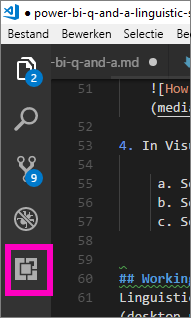
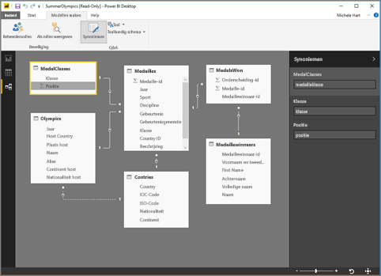
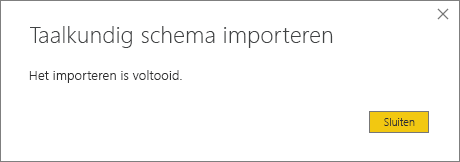

# <a name="language-modeling-and-the-linguistic-schema"></a>Taalmodellen maken en het taalkundige schema 
Normale zinnen en natuurlijke taal gebruiken om informatie uit uw gegevens te kunnen opvragen, is uiterst nuttig. Nog nuttiger is het wanneer uw gegevens antwoorden. Dit is wat u voor elkaar kunt krijgen met Q&A in Power BI. Wanneer u Power BI Q&A een vraag stelt, wordt geprobeerd een zo goed mogelijk antwoord te geven. 

Maar voor nog betere Q&A-interacties kunnen de antwoorden op verschillende manieren worden verbeterd, bijvoorbeeld door het taalkundige schema te bewerken. 

Het begint allemaal met uw zakelijke gegevens.  Hoe beter het gegevensmodel is, hoe eenvoudiger gebruikers antwoorden van een goede kwaliteit kunnen krijgen. Het model kan bijvoorbeeld worden verbeterd door een taalkundig schema toe te voegen dat terminologie en relaties tussen tabellen en kolomnamen in uw gegevensset definieert en categoriseert. Power BI Desktop is de plek waar u uw taalkundige schema’s kunt beheren. 

## <a name="what-is-a-linguistic-schema"></a>Wat is een taalkundig schema
Een taalkundig schema beschrijft termen en frasen die Q&A moet begrijpen voor objecten in een gegevensset, zoals woordsoorten, synoniemen en formuleringen die betrekking hebben op die gegevensset. Wanner u een gegevensset importeert of hiermee verbinding maakt, maakt Power BI een taalkundig schema op basis van de structuur van de gegevensset. Wanneer u Q&A een vraag stelt, wordt gezocht naar overeenkomsten en relaties in de gegevens om de intentie van uw vraag te ontdekken. Er wordt bijvoorbeeld gezocht naar zelfstandige naamwoorden, werkwoorden, bijvoeglijke naamwoorden, formuleringen en andere elementen. Er wordt naar relaties gezocht, zoals welke kolommen objecten van een werkwoord zijn. 

U bent waarschijnlijk bekend met woordsoorten (zie onder als dat niet het geval is), maar formuleringen is mogelijk een nieuwe term voor u.  Een formulering is de manier waarop u de relatie tussen bepaalde dingen formuleert. U kunt bijvoorbeeld de relatie tussen klanten en producten omschrijven als 'klanten die producten kopen'. Of u zegt bijvoorbeeld 'leeftijden die aangeven hoe oud klanten zijn' om de relatie tussen klanten en leeftijden te beschrijven. Of zeg 'klanten hebben telefoonnummers' om de relatie tussen klanten en telefoonnummers te beschrijven.

Deze formuleringen zijn beschikbaar in vele vormen en maten. Een aantal komt direct overeen met relaties in het gegevensmodel. Een aantal koppelt kolommen aan hun ingesloten tabellen. Andere koppelen meerdere tabellen aan kolommen in complexe relaties. In alle gevallen beschrijven formuleringen de relatie tussen zaken aan de hand van dagelijkse termen.

Taalkundige schema's worden opgeslagen in een YAML-indeling. Deze indeling is verwant aan de zeer populaire JSON-indeling maar biedt een flexibelere en eenvoudiger te lezen syntaxis. Taalkundige schema's kunnen worden bewerkt, geëxporteerd en geïmporteerd in Power BI Desktop.

## <a name="prerequisites"></a>Vereisten
- Als u het artikel over [het verbeteren van uw gegevensmodel voor Q&A](desktop-qna-in-reports.md) nog niet hebt gelezen, wilt u dit wellicht eerst doen. Hieraan staan talloze tips voor het ontwerpen en verbeteren van uw gegevensmodel en een belangrijke sectie over het toevoegen van synoniemen.  

- Q&A kent twee kanten.  Ten eerste is er het voorbereiden, of het 'maken van een model'.  Daarnaast is er een deel voor het stellen van vragen en het verkennen van de gegevens, oftewel het 'verbruiken'. Bij een aantal bedrijven zijn mogelijk werknemers als data modeler of IT-beheerder in dienst die de gegevenssets samenstellen, de gegevensmodellen maken en de gegevenssets naar Power BI publiceren.  Er is dan een tweede set werknemers die de gegevens online 'verbruiken'.  Bij andere bedrijven zijn deze rollen wellicht gecombineerd. 

    Dit onderwerp is bedoeld de data modelers. De personen die een gegevensset optimaliseren en de best mogelijke Q&A-resultaten bieden. 

- [.yaml- en .pbix-voorbeeldbestanden](https://go.microsoft.com/fwlink/?linkid=871858)    
- Voor de YAML-bestandseditor raden we [Visual Studio Code](https://code.visualstudio.com/) aan


### <a name="set-up-an-editor-for-yaml-files"></a>Een editor voor YAML-bestanden instellen
U wordt aangeraden Visual Studio Code te gebruiken om YAML-bestanden voor taalkundige schema’s te bewerken. Visual Studio Code bevat kant-en-klare ondersteuning voor YAML-bestanden en kan worden uitgebreid om specifiek de Power BI-indeling voor taalkundige schema’s te valideren.
1. Installeer [Visual Studio Code](https://code.visualstudio.com/).    

2. Selecteer het taalkundige voorbeeldschema dat u eerder hebt opgeslagen: [YAML-bestand](https://go.microsoft.com/fwlink/?linkid=871858) (SummerOlympics.lsdl.yaml).    
4. Selecteer **Visual Studio Code** en **Altijd deze app gebruiken om .yaml-bestanden te openen**.

    

4. Installeer in Visual Studio Code de YAML-ondersteuning van de Red Hat-extensie.

   

    a. Selecteer het tabblad **Extensies** (laatste aan de linkerkant) of druk op CTRL+SHIFT+X.    
        
    b. Zoek 'yaml' en selecteer **YAML-ondersteuning door Red Hat** in de lijst.    
    c. Selecteer **Installeren > Opnieuw laden**.


## <a name="working-with-linguistic-schemas"></a>Werken met taalkundige schema's
Taalkundige schema's kunnen worden bewerkt, geïmporteerd en geëxporteerd in de [weergave Relatie](desktop-relationship-view.md) in Power BI Desktop. Eén manier om een taalkundig schema te bewerken, is [synoniemen toe te voegen in het deelvenster **Synoniemen** ](desktop-qna-in-reports.md). Hiervoor hoeft u het YAML-bestand niet te openen.




 U kunt een taalkundig schema ook bewerken door het YAML-bestand te exporteren en rechtstreeks te bewerken.  Wanneer u het YAML-bestand van een taalkundig schema bewerkt, tagt u kolommen in de tabel als verschillende grammaticale elementen en definieert u woorden die een collega zou kunnen gebruiken om een vraag te formuleren. U vermeldt bijvoorbeeld de kolommen die het onderwerp en het object zijn van het werkwoord en u voegt alternatieve woorden toe die collega’s zouden kunnen gebruiken om naar tabellen, kolommen en meetwaarden in uw model te verwijzen. 


Voordat u een taalkundig schema kunt bewerken, moet u deze openen (exporteren) vanaf Desktop. Wanneer u het YAML-bestand weer op dezelfde locatie opslaat, wordt dit als importeren beschouwd.  Maar u kunt ook andere YAML-bestanden importeren.  Als u bijvoorbeeld een vergelijkbare gegevensset hebt en u al veel tijd hebt besteed aan het toevoegen van woordsoorten, het identificeren van relaties, het maken van formuleringen en het maken van synoniemen. 

Q&A gebruikt al deze informatie in combinatie met eventuele verbetering die u aanbrengt om betere antwoorden te geven, vragen automatisch aan te vullen en vragen samen te vatten.


## <a name="edit-a-linguistic-schema"></a>Taalkundig schema bewerken
Wanneer u eerst uw taalkundige schema vanaf Desktop exporteert, wordt de inhoud in het bestand grotendeels of volledig automatisch gegenereerd door de Q&A-engine. Deze gegenereerde entiteiten, woorden (synoniemen), relaties en formuleringen worden aangeduid met de tag **Status: gegenereerd** en worden vooral ter informatie in het bestand ingesloten, maar kunnen ook een nuttig beginpunt zijn voor uw eigen wijzigingen. 

> [!NOTE]
> Het YAML-voorbeeldbestand in deze zelfstudie bevat niet de tags **Status: gegenereerd** of **Status: verwijderd** aangezien deze speciaal zijn voorbereid voor deze zelfstudie. Als u deze tags wilt zien, opent u een onbewerkt .pbix-bestand in de weergave Relatie en exporteert u het taalkundige schema.


Wanneer u uw taalkundige schemabestand weer naar Power BI Desktop importeert, worden alle elementen met de markering **Status: gegenereerd** genegeerd (en later opnieuw gegenereerd), dus als u gegenereerde inhoud wilt wijzigen, moet u ook de bijbehorende tag **Status: gegenereerd** verwijderen. Evenzo moet u, als u gegenereerde inhoud wilt verwijderen, de tag **Status: gegenereerd** wijzigen in **Status: verwijderd**, zodat deze niet opnieuw wordt gegenereerd wanneer u uw taalkundige schemabestand importeert.

1. Open de gegevensset in de *relatieweergave* in Power BI Desktop. 
2. Selecteer het tabblad **Model maken** en kies **Taalkundig schema exporteren**.
3. Selecteer Visual Code (of een andere editor).
4. Make uw bewerkingen en sla het YAML-bestand op.
5. Selecteer vanaf Desktop **de weergave Relatie > het tabblad Model maken > Taalkundig schema > Taalkundig schema importeren**.
6. Navigeer naar de locatie waar u het bewerkte YAML-bestand hebt opgeslagen en selecteer het. Een bevestigingsbericht vertelt u dat het YAML-bestand van het taalkundige schema is geïmporteerd.

    

### <a name="add-phrasings-to-the-linguistic-schema"></a>Formuleringen aan het taalkundige schema toevoegen
Een formulering is de manier waarop u de relatie tussen bepaalde dingen formuleert. U kunt bijvoorbeeld de relatie tussen klanten en producten omschrijven als 'klanten die producten kopen'. Of u zegt bijvoorbeeld 'leeftijden die aangeven hoe oud klanten zijn' om de relatie tussen klanten en leeftijden te beschrijven. OF zeg 'atleten winnen medailles' om de relatie tussen atleten en medailles te beschrijven.

Deze formuleringen zijn beschikbaar in vele vormen en maten. Een aantal houdt rechtstreeks verband met relaties in het semantische model. Een aantal koppelt kolommen aan hun ingesloten tabellen. Andere koppelen meerdere tabellen aan kolommen in complexe relaties. In alle gevallen beschrijven formuleringen de relatie tussen zaken aan de hand van dagelijkse termen.

## <a name="where-do-phrasings-come-from"></a>Waar komen formuleringen vandaan?
Veel eenvoudige formuleringen worden automatisch aan het taalkundige schema toegevoegd, op basis van de structuur van het model en een aantal gokken op basis van kolomnamen. Bijvoorbeeld:
- De meeste kolommen zijn gekoppeld aan hun ingesloten tabel met een eenvoudige formulering zoals 'producten hebben beschrijvingen'.
- Modelrelaties leiden tot standaardformuleringen voor beide kanten van de relatie zoals 'orders hebben producten' en 'producten hebben orders'.
- Een aantal modelrelaties kan, op basis van hun kolomnamen, een ingewikkeldere standaardformulering krijgen zoals 'orders worden verzonden naar steden'.

Uw gebruikers kunnen echter op tal van manieren over zaken praten, die Q&A niet kan raden. Voor die gevallen kunt u uw eigen formuleringen handmatig toevoegen.


## <a name="why-should-i-add-phrasings"></a>Waarom moet ik formuleringen toevoegen?
De eerste reden voor het toevoegen van een formulering is dat u een nieuwe term definieert. Als u bijvoorbeeld de vraag 'maak een lijst van de oudste klanten' wilt stellen, moet u eerst Q&A laten weten wat u met 'oud' bedoelt. Hiervoor moet u een formulering zoals 'leeftijden geven aan hoe oud klanten zijn' toevoegen.

De tweede reden voor het toevoegen van een formulering is dat u onduidelijkheden kunt oplossen. Basiszoekopdrachten naar trefwoorden worden moeilijker als woorden meerdere betekenissen hebben. 'Vluchten naar Chicago' betekent bijvoorbeeld wat anders dan 'Vluchten van Chicago', maar Q&A weet niet welke van de twee u bedoelt tenzij u de formuleringen 'vluchten komen uit vertreksteden' en 'vluchten komen aan in aankomststeden' toevoegt. Evenzo begrijpt Q&A alleen het onderscheid tussen 'auto's die Jan aan Marije verkocht' en 'auto’s die Jan van Marije heeft gekocht' als u de formuleringen 'klanten kopen auto's van werknemers' en 'werknemers verkopen auto's aan klanten' toevoegt.

De laatste reden voor het toevoegen van een formulering is dat u nieuwe formuleringen verbetert. In plaats van Q&A 'Laat de klanten en hun producten zien' te laten herhalen, is het duidelijker wanneer u 'Laat de klanten en de producten die ze hebben gekocht zien' of 'Laat de klanten en de producten die ze hebben beoordeeld zien' terugkrijgt, afhankelijk van hoe de vraag is begrepen. Door aangepaste formuleringen toe te passen, kunnen nieuwe formuleringen explicieter en minder verwarrend zijn.


## <a name="what-kinds-of-phrasings-are-there"></a>Welke soorten formuleringen zijn er?
Om de verschillende soorten formuleringen te leren begrijpen, moet u eerst een aantal heel basale grammaticatermen kennen:
- Een *zelfstandig naamwoord* is een persoon, plaats of voorwerp. 
    - Voorbeelden: auto, tiener, Marty, fluxcompensator
- Een *werkwoord* is een actie of een staat. 
    - Voorbeelden: uitkomen, barsten, verslinden, uitwerpen
- Een *bijvoeglijk naamwoord* is een beschrijvend woord waarmee zelfstandige naamwoorden worden aangepast. 
    - Voorbeelden: krachtig, magisch, gouden, gestolen
- Een *voorzetsel* is een woord dat wordt gebruikt vóór een zelfstandig naamwoord om deze te koppelen aan een eerder zelfstandig naamwoord, werkwoord of bijvoeglijk naamwoord 
    - Voorbeelden: van, voor, naast, op
-  Een *kenmerk* is een kwaliteit of functie van iets.
-  Een *naam* is een woord of reeks woorden waarmee naar een persoon, dier, plaats of voorwerp wordt verwezen.   


## <a name="attribute-phrasings"></a>Kenmerkformuleringen
Kenmerkformuleringen zijn de kracht van Q&A en worden gebruikt wanneer het ene ding fungeert als kenmerk van een ander ding. Ze zijn eenvoudig en duidelijk en voeren het zware werk uit wanneer er geen gedetailleerdere formulering is gedefinieerd. Kenmerkformuleringen worden beschreven met behulp van het basiswerkwoord 'hebben' ('producten hebben categorieën' en 'hostlanden hebben hoststeden') en staan automatisch toe dat er vragen worden gesteld met behulp van de voorzetsels 'van' en 'voor' ('categorieën van producten', 'orders voor producten') en bezittelijke voornaamwoorden ('Jans orders'). Kenmerkformuleringen worden gebruikt in vragen zoals:
- Welke klanten hebben orders?
- Maak een lijst met hoststeden per land in oplopende volgorde
- Laat orders met thee zien
- Maak een lijst van klanten met orders
- Wat is de categorie of elk product?
- De orders van graaf Robert King    

Het overgrote deel van de kenmerkformuleringen dat voor uw model nodig is, wordt automatisch gegenereerd, op basis van tabel/kolom-insluiting en modelrelaties. U hoeft ze dus in de regel niet zelf te maken.
Dit is een voorbeeld hoe een kenmerkformulering eruit ziet in het taalkundige schema:

```json
product_has_category:
  Binding: {Table: Products}
  Phrasings:
  - Attribute: {Subject: product, Object: product.category}
```
 
## <a name="name-phrasings"></a>Naamformuleringen
Naamformuleringen zijn nuttig wanneer uw gegevensmodel een tabel bevat die benoemde objecten bevat, zoals de namen van sporters of klanten. De formulering 'productnamen zijn namen van producten' is bijvoorbeeld essentieel om productnamen in vragen te kunnen gebruiken. Hoewel u met een naamformulering ook 'genaamd' als werkwoord inschakelt (bijvoorbeeld 'Maak een lijst met klanten genaamd Jan Smits'), is het, wanneer u ze gebruikt in combinatie met andere formuleringen, uiterst belangrijk dat er een naamwaarde wordt gebruikt om naar een specifieke tabelrij te verwijzen. Zo kan Q&A uit 'Klanten die thee hebben gekocht' halen dat de waarde 'thee' naar de hele rij van de producttabel verwijst en niet naar slechts een waarde in de kolom productnaam. Naamformuleringen worden gebruikt in vragen zoals:    
- Welke werknemers heten Robert King
- Wie heet Ernst Handel
- De sporten van Fernand De Montigny
- Aantal atleten genaamd Marije
- Wat heeft Robert King gekocht?

Ervan uitgaande dat u een logische naamconventie gebruikt voor naamkolommen in uw model (bijvoorbeeld 'naam' of 'Productnaam' in plaats van 'PrdNm'), zal het merendeel van de naamformuleringen die u voor uw model nodig hebt, automatisch worden gegenereerd. U hoeft ze dus niet zelf aan te maken.

Dit is een voorbeeld hoe een naamformulering er in het taalkundige schema uitziet:

```json
employee_has_name:
  Binding: {Table: Employees}
  Phrasings:
  - Name:
      Subject: employee
      Name: employee.name
```

 
## <a name="adjective-phrasings"></a>Formuleringen van bijvoeglijk naamwoorden
Formuleringen van bijvoeglijke naamwoorden definiëren nieuwe bijvoeglijke naamwoorden die worden gebruikt om dingen in uw model te beschrijven. De formulering 'tevreden klanten zijn klanten met een beoordeling > 6' is bijvoorbeeld nodig om vragen te stellen zoals 'maak een lijst van de tevreden klanten in Rotterdam'. Er zijn verschillende vormen voor formuleringen van bijvoeglijke naamwoorden, die in verschillende situaties worden gebruikt.

*Eenvoudige formuleringen van bijvoeglijke naamwoorden* definiëren een nieuw bijvoeglijk naamwoord op basis van een voorwaarde, zoals 'uit de handel genomen producten zijn producten met de status = D'. Eenvoudige formuleringen van bijvoeglijke naamwoorden worden gebruikt in vragen zoals:
- Welke producten zijn uit de handel genomen?
- Maak een lijst van de uit de handel genomen producten
- Maak een lijst van de winnaars van een gouden medaille
- Producten die zijn nabesteld

Dit is een voorbeeld hoe een eenvoudige formulering van een bijvoeglijk naamwoord er in het taalkundige schema uitziet: product_is_discontinued:

```json
Binding: {Table: Products}
  Conditions:
  - Target: product.discontinued
    Operator: Equals
    Value: true
  Phrasings:
  - Adjective:
      Subject: product
      Adjectives: [discontinued]
```

*Formuleringen van bijvoeglijke naamwoorden voor meetwaarden* definiëren een nieuw bijvoeglijk naamwoord op basis van een numerieke waarde die de mate aangeeft waarin het bijvoeglijke naamwoord van toepassing is, zoals 'lengtes geven aan hoe lang een rivier is' en 'kleine landregio’s hebben kleine landoppervlakken'. Formuleringen van bijvoeglijke naamwoorden voor meetwaarden worden gebruikt in vragen zoals:
- Maak een lijst van de lange rivieren
- Welke rivieren zijn het langst?
- Maak een lijst van de kleinst landregio’s die een gouden medaille voor basketbal hebben gewonnen
- Hoe lang is de Rio Grande?

Dit is een voorbeeld hoe een formulering van een bijvoeglijk naamwoord voor meetwaarden er in het taalkundige schema uitziet: river_has_length:

 ```json
Binding: {Table: Rivers}
  Phrasings:
  - Adjective:
      Subject: river
      Adjectives: [long]
      Antonyms: [short]
      Measurement: river.length
```

*Dynamische formuleringen van bijvoeglijke naamwoorden* definiëren een reeks nieuwe bijvoeglijke naamwoorden op basis van waarden in een kolom in het model, zoals 'kleuren beschrijven producten' en 'evenementen hebben geslachten per evenement'. Dynamische formuleringen van bijvoeglijke naamwoorden worden gebruikt in vragen zoals:
- Maak een lijst van de rode producten
- Welke producten zijn groen?
- Laat schaatsevenementen voor vrouwen zien
- Tel het aantal problemen dat actief is

Dit is een voorbeeld hoe een dynamische formulering van bijvoeglijke naamwoorden er in het taalkundige schema uitziet: product_has_color:
```json
Binding: {Table: Products}
  Phrasings:
  - DynamicAdjective:
      Subject: product
      Adjective: product.color
```

 
## <a name="noun-phrasings"></a>Formuleringen van zelfstandige naamwoorden
Formuleringen van zelfstandige naamwoorden definiëren nieuwe zelfstandige naamwoorden die subsets van dingen in uw model beschrijven. Ze bevatten vaan een soort modelspecifieke meetwaarde of voorwaarde. Voor ons Olympische model willen we bijvoorbeeld formuleringen toevoegen die een onderscheid maken tussen kampioenen en medaillewinnaars, balsporten en watersporten, teams en afzonderlijke sporters, leeftijdscategorieën voor sporters (tieners, volwassenen, senioren) , etc. Voor onze filmdatabase willen we misschien formuleringen van zelfstandige naamwoorden toevoegen voor 'flops zijn films met een nettowinst < 0' zodat we vragen kunnen stellen zoals 'tel het aantal flops per jaar'. Er zijn twee soorten formuleringen van zelfstandige naamwoorden, die in verschillende situaties worden gebruikt.

*Eenvoudige formuleringen van zelfstandige naamwoorden* definiëren een nieuw zelfstandig naamwoord op basis van een voorwaarde, zoals 'aannemers zijn werknemers waarbij fulltime = false' en 'een kampioen is een atleet waarbij het aantal medailles >5'. Eenvoudige formuleringen van zelfstandige naamwoorden worden gebruikt in vragen zoals:

- Welke werknemers zijn aannemer?
- Tel het aantal aannemers in Amsterdam
- Hoeveel kampioenen in 2016

Dit is een voorbeeld hoe een eenvoudige formulering van zelfstandige naamwoorden er in het taalkundige schema uitziet: employee_is_contractor:

```json
Binding: {Table: Employees}
  Conditions:
  - Target: employee.full_time
    Operator: Equals
    Value: false
  Phrasings:
  - Noun:
      Subject: employee
      Nouns: [contractor]
```

*Dynamische formuleringen van zelfstandige naamwoorden* definiëren een reeks nieuwe zelfstandig naamwoorden op basis van waarden in een kolom in het model, zoals 'banen definiëren subsets van werknemers'. Dynamische formuleringen van zelfstandige naamwoorden worden gebruikt in vragen zoals:

- Maak een lijst van de caissières in Zwolle
- Welke werknemers zijn barista?
- Maak een lijst van de scheidsrechters in 1992

Dit is een voorbeeld hoe een dynamische formulering van zelfstandige naamwoorden er in het taalkundige schema uitziet: employee_has_job:

 ```json
Binding: {Table: Employees}
  Phrasings:
  - DynamicNoun:
      Subject: employee
      Noun: employee.job
```

## <a name="preposition-phrasings"></a>Voorzetselformuleringen
Voorzetselformuleringen worden gebruikt om te beschrijven hoe dingen in uw model zijn gekoppeld via voorzetsels. De formulering 'steden zijn in landen' biedt bijvoorbeeld meer duidelijkheid bij vragen zoals 'tel de steden in Overijssel'. Een aantal voorzetselformuleringen worden automatisch gemaakt zodra een kolom als geografische entiteit is herkend. Voorzetselformuleringen worden gebruikt in vragen zoals:

- Tel de klanten in Apeldoorn
- Maak een lijst van de boeken over taalkunde
- In welke stad woont Jan Smits?
- Hoeveel boeken zijn geschreven door Stephen Pinker?
 
Dit is een voorbeeld hoe een voorzetselformulering er in het taalkundige schema uitziet: klanten_are_in_cities:

 ```json
Binding: {Table: Customers}
  Phrasings:
  - Preposition:
      Subject: customer
      Prepositions: [in]
      Object: customer.city
```

 
## <a name="verb-phrasings"></a>Werkwoordformuleringen
Werkwoordformuleringen worden gebruikt om te beschrijven hoe dingen in uw model zijn gekoppeld via werkwoorden. De formulering 'klanten kopen producten' biedt bijvoorbeeld meer duidelijkheid bij vragen zoals 'wie kocht kaas?' en 'wat heeft Jan gekocht?' Werkwoordformuleringen zijn de meest flexibele soorten formuleringen, omdat ze vaak meer dan twee dingen aan elkaar koppelen, zoals in 'werknemers verkopen producten aan klanten'. Werkwoordformuleringen worden gebruikt in vragen zoals:

- Wie heeft wat aan wie verkocht?
- Welke werknemer heeft thee aan Jan verkocht?
- Aan hoeveel klanten heeft Marije thee verkocht?
- Maak een lijst van de producten die Marije aan Jan heeft verkocht.
- Welke uit de handel genomen producten zijn verkocht aan klanten in Zwolle door werknemers uit Amersfoort?

Werkwoordformuleringen kunnen ook voorzetselbepalingen bevatten, wat de flexibiliteit van deze formuleringen nog eens versterkt. Denk bijvoorbeeld aan 'atleten winnen medailles bij wedstrijden' of 'klanten krijgen restitutie voor producten'. Werkwoordformuleringen met voorzetselbepalingen worden gebruikt in vragen zoals:

- Hoeveel atleten hebben een gouden medaille gewonnen bij de Visa Championships?
- Aan welke klanten is een restitutie gegeven voor kaas?
- Tijdens welke wedstrijd heeft Danell Leyva een bronzen medaille gewonnen?

Een aantal werkwoordformuleringen wordt automatisch gemaakt zodra wordt herkend dat een kolom zowel een werkwoord als een voorzetsel bevat.

Dit is een voorbeeld hoe een werkwoordformulering er in het taalkundige schema uitziet: klanten_buy_producten_from_salespeople:

```json
Binding: {Table: Orders}
  Phrasings:
  - Verb:
      Subject: customer
      Verbs: [buy, purchase]
      Object: product
      PrepositionalPhrases:
      - Prepositions: [from]
        Object: salesperson
```

## <a name="relationships-with-multiple-phrasings"></a>Relaties met meerdere formuleringen
In veel gevallen kan één relatie op meerdere manieren worden beschreven. In dit geval kan één relatie meerdere formuleringen hebben. Het komt regelmatig voor dat de relatie tussen een tabelentiteit en een kolomentiteit zowel een kenmerkformulering als een andere formulering bevat. In de relatie tussen klant en klantnaam wilt u bijvoorbeeld zowel een kenmerkformulering (bijvoorbeeld 'klanten hebben namen') als een naamformulering (bijvoorbeeld 'klantnamen zijn de namen van klanten') gebruiken, zodat u beide soorten vragen kunt stellen.

Dit is een voorbeeld hoe een relatie met twee formuleringen er in het taalkundige schema uitziet: klant_has_naam:

  ```json
Binding: {Table: Customers}
  Phrasings:
    - Attribute: {Subject: customer, Object: customer.name}
    - Name:
        Subject: customer
        Object: customer.name
```

Een ander voorbeeld is het toevoegen van de alternatieve formulering 'werknemers verkopen producten aan klanten' aan de relatie 'klanten kopen producten van werknemers'. Let op: u hoeft geen varianten zoals 'werknemers verkopen producten **aan klanten**' of 'producten worden verkocht aan klanten **door werknemers**' toe te voegen,aangezien de varianten 'door' en 'aan' van het onderwerp en indirecte voorwerp automatisch door Q&A worden afgeleid.

## <a name="considerations-and-troubleshooting"></a>Aandachtspunten en probleemoplossing
Als u een .lsdl.yaml bestand wijzigt dat niet voldoet aan de indeling van het taalkundige schema, ziet u nu validatielijntjes zoals deze, om problemen aan te geven: 

    


Hebt u nog vragen? [Misschien dat de Power BI-community het antwoord weet](http://community.powerbi.com/)
