# Een filter aan een Power BI-servicerapport toevoegen (in de bewerkingsweergave)
> [!TIP]
> U wordt aangeraden eerst [About filters and highlighting in Power BI reports](power-bi-reports-filters-and-highlighting.md) (Over filters en markeren in Power BI-rapporten) te lezen.

De voorbeelden in dit artikel hebben betrekking op de Power BI-service. De stappen zijn echter bijna identiek in Power BI Desktop.
> 
> 

## Wat is het verschil tussen rapportfilters in de bewerkingsweergave versus de leesweergave?
U kunt in twee modi met rapporten werken: in de [leesweergave](consumer/end-user-reading-view.md) en de [bewerkingsweergave](service-interact-with-a-report-in-editing-view.md).  De beschikbare filtermogelijkheden zijn afhankelijk van de modus waarin u werkt.

* In de bewerkingsweergave kunt u rapport-, pagina- en visualisatiefilters toevoegen. Als u het rapport opslaat, worden de filters ook opgeslagen. Personen die het rapport in de leesweergave bekijken, kunnen de filters gebruiken die u hebt toegevoegd.
* In de leesweergave kunt u de filters voor rapporten, pagina's en visuals, en de gedetailleerde filters gebruiken die al in het rapport beschikbaar zijn. U kunt echter geen nieuwe filters toevoegen. De wijzigingen die u in het deelvenster Filters aanbrengt, worden echter samen met het rapport opgeslagen, zelfs als u het rapport in een mobiele app weergeeft en zelfs als u het rapport laat liggen en later weer verder gaat.  

> [!NOTE]
> In dit artikel wordt beschreven hoe u filters maakt in de **bewerkingsweergave** voor rapporten.  Zie [Filters gebruiken in de leesweergave voor rapporten](consumer/end-user-reading-view.md) voor meer informatie over filters in de leesweergave.

## Filters die beschikbaar zijn in het Power BI-deelvenster *Filters*
Zowel in Power BI Desktop als in de Power BI-service wordt het deelvenster Filters weergegeven aan de rechterkant van het rapportcanvas. Als het deelvenster niet wordt weergegeven, selecteert u het symbool '>' in de rechterbovenhoek om het deelvenster uit te vouwen.

Er zijn vier soorten filters.

- **Paginafilter** wordt toegepast op alle visuals op een rapportpagina     
- **Filter voor visuals** wordt toegepast op één visual op een rapportpagina    
- **Gedetailleerde filter** wordt toegepast op één item in een rapport    
- **Rapportfilter** wordt toegepast op alle pagina's in een rapport    

    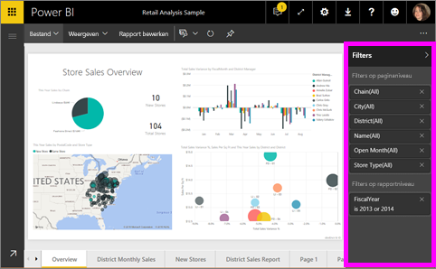

Omdat filters *behouden blijven*, behoudt Power BI gemaakte wijzigingen in het filter, de slicer en andere gegevensweergaven wanneer u van het rapport weg navigeert. U kunt dus verdergaan waar u bent gebleven wanneer u naar het rapport terugkeert. Als u uw filterwijzigingen niet wilt bewaren, selecteert u **Standaardinstelling herstellen** in de bovenste menubalk.

## Een filter toevoegen aan een specifieke visualisatie (ook wel een visualisatiefilter genoemd)
U kunt dit op twee manieren doen: 

* door op een veld te filteren dat al door de visualisatie wordt gebruikt;
* door een veld te identificeren dat nog niet door de visualisatie wordt gebruikt en dit veld rechtstreeks toe te voegen aan de bucket **Filters op niveau van visuele elementen**.

### Velden filteren die al in de visualisatie aanwezig zijn
1. Open [het rapport in de bewerkingsweergave](consumer/end-user-reading-view.md).
   
   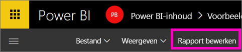
2. Open het deelvenster Visualisaties en filters en het deelvenster Velden (indien nog gesloten).
   
   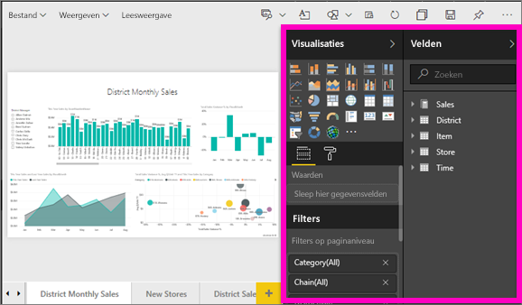
3. Selecteer een visueel element om het te activeren. Alle velden die door het visuele element worden gebruikt, worden geïdentificeerd in het deelvenster **Velden** en tevens vermeld in het deelvenster **Filters** (onder de kop **Filters op niveau van visuele elementen**).
   
   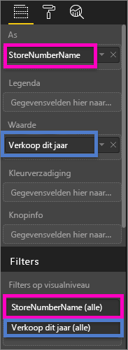
4. We gaan nu een filter toevoegen aan een veld dat al door de visualisatie wordt gebruikt. 
   
   * Schuif omlaag naar het gebied **Filters op niveau van visuele elementen** en selecteer de pijl om het te filteren veld uit te vouwen. In dit voorbeeld filteren we het veld **StoreNumberName**
     
      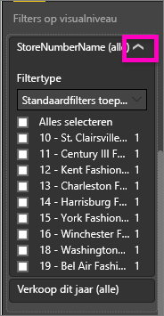 
   * Stel het besturingselement voor filters in op **Basic**, **Advanced** of **Top N** in (zie [How to use report filters](consumer/end-user-report-filter.md) (Rapportfilters gebruiken)). In dit voorbeeld selecteren we eenvoudig (basic) filteren en plaatsen markeringstekens naast de getallen 10, 11, 15 en 18.
     
      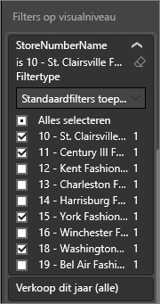 
   * Het visuele element wordt overeenkomstig het nieuwe filter gewijzigd. Als u het rapport met het filter opslaat, kunnen lezers van het rapport met het filter werken in de leesweergave door waarden te selecteren of te wissen.
     
      
5. Nu gaan we een geheel nieuw veld aan de visualisatie toevoegen, als een zogenaamd filter op visueel niveau.
   
   * Selecteer in het deelvenster Velden het veld dat u wilt toevoegen als een nieuw filter op visueel niveau en sleep het naar het gebied **Filters op niveau van visuele elementen**.  In dit voorbeeld slepen we **District Manager** naar de bucket **Filters op niveau van visuele elementen** en selecteren alleen Andrew Ma. 
     
      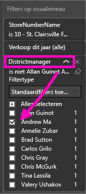
   * U ziet dat **District Manager** *niet* aan de visualisatie zelf wordt toegevoegd. De visualisatie bestaat nog steeds uit **WinkelNummerNaam** als de as en **Omzet van dit jaar** als de waarde.  
     
      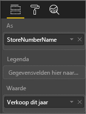
   * De visualisatie zelf wordt nu gefilterd om alleen de verkopen van Andrew voor de opgegeven winkels van dit jaar te laten zien.
     
     

## Een filter toevoegen aan een hele pagina (ook wel paginaweergavefilter genoemd)
1. Open [het rapport in de bewerkingsweergave](consumer/end-user-reading-view.md).
2. Open het deelvenster Visualisaties en filters en het deelvenster Velden (indien nog gesloten).
3. Selecteer in het deelvenster Velden het veld dat u wilt toevoegen als een nieuw filter op paginaniveau en sleep het naar het gebied **Filters op paginaniveau**.  
4. Selecteer de waarden die u wilt filteren en stel de besturingselementen voor het filter in op **Basic** of **Advanced** (zie [How to use report filters](consumer/end-user-report-filter.md) (Rapportfilters gebruiken)).
   
   Alle visualisaties op de pagina waarop dit filter van invloed is, worden opnieuw getekend in overeenstemming met de wijziging. 
   
   

Als u het rapport met het filter opslaat, kunnen lezers van het rapport met het filter werken in de leesweergave door waarden te selecteren of te wissen.

## Een drillthrough-filter toevoegen
Met drillthrough in Power BI-service en Power BI Desktop kunt u een *doelpagina* voor uw rapport maken die zich op een bepaalde entiteit richt, zoals een leverancier, klant of fabrikant. Gebruikers kunnen nu vanaf de andere rapportpagina's met de rechtermuisknop op een gegevenspunt voor die entiteit klikken en inzoomen op de betreffende pagina.

### Een drillthrough-filter maken
Open hiertoe het voorbeeld van klantwinstgevendheid in de bewerkingsweergave. Stel dat u een pagina wilt die zich richt op leidinggevende, zakelijke gebieden.   

1. Voeg een nieuwe pagina aan het rapport toe en geef deze de naam **Leidinggevend team**. Dit wordt de drillthrough-*doelpagina*.
2. Voeg visualisaties toe die belangrijke metrische gegevens voor de bedrijfstakken van het leidinggevend team volgen.    
3. Voeg ook **Leidinggevende > Naam leidinggevende** toe aan de drillthrough-filters.    
   
    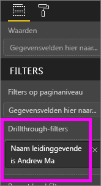
   
    Er wordt een pijl Vorige aan de rapportpagina toegevoegd.  Als een gebruiker deze pijl Vorige selecteert, wordt hij of zij teruggestuurd naar de *oorspronkelijke* rapportpagina - de pagina waarop voor drillthrough is gekozen. De pijl Vorige werkt alleen in de leesweergave.
   
     

### Het drillthrough-filter gebruiken
We gaan nu kijken hoe het drillthrough-filter werkt.

1. Begin op de rapportpagina **Team Scorecard**.    
2. Stel dat u Andrew Ma bent en u wilt de rapportpagina Leidinggevend team filteren met slechts uw eigen gegevens.  Klik in het diagram in het gebied linksboven op een groene gegevenspunt om de menuoptie Drillthrough te openen.
   
    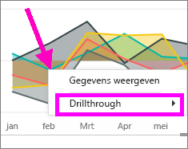
3. Selecteer **Drillthrough > Leidinggevend team** om in te zoomen op de rapportpagina met de naam **Leidinggevend team**. De pagina wordt gefilterd en er wordt informatie weergegeven over het gegevenspunt waarop u met de rechtermuisknop hebt geklikt, in dit geval Andrew Ma. Alleen het veld in de verdieping Drillthrough-filters wordt doorgegeven aan de drillthrough-pagina van het rapport.  
   
    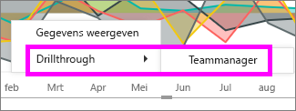

## Een filter aan een heel rapport toevoegen (ook wel rapportfilter genoemd)
1. Open [het rapport in de bewerkingsweergave](consumer/end-user-reading-view.md).
2. Open het deelvenster Visualisaties en filters en het deelvenster Velden (indien nog gesloten).
3. Selecteer in het deelvenster Velden het veld dat u wilt toevoegen als een nieuw filter op rapportniveau en sleep het naar het gebied **Filters op rapportniveau**.  
4. Selecteer de waarden die u wilt filteren (Zie [Rapportfilters gebruiken](consumer/end-user-report-filter.md)).

    De visuele elementen op de actieve pagina (en ook op alle andere pagina's van het rapport) worden gewijzigd overeenkomstig het nieuwe filter. Als u het rapport met het filter opslaat, kunnen lezers van het rapport met het filter werken in de leesweergave door waarden te selecteren of te wissen.

1. Selecteer de pijl Vorige om terug te keren naar de vorige rapportpagina.

## Aandachtspunten en probleemoplossing

- Er zijn situaties waarin het filter op visueel niveau en op paginaniveau verschillende resultaten kunnen retourneren.  Als u bijvoorbeeld een filter op visueel niveau toevoegt, wordt er door Power BI gefilterd op de geaggregeerde resultaten.  De standaardaggregatie is Som, maar u kunt [het samenvoegingstype wijzigen](service-aggregates.md) (Engelstalig).  

    Als u vervolgens een filter op paginaniveau toevoegt, wordt er door Power BI zonder aggregeren gefilterd.  Dit gebeurt omdat een pagina meerdere visuele elementen kan bevatten die elk verschillende aggregatietypen kunnen gebruiken.  Het filter wordt dus op elke gegevensrij toegepast.

- Als u het deelvenster Velden niet ziet, controleer dan of u in de [bewerkingsweergave](service-interact-with-a-report-in-editing-view.md) voor rapporten zit    
- Als u veel wijzigingen in de filters hebt aangebracht en wilt terugkeren naar de standaardinstellingen van de auteur van het rapport, selecteert u **Standaardinstelling herstellen** in de bovenste menubalk.

## Volgende stappen
 [How to use report filters](consumer/end-user-report-filter.md) (Rapportfilters gebruiken)

  [Filters and highlighting in reports](power-bi-reports-filters-and-highlighting.md) (Filters en markeren in rapporten)

[Interact with filters and highlighting in report Reading View](consumer/end-user-reading-view.md) (Werken met filters en markeringen in de leesweergave voor rapporten)

[Change how report visuals cross-filter and cross-highlight each other](consumer/end-user-interactions.md) (Wijzigen hoe visuele rapportelementen elkaar kruislings filteren en markeren)

Hebt u nog vragen? [Misschien dat de Power BI-community het antwoord weet](http://community.powerbi.com/)

