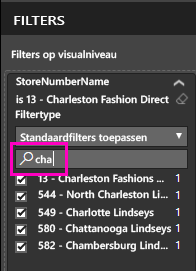
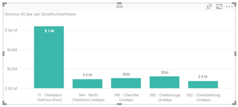
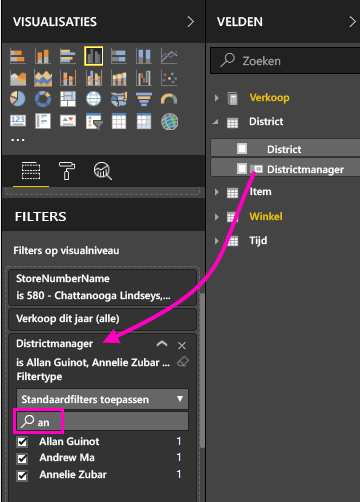
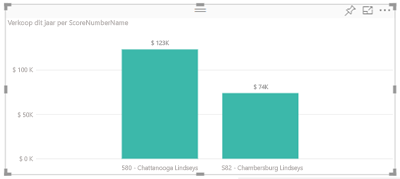

# Een filter aan een Power BI-servicerapport toevoegen (in de bewerkingsweergave)

In dit artikel wordt uitgelegd hoe u een paginafilter, visualisatiefilter, rapportfilter of drillthrough-filter toevoegt aan een rapport in Power BI. De voorbeelden in dit artikel hebben betrekking op de Power BI-service. De stappen zijn bijna identiek voor Power BI Desktop.

## Filters in de bewerkingsweergave of leesweergave
U kunt in twee verschillende weergaven werken met rapporten: leesweergave en bewerkingsweergave. De beschikbare filtermogelijkheden zijn afhankelijk van de weergave waarin u werkt. Zie [Over filters en markeren in Power BI-rapporten](power-bi-reports-filters-and-highlighting.md) voor uitgebreide informatie.

In dit artikel wordt beschreven hoe u filters maakt in de **bewerkingsweergave** voor rapporten.  Zie [deze snelstartgids](consumer/end-user-reading-view.md) voor meer informatie over filters in de leesweergave.

## Filtertypen in het deelvenster Filters
Zowel in Power BI Desktop als in de Power BI-service wordt het deelvenster Filters weergegeven aan de rechterkant van het rapportcanvas. Als het deelvenster niet wordt weergegeven, selecteert u het symbool '>' in de rechterbovenhoek om het deelvenster uit te vouwen.

Er zijn vier typen filters: **paginafilter**, **visualisatiefilter**, **drillthrough-filter** en **rapportfilter**.

Omdat filters *behouden blijven* wanneer het rapport niet meer de focus heeft, behoudt Power BI gemaakte wijzigingen in het filter, de slicer en andere gegevensweergaven. U kunt dus verdergaan waar u bent gebleven wanneer u terugkeert naar het rapport. Als u uw filterwijzigingen niet wilt bewaren, selecteert u **Standaardinstelling herstellen** in de bovenste menubalk.

## Een filter aan een visualisatie toevoegen
U kunt op twee manieren een filter toevoegen aan een specifieke visualisatie (ook wel een visueel element genoemd). 

* Filter een veld dat al door de visualisatie wordt gebruikt.
* Zoek een veld dat nog niet door de visualisatie wordt gebruikt en voeg dit veld rechtstreeks toe aan de bucket **Filters op niveau van visuele elementen**.

In deze procedure wordt overigens het voorbeeld Retail Analysis gebruikt. U kunt dit voorbeeld downloaden om de stappen te volgen. Download het voorbeeld [Retail Analysis](sample-retail-analysis.md).

### De velden in de visualisatie filteren

1. Open [het rapport in de bewerkingsweergave](service-the-report-editor-take-a-tour.md).
   
   
2. Open het deelvenster Visualisaties en filters en het deelvenster Velden (indien nog gesloten).
   
   
3. Selecteer een visueel element om het te activeren. Alle velden die door de visualisatie worden gebruikt, staan in het deelvenster **Velden** en ook in het deelvenster **Filters**, onder het kopje **Filters op niveau van visuele elementen**.
   
   
4. We gaan nu een filter toevoegen aan een veld dat al door de visualisatie wordt gebruikt. 
   
    Schuif omlaag naar het gebied **Filters op niveau van visuele elementen** en selecteer de pijl om het te filteren veld uit te vouwen. In dit voorbeeld filteren we het veld **StoreNumberName**.
     
     
    
    Stel het filtertype in op **Standaardfilters toepassen**, **Geavanceerd filteren** of **Populairste N**. In dit voorbeeld gebruiken we standaardfilters om te zoeken naar **cha** en die vijf winkels te selecteren.
     
     
   
    Het visuele element wordt overeenkomstig het nieuwe filter gewijzigd. Als u het rapport met het filter opslaat, zien lezers van het rapport de gefilterde visualisatie en kunnen ze met het filter werken in de leesweergave door waarden te selecteren of te wissen.
     
    

### Filteren met een veld dat niet is opgenomen in de visualisatie

Nu gaan we een nieuw veld aan de visualisatie toevoegen, als een filter op het niveau van visuele elementen.
   
1. Selecteer in het deelvenster Velden het veld dat u wilt toevoegen als een nieuw filter op het niveau van visuele elementen en sleep het veld naar het gebied **Filters op niveau van visuele elementen**.  In dit voorbeeld slepen we **District Manager** naar de bucket **Filters op niveau van visuele elementen**, zoeken we naar **an** en selecteren we die drie managers. 
     
    

    U ziet dat **District Manager** zelf *niet* aan de visualisatie wordt toegevoegd. De visualisatie bestaat nog steeds uit **WinkelNummerNaam** als de as en **Omzet van dit jaar** als de waarde.  
     
    

    De visualisatie zelf wordt nu gefilterd om alleen de verkopen van de gefilterde managers voor de opgegeven winkels van dit jaar te laten zien.
     
    

    Als u het rapport met dit filter opslaat, kunnen lezers van het rapport werken met het filter **District Manager** in de leesweergave door waarden te selecteren of te wissen.

## Een filter toevoegen aan een hele pagina

U kunt ook een filter toevoegen aan een hele pagina (ook wel een paginaweergavefilter genoemd).
1. Open [het rapport in de bewerkingsweergave](service-the-report-editor-take-a-tour.md).
2. Open het deelvenster Visualisaties en filters en het deelvenster Velden (indien nog gesloten).
3. Selecteer in het deelvenster Velden het veld dat u wilt toevoegen als een nieuw filter op paginaniveau en sleep het veld naar het gebied **Filters op paginaniveau**.  
4. Selecteer de waarden die u wilt filteren en stel het filtertype in op **Standaardfilters toepassen** of **Geavanceerd filteren**.
   
   Alle visualisaties op de pagina waarop dit filter van invloed is, worden opnieuw getekend in overeenstemming met de wijziging. 
   
   

    Als u het rapport met het filter opslaat, kunnen lezers van het rapport met het filter werken in de leesweergave door waarden te selecteren of te wissen.

## Een drillthrough-filter toevoegen
Met drillthrough in Power BI-service en Power BI Desktop kunt u een *doelpagina* voor uw rapport maken die zich op een bepaalde entiteit richt, zoals een leverancier, klant of fabrikant. Gebruikers kunnen nu vanaf de andere rapportpagina's met de rechtermuisknop op een gegevenspunt voor die entiteit klikken en inzoomen op de betreffende pagina.

### Een drillthrough-filter maken
Open hiertoe het voorbeeld van klantwinstgevendheid in de bewerkingsweergave. Stel dat u een pagina wilt die zich richt op leidinggevende, zakelijke gebieden.   

1. Voeg een nieuwe pagina aan het rapport toe en geef deze de naam **Leidinggevend team**. Dit wordt de drillthrough-*doelpagina*.
2. Voeg visualisaties toe die belangrijke metrische gegevens voor de bedrijfstakken van het leidinggevend team volgen.    
3. Voeg ook **Leidinggevende > Naam leidinggevende** toe aan de drillthrough-filters.    
   
    
   
    Er wordt een pijl Vorige aan de rapportpagina toegevoegd.  Als een gebruiker deze pijl Vorige selecteert, wordt hij of zij teruggestuurd naar de *oorspronkelijke* rapportpagina - de pagina waarop voor drillthrough is gekozen. De pijl Vorige werkt alleen in de leesweergave.
   
     

### Het drillthrough-filter gebruiken
We gaan nu kijken hoe het drillthrough-filter werkt.

1. Begin op de rapportpagina **Team Scorecard**.    
2. Stel dat u Andrew Ma bent en u wilt de rapportpagina Leidinggevend team filteren met slechts uw eigen gegevens.  Klik in het diagram in het gebied linksboven op een groene gegevenspunt om de menuoptie Drillthrough te openen.
   
    
3. Selecteer **Drillthrough > Leidinggevend team** om in te zoomen op de rapportpagina met de naam **Leidinggevend team**. De pagina wordt gefilterd en er wordt informatie weergegeven over het gegevenspunt waarop u met de rechtermuisknop hebt geklikt, in dit geval Andrew Ma. Alleen het veld in de verdieping Drillthrough-filters wordt doorgegeven aan de drillthrough-pagina van het rapport.  
   
    

## Een filter aan een heel rapport toevoegen (ook wel rapportfilter genoemd)
1. Open [het rapport in de bewerkingsweergave](service-the-report-editor-take-a-tour.md).
2. Open het deelvenster Visualisaties en filters en het deelvenster Velden (indien nog gesloten).
3. Selecteer in het deelvenster Velden het veld dat u wilt toevoegen als een nieuw filter op rapportniveau en sleep het veld naar het gebied **Filters op rapportniveau**.  
4. Selecteer de waarden die u wilt filteren.

    De visuele elementen op de actieve pagina (en ook op alle andere pagina's van het rapport) worden gewijzigd overeenkomstig het nieuwe filter. Als u het rapport met het filter opslaat, kunnen lezers van het rapport met het filter werken in de leesweergave door waarden te selecteren of te wissen.

1. Selecteer de pijl Vorige om terug te keren naar de vorige rapportpagina.

## Aandachtspunten en probleemoplossing

- Er zijn situaties waarin het filter op visueel niveau en op paginaniveau verschillende resultaten kunnen geven.  Als u bijvoorbeeld een filter op visueel niveau toevoegt, wordt er door Power BI gefilterd op de geaggregeerde resultaten.  De standaardaggregatie is Som, maar u kunt [het samenvoegingstype wijzigen](service-aggregates.md) (Engelstalig).  

    Als u vervolgens een filter op paginaniveau toevoegt, wordt er door Power BI zonder aggregeren gefilterd.  Dit gebeurt omdat een pagina meerdere visuele elementen kan bevatten die elk verschillende aggregatietypen kunnen gebruiken.  Het filter wordt dus op elke gegevensrij toegepast.

- Als u het deelvenster Velden niet ziet, controleer dan of u in de [bewerkingsweergave](service-interact-with-a-report-in-editing-view.md) voor rapporten zit    
- Als u veel wijzigingen in de filters hebt aangebracht en wilt terugkeren naar de standaardinstellingen van de auteur van het rapport, selecteert u **Standaardinstelling herstellen** in de bovenste menubalk.

## Volgende stappen
[Rondleiding door het deelvenster Filters van het rapport](consumer/end-user-report-filter.md)

[Filters en markeren in rapporten](power-bi-reports-filters-and-highlighting.md)

[Snelstart: meer informatie over de mogelijkheden van Power BI voor gebruikers](consumer/end-user-reading-view.md)

[Wijzigen hoe visuele rapportelementen elkaar kruislings filteren en markeren](consumer/end-user-interactions.md)

Hebt u nog vragen? [Misschien dat de Power BI-community het antwoord weet](http://community.powerbi.com/)

