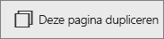

# Een pagina toevoegen aan een Power BI-rapport
## Een nieuwe lege pagina toevoegen
Er is geen reden om te veel gegevens op een rapportpagina weer te geven. U kunt gewoon een nieuwe lege pagina toevoegen.

Selecteer het gele pluspictogram en typ een naam voor de nieuwe pagina.  

## Een pagina dupliceren
Als de [bewerkingsmodus](service-interact-with-a-report-in-editing-view.md) is geactiveerd, selecteert u in de bovenste balk met besturingselementen het pictogram**Deze pagina dupliceren**.

Er wordt een nieuwe pagina gemaakt. Dit is ook meteen de actieve pagina. Als u de naam wilt wijzigen, dubbelklikt u op de naam op het tabblad om deze te markeren. Vervolgens geeft u een nieuwe naam op.  Zie [Namen wijzigen in de Power BI-service](service-rename.md) voor meer informatie.

## Volgende stappen
Lees meer over [rapporten in Power BI](service-reports.md)

[Power BI - basisconcepten](service-basic-concepts.md)

Nog vragen? [Misschien dat de Power BI-community het antwoord weet](http://community.powerbi.com/).

