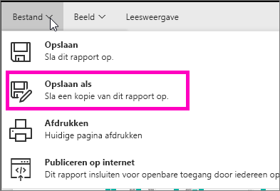
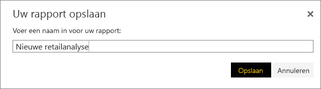
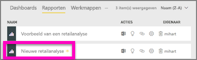

# Een nieuw rapport maken van een bestaand rapport (een rapport kopiëren)
Misschien hebt u een rapport dat al verbinding maakt met uw gegevensset en bevat het rapport enkele visuals die u wilt opnieuw wilt gebruiken of wilt wijzigen.  In dat geval kunt u het rapport gewoon kopiëren als basis voor een nieuw rapport.  Hiervoor gaat u als volgt te werk:

1. [Open een rapport](consumer/end-user-report-open.md).
2. Selecteer in het menu **Bestand** de optie **Opslaan als**.
   
   
3. Typ een naam voor het nieuwe rapport en selecteer **Opslaan**.
   
   
   
   Er wordt een bericht weergegeven met de melding dat uw nieuwe rapport is opgeslagen in de huidige werkruimte in Power BI.
   
   
4. Open het tabblad **Rapporten** van uw werkruimte en selecteer het nieuwe rapport om dit te openen. Desgewenst kunt u visuals verwijderen die u niet wilt behouden, andere visuals wijzigen en nieuwe visuals toevoegen.
   
   
5. Veel plezier met het bijwerken en bewerken van uw nieuwe rapport.

## Volgende stappen:
[Nieuwe visualisaties maken](visuals/power-bi-report-add-visualizations-ii.md)

[Visualisaties verwijderen](service-delete.md) die u niet nodig hebt

[Een rapport maken met Power BI Desktop](desktop-report-view.md)
