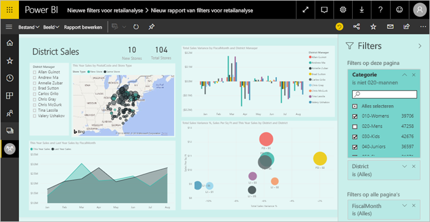
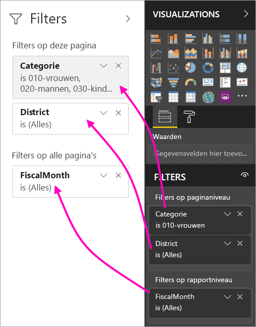
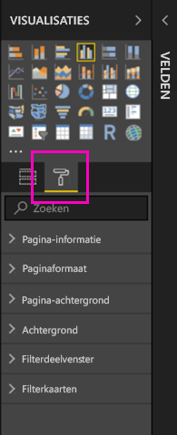
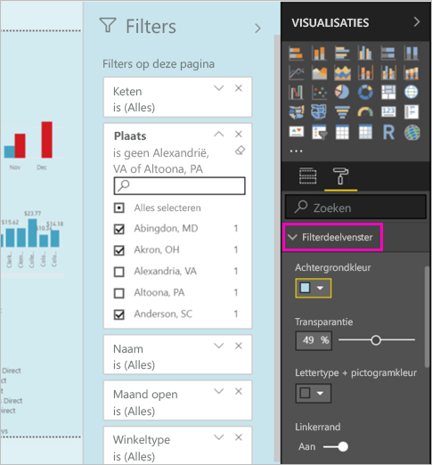

# De nieuwe filterervaring in Power BI-rapporten (preview)

In dit artikel wordt de nieuwe filterfunctionaliteit beschreven: Filters in Power BI krijgen nieuwe functionaliteit en een nieuw ontwerp. Wanneer u rapporten in Power BI Desktop of in de Power BI-service ontwerpt, kunt u ervoor zorgen dat het venster Filters eruitziet als en werkt met het volledige rapport. In de nieuwe ervaring doet het oude venster Filters dienst als een bewerkingsvenster voor filters en is het nieuwe venster Filters het enige venster dat de gebruikers van uw rapport zien. 
 

Dit is wat u als rapportontwerper kunt doen met de nieuwe filters:

- Een alleen-lezenweergave voor filters in de koptekst van de visual, zodat gebruikers precies weten welke filters of slicer van invloed zijn op een bepaalde visual.
- Het filtervenster zo indelen en aanpassen dat het als onderdeel van uw rapport voelt.
- Definiëren of het venster Filters standaard open of samengevouwen is wanneer een gebruiker het rapport opent.
- Het gehele filtervenster, of specifieke filters waarvan u niet wilt dat gebruikers deze zien, verbergen.
- De zichtbaarheid en open en samengevouwen status van het nieuwe filtervenster beheren en zelfs vastleggen.
- Filters vergrendelen waarvan u niet wilt dat gebruikers deze bewerken.

## De nieuwe filterfunctionaliteit aanzetten 

U schakelt de nieuwe ervaring in Power BI Desktop in. Vervolgens kunt u daar of in de Power BI-service filters bewerken (https://app.powerbi.com). Omdat deze nieuwe filterervaring in preview is, moet u deze eerst inschakelen in Power BI Desktop. Als u een rapport begint te maken in de Power BI-service, kan het geen nieuwe filters hebben.

### Nieuw filter inschakelen voor alle nieuwe rapporten

1. Selecteer in Power BI Desktop **Bestand** > **Opties en instellingen** > **Opties** > **Preview-functies** en selecteer vervolgens het selectievakje **Nieuwe filterervaring**. 
2. Start Power BI Desktop opnieuw op om de nieuwe filterervaring in alle nieuwe rapporten te kunnen zien.

Nadat u Power BI Desktop opnieuw hebt opgestart, is het standaard ingeschakeld voor alle nieuwe rapporten die u maakt.  

### Nieuwe filters inschakelen voor een bestaand rapport

U kunt de nieuwe filters ook voor bestaande rapporten inschakelen.

1. Selecteer in een bestaand rapport in Power BI Desktop **Bestand** > **Opties en instellingen** > **Opties**
2. Selecteer onder **Rapportinstellingen** **Het bijgewerkte filtervenster inschakelen en filters weergeven in de visuele koptekst voor dit rapport**.

## Het nieuwe filtervenster maken

Nadat u het nieuwe filtervenster hebt ingeschakeld, ziet u het recht naast de rapportpagina, standaard ingedeeld op basis van uw huidige rapportinstellingen. Het oude filtervenster doet nu dienst als het bewerkingsvenster voor filters. Het nieuwe filtervenster geeft weer wat de gebruikers van uw rapport zien wanneer u uw rapport publiceert. U kunt bestaande filters bijwerken in het nieuwe venster, maar u kunt het oude filtervenster gebruiken om in te stellen welke filters u wilt gebruiken.

1. Besluit eerst of u wilt dat de gebruikers van uw rapport het filtervenster zien. Als u wilt dat gebruikers het venster zien, selecteert u het oogpictogram  naast Filters.

2. Sleep interessegebieden als visual, pagina, of filters op rapportniveau naar het bewerkvenster voor filters om uw nieuwe filtervenster te maken. U ziet deze in het nieuwe venster Filters.

    

Wanneer u een visual toevoegt aan een rapport-canvas, voegt Power BI automatisch een filter voor elk veld in de visual toe. Power BI voegt die automatische filters niet toe aan het alleen-lezenvenster voor filters. U moet het oogpictogram selecteren om deze toe te voegen.

 
## Filters vergrendelen of verbergen

U kunt afzonderlijke filterkaarten vergrendelen of verbergen. Wanneer u een filter vergrendelt, kunnen de gebruikers van uw rapport het filter zien, maar niet wijzigen. Als u het filter verbergt, kunnen de gebruikers het ook niet zien. Het is handig om filterkaarten te verbergen als u opruimfilters wilt verbergen die onverwachte of null-waarden uitsluiten. 

- In het bewerkvenster voor filters schakelt u in een filterkaart de pictogrammen **Filter vergrendelen** of **Filter verbergen** in of uit.

   

Als u deze instellingen in het bewerkvenster voor filters aan- of uitzet, ziet u de wijzigingen in het nieuwe filtervenster. Verborgen filters worden niet weergegeven in pop-upfilters voor een visual.

U kunt de status van uw filtervenster ook zo configureren dat de zich aanpast aan de bladwijzers in uw rapport. De zichtbaarheidsstatus en de status open of gesloten zijn allemaal vast te leggen.
 
## Het nieuwe venster Filters indelen

Een groot deel van deze nieuwe ervaring is dat u het filtervenster nu kunt indelen aan de hand van het uiterlijk van uw rapport. U kunt het filtervenster verschillend indelen voor elke pagina in het rapport. Dit zijn de elementen die u kunt opmaken: 

- Achtergrondkleur
- Doorzichtigheid van achtergrond
- Rand van filtervenster in- of uitschakelen
- De kleur van de rand van het filtervenster

U kunt deze elementen ook opmaken voor filterkaarten, afhankelijk van of deze zijn toegepast (ingesteld op iets) of beschikbaar zijn (uitgeschakeld): 

- Achtergrondkleur
- Doorzichtigheid van achtergrond
- Rand: in- of uitschakelen
- Randkleur

### De indeling voor het venster Filters en filterkaarten instellen

1. In het rapport klikt u op het rapport zelf, of op de *achtergrond*, en vervolgens selecteert u **Indeling** in het venster **Visualisaties**. 
    U ziet de indelingsopties voor de rapportpagina, de achtergrond en het venster Filters en de filterkaarten.

        

1. Vouw het **Filtervenster** uit om de kleur van de achtergrond, het pictogram en de linkerrand te kiezen om de rapportpagina op te maken.

    

1. Vouw **Filterkaarten** uit om de kleuren en randen voor **Beschikbaar** en **Toegepast** in te stellen. Als u beschikbare en toegepaste kaarten verschillende kleuren geeft, is het duidelijk welke filters er zijn toegepast. 
  
    

## Filters voor een visual bekijken in Leesmodus

In de Leesmodus kunt u uw muisaanwijzer over het filterpictogram een visual bewegen en een pop-upvenster bekijken met alle filters, slicers, enz. die invloed hebben op die visual. De indeling van het pop-upvenster is dezelfde als de indeling van het filtervenster. 

Dit zijn de typen filters die in deze weergave worden weergegeven: 
- Standaardfilters
- Slicers
- Kruislings markeren 
- Kruislings filteren
- Geavanceerde filters
- Top N-filters
- Relatieve datumfilters
- Synchroonslicers
- Opname-/uitsluitingsfilters
- Filters die via een URL zijn doorgegeven

## Binnenkort beschikbaar

We zijn van plan om in de komende maanden de volgende verbetering in te voeren:
- Mogelijkheid om de volgorde van filterkaarten te wijzigen
- Eén filtervenster voor rapportmakers 
- Meer opmaakopties

Probeer de nieuwe filterervaring eens uit. Geef ons feedback over deze functie en vertel ons hoe we deze ervaring kunnen blijven verbeteren. 

## Volgende stappen
[How to use report filters](consumer/end-user-report-filter.md) (Rapportfilters gebruiken)

[Filters and highlighting in reports](power-bi-reports-filters-and-highlighting.md) (Filters en markeren in rapporten)

[Interact with filters and highlighting in report Reading View](consumer/end-user-reading-view.md) (Werken met filters en markeringen in de leesweergave voor rapporten)

[Change how report visuals cross-filter and cross-highlight each other](consumer/end-user-interactions.md) (Wijzigen hoe visuele rapportelementen elkaar kruislings filteren en markeren)

Hebt u nog vragen? [Misschien dat de Power BI-community het antwoord weet](http://community.powerbi.com/)

