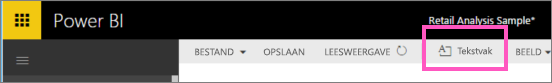
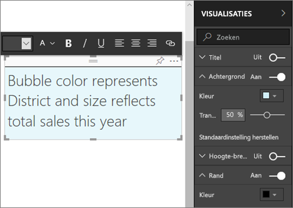
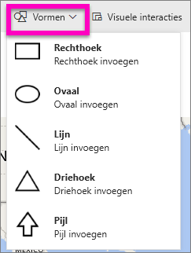
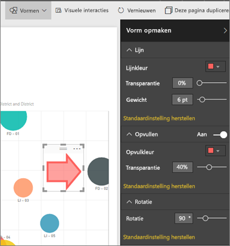

# Statische inhoud in Power BI-rapporten
Er kunnen tekstvakken en vormen aan de rapporten worden toegevoegd met behulp van de Power BI-service en Power BI Desktop. In beide gevallen moet u bewerkingsrechten voor het rapport hebben. Als een rapport met u is gedeeld, hebt u geen toegang tot de bewerkingsweergave. 

Bekijk hoe Will Power BI Desktop gebruikt om [statistische afbeeldingen aan een rapport toe te voegen](guided-learning/visualizations.yml#step-11) en volg vervolgens de stappen hieronder om het zelf met de Power BI-service te proberen.
> 
> <iframe width="560" height="315" src="https://www.youtube.com/embed/_3q6VEBhGew" frameborder="0" allowfullscreen></iframe>
> 

## Een tekstvak toevoegen aan een rapport
1. Open een rapport in de bewerkingsweergave.

2. Plaats de cursor op een leeg gebied in het rapportcanvas en selecteer **Tekstvak**.
   
   
2. Typ de tekst in het tekstvak en maak desgewenst het lettertype, de kleur en de uitlijning op. 
   
   
3. Selecteer het grijze gebied aan de bovenkant en sleep dit om het tekstvak te positioneren. Als u de grootte van het tekstvak wilt wijzigen, selecteert en sleept u een van de contourgrepen. 
   
   

4. Terwijl het tekstvak nog is geselecteerd, voegt u aanvullende opmaak toe in het deelvenster VISUALISATIES. In dit voorbeeld hebben we de achtergrond en rand opgemaakt. U kunt ook een exacte grootte en positie voor een tekstvak maken.  

   

5. Als u het tekstvak wilt sluiten, selecteert u een lege ruimte op het rapportcanvas. 

5. Selecteer het speldpictogram  om het tekstvak vast te maken aan een dashboard. 

## Een vorm toevoegen aan een rapport
1. Plaats de cursor op het rapportcanvas en selecteer **Vormen**.
   
   
2. Selecteer in de vervolgkeuzelijst de vorm die u wilt toevoegen aan uw rapportcanvas. Laten we een pijl toevoegen om de aandacht te vestigen op de bel met de hoogste verkoopafwijking. 
   
   Pas uw vorm aan in het deelvenster **Vorm opmaken**. In dit voorbeeld hebben we een rode pijl met een donkerrode rand gemaakt die 90 graden is gedraaid.
   
   
3. Selecteer het grijze gebied aan de bovenkant en sleep om de vorm te positioneren. Als u de grootte van het tekstvak wilt wijzigen, selecteert en sleept u een van de contourgrepen. U kunt, net als bij het tekstvak, een exacte grootte en positie maken voor een vorm.

> **Opmerking**: vormen kunnen niet worden vastgemaakt aan een dashboard, behalve als één van de visualisaties wanneer u [een live-pagina vastmaakt](service-dashboard-pin-live-tile-from-report.md). 
> 
> 

### Volgende stappen
[Een hyperlink toevoegen aan een tekstvak](service-add-hyperlink-to-text-box.md)

[Power BI - basisconcepten](service-basic-concepts.md)

Hebt u nog vragen? [Misschien dat de Power BI-community het antwoord weet](http://community.powerbi.com/)
