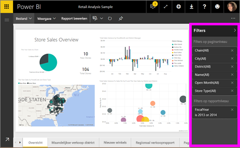
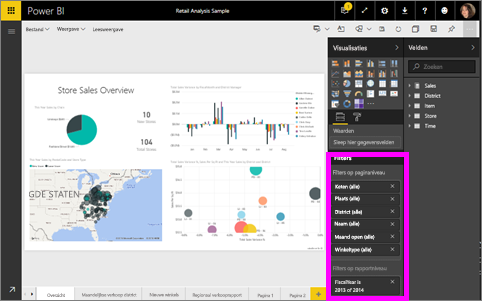

# Over filters en markeren in Power BI-rapporten
***Filters*** zorgen ervoor dat alleen die gegevens worden weergegeven waarop u zich wilt concentreren.  ***Markeren*** is geen filtertechniek, aangezien er geen gegevens worden verwijderd. In plaats daarvan wordt een subset van de zichtbare gegevens gemarkeerd. De niet-gemarkeerde gegevens blijven wel zichtbaar maar zijn lichter van kleur.

Er zijn diverse verschillende manieren om rapporten in Power BI te filteren en te markeren. Wanneer al deze informatie in één artikel zou worden gepresenteerd, zou dit alleen maar tot verwarring leiden. We hebben daarom de volgende onderverdeling gemaakt:

* Inleiding tot filters en markeren (het artikel dat u nu leest)
* De manieren waarop u [filters en markeringen kunt maken en gebruiken in de bewerkingsweergave of de rapporten die u hebt gemaakt](power-bi-report-add-filter.md). Wanneer u over bewerkingsmachtigingen beschikt voor een rapport, kunt u filters en markeringen in rapporten maken, wijzigen en verwijderen.
* De manieren waarop u [filters en markeringen kunt gebruiken in rapporten die met u zijn gedeeld of in rapporten in de leesweergave](service-interact-with-a-report-in-reading-view.md). De mogelijkheden zijn beperkter, maar u beschikt met Power BI nog altijd over tal van filter- en markeeropties.  
* [Een gedetailleerd overzicht van de besturingselementen die in de bewerkingsweergave beschikbaar zijn om te filteren en te markeren](power-bi-how-to-report-filter.md), inclusief uitgebreide informatie over de typen filters (bijvoorbeeld datum en tijd, numerieke tekst) en het verschil tussen de basisopties en geavanceerde opties.
* Nu u weet hoe de standaard filter- en markeeropties werken, kunt u [leren om te wijzigen op welke manier visualisaties op een pagina elkaar filteren en markeren](service-reports-visual-interactions.md).

> [!TIP]
> Hoe weet Power BI hoe gegevens aan elkaar zijn gerelateerd?  Er wordt gebruikgemaakt van de relaties tussen de verschillende tabellen en velden in het onderliggende [gegevensmodel](https://support.office.com/article/Create-a-Data-Model-in-Excel-87e7a54c-87dc-488e-9410-5c75dbcb0f7b?ui=en-US&rs=en-US&ad=US) om ervoor te zorgen dat de items op een rapportpagina met elkaar communiceren.
> 
> 

## Inleiding tot het gebruik van het deelvenster Filters om gegevens in rapporten te filteren en te markeren

Filters en markeringen kunnen worden toegepast via het deelvenster **Filters** of door rechtstreeks in het rapport gegevens te selecteren (ad hoc, zie onderaan de pagina). Het deelvenster Filters bevat de tabellen en velden die in het rapport worden gebruikt en de filters die zijn toegepast, indien van toepassing. De filters worden onderverdeeld in **Filters op paginaniveau**, **Filters op rapportniveau** en **Filters op het niveau van visuele elementen**.  Er worden alleen filters op het niveau van visuele elementen weergegeven als u een visualisatie op het rapportcanvas selecteert.

> [!TIP]
> Als naast het filter het woord **Alle** wordt weergegeven, betekent dit dat het hele veld is opgenomen als een filter.  Zo zien we aan **Chain (All)** (Keten (Alle)) in onderstaande schermopname dat deze rapportpagina gegevens bevat over alle winkelketens.  Aan de andere kant blijkt uit het filter op rapportniveau **FiscalYear is 2013 or 2014** (Boekjaar is 2013 of 2014) dat het rapport alleen gegevens voor de boekjaren 2013 en 2014 bevat.
> 
> 

## Filters in de leesweergave versus filters in de bewerkingsweergave
U kunt in twee modi met rapporten werken: in de [leesweergave](service-interact-with-a-report-in-reading-view.md) en de [bewerkingsweergave](service-interact-with-a-report-in-editing-view.md).  De beschikbare filtermogelijkheden zijn afhankelijk van de modus waarin u werkt.

* In de bewerkingsweergave kunt u rapport-, pagina- en visualisatiefilters toevoegen. Als u het rapport opslaat, worden de filters ook opgeslagen. Personen die het rapport bekijken in de leesweergave, kunnen werken met de filters die u hebt toegevoegd, maar ze kunnen hun wijzigingen niet opslaan.
* In de leesweergave kunt u werken met elk pagina- en visualisatiefilter dat al in het rapport aanwezig is, maar u kunt uw filterwijzigingen niet opslaan.

### Het deelvenster Filters in de leesweergave
Als u alleen in de leesweergave toegang tot een rapport hebt, ziet het deelvenster Filters er ongeveer als volgt uit:

Deze pagina van het rapport bevat dus zes filters op paginaniveau en één filter op rapportniveau.

Selecteer een visueel element om te controleren of het rapport ook filters op het niveau van de visuele elementen bevat. In de onderstaande afbeelding zijn er zes filters op het bellendiagram toegepast.

Verken de gegeven in de leesweergave door de bestaande filters te wijzigen. Meer informatie hierover vindt u in het artikel [Filters gebruiken in de leesweergave](service-interact-with-a-report-in-reading-view.md)

### Het deelvenster Filters in de bewerkingsweergave
Wanneer u over eigenaarsmachtigingen voor een rapport beschikt en het rapport opent in de leesweergave, hebben en het in de weergave bewerken Open, ziet u dat **Filters** slechts een van de vele beschikbare deelvensters is.

Net als in de leesweergave (hierboven) zien we dat dit rapport zes filters op paginaniveau en één filter op rapportniveau bevat. En als we het bellendiagram selecteren, zien we dat er zes filters op het niveau van de visuele elementen zijn toegepast.

Meer we kunnen in de bewerkingsweergave nog veel meer met filters en markeringen doen. Het belangrijkste verschil is dat er nieuwe filters kunnen worden toegevoegd. Hoe u dit doet en nog veel meer informatie kunt u lezen in het artikel [Een filter aan een rapport toevoegen](power-bi-report-add-filter.md).

## Ad hoc filteren en markeren
Selecteer een veld op het rapportcanvas om de rest van de pagina te filteren en te markeren. Selecteer een lege ruimte in hetzelfde visuele element om deze te verwijderen. Dit type filters en markeringen wordt niet opgeslagen in het rapport, maar biedt wel een leuke manier om snel de impact van gegevens te verkennen. Zie [Interacties tussen visuele elementen](service-reports-visual-interactions.md) als u de werking van dit type kruisfilters en kruismarkeringen wilt verfijnen.

## Volgende stappen
[Filters en markeringen gebruiken (in de leesweergave)](service-interact-with-a-report-in-reading-view.md)

[Een filter aan een rapport toevoegen (in de bewerkingsweergave)](power-bi-report-add-filter.md)

[Een overzicht van de rapportfilters](power-bi-how-to-report-filter.md)

[Wijzigen hoe visuele rapportelementen elkaar kruislings filteren en markeren](service-reports-visual-interactions.md)

Lees meer over [rapporten in Power BI](service-reports.md)

Nog vragen? [Misschien dat de Power BI-community het antwoord weet](http://community.powerbi.com/).

