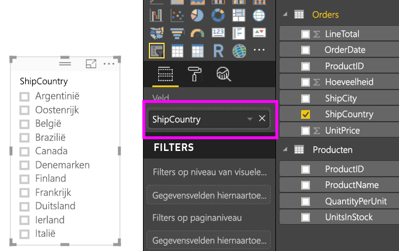
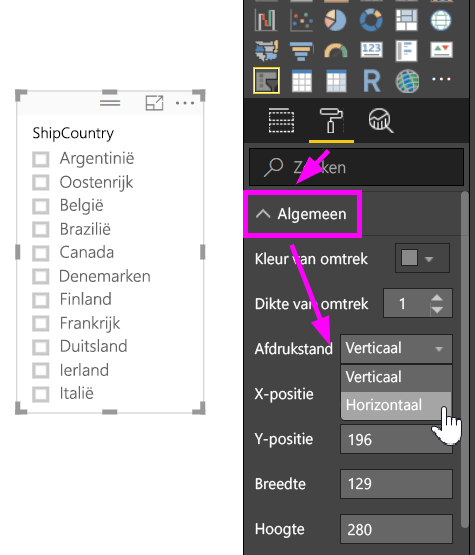
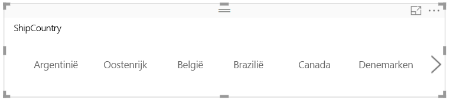
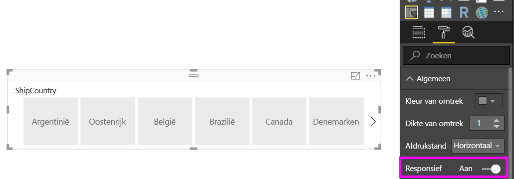
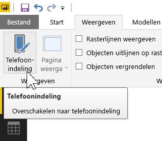
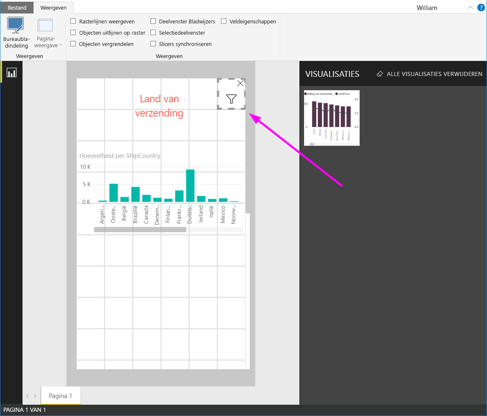

# Een responsieve slicer maken waarvan u de grootte kunt wijzigen in Power BI

Responsieve slicers worden in grootte aangepast zodat ze overal op het rapport passen. U kunt de grootte en vorm van responsieve slicers aanpassen, van horizontaal naar vierkant naar verticaal. De waarden in de slicer worden hierop automatisch gerangschikt. In Power BI Desktop kunt in de Power BI-service horizontale slicers en slicers voor datum/bereik responsief maken. Slicers voor datum/bereik hebben tevens verbeterde aanraakgebieden, zodat u ze eenvoudiger razendsnel kunt wijzigen. U kunt responsieve slicers zo klein of groot maken als u zelf wilt. Het formaat wordt ook automatisch aangepast zodat ze goed op rapporten in de Power BI-service en in de mobiele Power BI-apps passen. 

## Een slicer maken

De eerste stap bij het maken van een dynamische slicer is het maken van een eenvoudige slicer. 

1. Selecteer het pictogram **Slicer**  in het deelvenster **Visualisaties**.
2. Sleep het veld dat u wilt filteren naar **Veld**.

    

## Naar een horizontale slicer converteren

1. Selecteer de slicer en selecteer vervolgens in het deelvenster **Visualisaties** het tabblad **Indeling**.
2. Vouw de sectie **Algemeen** uit en selecteer vervolgens voor **Afdrukstand** de optie **Horizontaal**.

     

1.  Waarschijnlijk wilt u de weergave breder maken om weer waarden weer te geven.

     

## De slicer responsief maken en hiermee experimenteren

Deze stap is eenvoudig. 

1. Stel bij **Afdrukstand** in de sectie **Algemeen** van het tabblad **Indeling** de optie **Responsief** in op **Aan**.  

    

1. Nu kunt u ermee experimenteren. Versleep de hoeken om de slicer korter, hoger, breder of smaller te maken. Als u de slicer klein genoeg maakt, wordt alleen nog een filterpictogram weergegeven.

    

## Toevoegen aan de rapportindeling voor telefoons

In Power BI Desktop kunt u voor elke pagina van een rapport een telefoonindeling maken. Als een pagina een telefoonindeling heeft, wordt de pagina op een mobiele telefoon in afdrukstand Staand weergegeven. Anders moet u deze weergeven in de afdrukstand Liggend. 

1. Selecteer in het menu **Beeld** de optie **Telefoonindeling**.

     
    
1. Sleep alle visuals die u in het telefoonrapport wilt weergeven in het raster. Wanneer u de responsieve slicer sleept, stelt u dit op de gewenste grootte in; in dit geval slechts een filterpictogram.

    

Meer informatie over het maken van [rapporten die zijn geoptimaliseerd voor de mobiele Power BI-apps](desktop-create-phone-report.md).

## Een slicer voor tijd of bereik responsief maken

U kunt dezelfde stappen volgen om een slicer voor tijd of bereik responsief te maken. Nadat u **Responsief** hebt ingesteld op **Aan**, ziet u een aantal dingen:

- In visuals wordt de volgorde van de invoervakken geoptimaliseerd op basis van de grootte die is toegestaan op het canvas. 
- De weergave van gegevenselementen wordt geoptimaliseerd om de slicer zo bruikbaar mogelijk te maken op basis van de grootte die is toegestaan op het canvas. 
- Door de nieuwe ronde handvatten op de schuifregelaars zijn de aanraakinteracties geoptimaliseerd. 
- Wanneer een visual te klein wordt om nog nuttig zijn, wordt het een pictogram weergegeven dat de betreffende visual vertegenwoordigt. Als u hiermee wilt werken, dubbeltikt u hierop om de visual in de focusmodus te openen. Dit bespaart kostbare ruimte op de rapportpagina zonder verlies van de functionaliteit.

## Volgende stappen

- [Slicers in de Power BI-service](power-bi-visualization-slicers.md)
- Hebt u nog vragen? [Misschien dat de Power BI-community het antwoord weet](http://community.powerbi.com/)