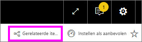
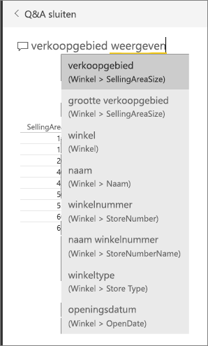
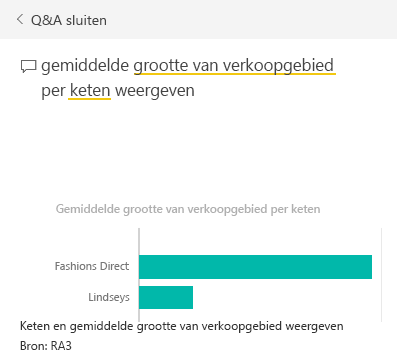
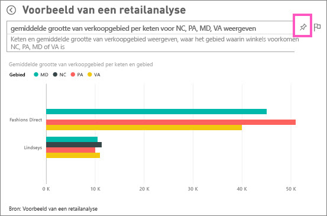
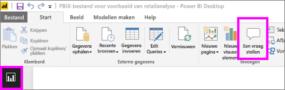
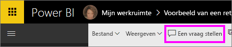
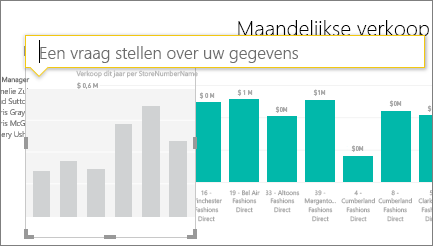
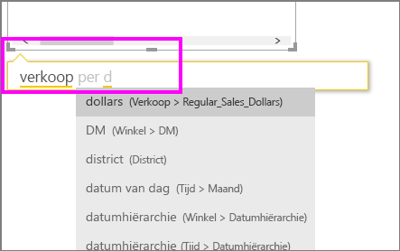
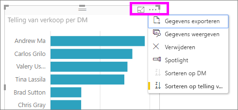

# Zelfstudie: Q&A gebruiken om visualisaties en rapporten te maken
Via het [Q&A-overzicht](consumer/end-user-q-and-a.md) hebt u kennisgemaakt met de Q&A-functie in Power BI en het onderscheid dat is gemaakt tussen *gebruikers* (dashboards en rapporten die worden gedeeld met hen) en *auteurs* (eigenaar van de onderliggende rapporten en gegevenssets). Het eerste deel van deze zelfstudie is voornamelijk bedoeld voor personen die gebruik maken van dashboards met Power BI-service. En het tweede gedeelte is bedoeld voor mensen die met Power BI-service of Power BI Desktop rapporten maken. [Q&A en Power BI-mobiel](consumer/mobile/mobile-apps-ios-qna.md) en [Q&A met Power BI Embedded](developer/qanda.md) worden behandeld in afzonderlijke artikelen.

Q&A is interactief en zelfs leuk, en u zult zien dat één vraag heel vaak zal leiden tot vele andere vragen, aangezien de visualisaties interessante dingen opleveren om te volgen. Kijk hoe Amanda demonstreert hoe ze met Q&A visualisaties maakt, dieper op deze visuals ingaat en deze aan dashboards vastmaakt.

<iframe width="560" height="315" src="https://www.youtube.com/embed/qMf7OLJfCz8?list=PL1N57mwBHtN0JFoKSR0n-tBkUJHeMP2cP" frameborder="0" allowfullscreen></iframe>

## Deel 1: Q&A gebruiken op een dashboard in Power BI-service (app.powerbi.com)
Een dashboard bevat tegels die zijn vastgemaakt vanuit een of meer gegevenssets, zodat u over gegevens in elk van deze gegevenssets vragen kunt stellen. Selecteer **Gerelateerde items weergeven** op de menubalk om te zien welke rapporten en gegevenssets zijn gebruikt voor het maken van het dashboard.

Het vak met Q&A-vragen bevindt zich in de linkerbovenhoek van het dashboard. Hier typt u uw vraag in natuurlijke taal in. Q&A herkent de woorden die u typt, en zoekt uit waar (in welke gegevensset) het antwoord kan worden gevonden. Ook helpt Q&A u uw vraag te formuleren door middel van automatisch aanvullen, anders formuleren en andere tekstuele en visuele hulpmiddelen.

Het antwoord op uw vraag wordt weergegeven als een interactieve visualisatie en wordt bijgewerkt als u de vraag wijzigt.

1. Open een dashboard en plaats de cursor in het vragenvak. Voordat u begint te typen, worden in een nieuw scherm suggesties weergegeven om u te helpen uw vraag te formuleren. U krijgt de namen van de tabellen in de [onderliggende gegevensset(s)](service-get-data.md) en mogelijk zelfs volledige vragen te zien als de eigenaar van de gegevensset [aanbevolen vragen](service-q-and-a-create-featured-questions.md) heeft gemaakt,

   

   U kunt altijd een van deze vragen als beginpunt kiezen en de vraag verder verfijnen voor het specifieke antwoord dat u zoekt. U kunt ook een tabelnaam gebruiken om een nieuwe vraag te formuleren.

2. Kies uit de opties voor gegevenssets of begin met uw eigen vraag in te typen en kies suggesties uit de vervolgkeuzelijst.

   

3. Als u een vraag typt, kiest de Q&A-functie de beste [visualisatie](visuals/power-bi-visualization-types-for-reports-and-q-and-a.md) om uw antwoord weer te geven. De visualisatie wordt dynamisch gewijzigd als u de vraag wijzigt.

   

4. Wanneer u een vraag typt, zoekt Power BI het beste antwoord op via gegevenssets die een tegel op dat dashboard hebben.  Als alle tegels van *gegevenssetA* zijn, is het antwoord afkomstig van *gegevenssetA*.  Als er tegels van *gegevenssetA* en *gegevenssetB* zijn, wordt het beste antwoord in deze twee gegevenssets gezocht.

   > [!TIP]
   > Wanneer u dus slechts een tegel van *gegevenssetA* hebt en u deze van uw dashboard verwijdert, heeft Q&A niet langer toegang tot *gegevenssetA*.
   >
   >
5. Wanneer u tevreden bent met het resultaat, [maakt u de visualisatie aan een dashboard vast](service-dashboard-pin-tile-from-q-and-a.md) door het speldpictogram in de rechterbovenhoek te selecteren. Als het dashboard met u is gedeeld of deel uitmaakt van een app, kunt u de visualisatie niet vastmaken.

   

##    Deel 2: Q&A gebruiken in een rapport in Power BI-service of Power BI Desktop

Verken met Q&A om uw gegevensset te verkennen en visualisaties aan het rapport en dashboards toe te voegen. Een rapport is gebaseerd op een enkele gegevensset en kan volledig leeg zijn of pagina's vol met visualisaties bevatten. Maar omdat een rapport leeg is, betekent dit nog niet dat er geen gegevens zijn om te verkennen--de gegevensset is gekoppeld aan het rapport en wacht tot u visualisaties verkent en maakt.  Als u wilt zien welke gegevensset wordt gebruikt om een rapport te maken, opent u het rapport in de leesmodus van Power BI-service en selecteert u **Gerelateerde items weergeven** op de menubalk.

Als u Q&A wilt gebruiken in rapporten, moet u over bewerkingsmachtigingen beschikken voor het rapport en de onderliggende gegevensset. Wij hebben in het onderwerp [Q&A-overzicht](consumer/end-user-q-and-a.md) dit ook wel een *auteur-scenario* genoemd. Als u dus in plaats daarvan een rapport *gebruikt* dat met u is gedeeld, is Q&A niet beschikbaar.

1. Open een rapport in de bewerkingsweergave (Power BI-service) of rapportweergave (Power BI Desktop) en selecteer **Een vraag stellen** in de menubalk.

    **Desktop**    
    

    **Service**    
    

2. Een vak met Q&A-vragen wordt op het rapportcanvas weergegeven. In het onderstaande voorbeeld wordt het vragenvak weergegeven boven op een andere visualisatie. Dit is geen probleem, maar dit is mogelijk beter om [een lege pagina aan het rapport toe te voegen](power-bi-report-add-page.md) voordat u een vraag stelt.

    

3. Plaats de cursor in het vraagvak. Terwijl u typt, geeft Q&A suggesties om u te helpen met het stellen van uw vraag.

   

4. Als u een vraag typt, kiest de Q&A-functie de beste [visualisatie](visuals/power-bi-visualization-types-for-reports-and-q-and-a.md) om uw antwoord weer te geven. De visualisatie wordt dynamisch gewijzigd als u de vraag wijzigt.

   

5. Wanneer u de visualisatie hebt die u wilt, selecteert u ENTER. U slaat de visualisatie met het rapport op door **Bestand > Opslaan** te selecteren.

6. Interactie met de nieuwe visualisatie. Het maakt niet uit hoe u de visualisatie gemaakt -- u hebt de beschikking over dezelfde interactiviteit, opmaak en functies.

   

   Als u de visualisatie in Power BI-service hebt gemaakt, kunt u deze zelfs [vastmaken aan een dashboard](service-dashboard-pin-tile-from-q-and-a.md).

## Laat Q&A weten welke visualisatie moet worden gebruikt.
U kunt met Q&A niet alleen de gegevens voor zichzelf laten spreken, u kunt in Power BI ook aangeven hoe de gegevens moeten worden weergegeven. U hoeft alleen maar 'as a <visualization type>' aan het einde van uw vraag te typen.  Bijvoorbeeld 'show inventory volume by plant as a map' en 'show total inventory as a card'.  Probeer het zelf maar eens.

##  Aandachtspunten en probleemoplossing
- Als u verbinding hebt gemaakt met een gegevensset met behulp van een live-verbinding of de gateway, moet u Q&A [inschakelen voor deze gegevensset](service-q-and-a-direct-query.md).

- U hebt een rapport geopend en ziet de optie Q&A niet. Zorg ervoor, als u de Power BI-service gebruikt, dat het rapport in de bewerkingsweergave is geopend. Als u de bewerkingsweergave niet kunt openen, betekent dit dat u niet over bewerkingsmachtigingen voor het rapport beschikt en niet Q&A kunt gebruiken bij dat specifieke rapport.

## Volgende stappen
Terug naar [Q&A in Power BI](consumer/end-user-q-and-a.md)   
[Zelfstudie: Q&A gebruiken met het Retail Sales-voorbeeld](power-bi-visualization-introduction-to-q-and-a.md)   
[Tips voor het stellen van vragen in Q&A](consumer/end-user-q-and-a-tips.md)   
[Een werkmap voorbereiden voor Q&A](service-prepare-data-for-q-and-a.md)  
[Een on-premises gegevensset voor Q&A voorbereiden](service-q-and-a-direct-query.md)
[Maak een tegel vast aan het dashboard vanuit Q&A](service-dashboard-pin-tile-from-q-and-a.md)
