# Aanbevolen procedures voor het ontwerpen van rapporten en visuele elementen
<!-- Shared newnav Include -->
[!INCLUDE [newnavbydefault](./includes/newnavbydefault.md)]

## Inleiding
In dit technische document worden de aanbevolen procedures voor het ontwerpen van rapporten in Power BI beschreven. Als eerste komen als onderdeel van de planning de beginselen van het ontwerpen van rapporten ter sprake. Deze beginselen kunt u toepassen op de pagina's en afzonderlijke visuele elementen die deel uitmaken van het rapport.  Veel van deze aanbevolen procedures zijn ook van toepassing op het ontwerpen van het dashboard.

We hopen dat u dit document als uitgangspunt kunt gebruiken en het geleerde toepast op uw eigen rapporten en visualisaties. Bovendien hopen we dat u met ons van gedachten wisselt op community.powerbi.com. Het ontwerpen van rapporten en het gebruik van visualisaties in Power BI is momenteel een erg populair onderwerp en het wordt uitgebreid en gedetailleerd besproken door experts, bloggers en websites (een aantal wordt aan het einde van dit document vermeld).   

> [!NOTE]
> De aanbevelingen die in dit technische document worden gedaan, kunt u als richtlijn gebruiken wanneer ze van toepassing zijn. Houd er wel rekening mee dat er voor elk principe dat hieronder wordt beschreven uitzonderingen bestaan.
> 
> 

*We worden overspoeld door informatie, niet omdat er te veel van is, maar omdat we niet weten hoe we het in goede banen moeten leiden.*
-- Stephen Few

## Algemene aspecten en terminologie
In Power BI kan een rapport een of meer pagina's bevatten en alle pagina's bij elkaar worden het rapport genoemd. De basiselementen van het rapport zijn visuele elementen (ook wel visualisaties genoemd), zelfstandige afbeeldingen en tekstvakken. Er zijn talloze opmaakopties voor de afzonderlijke gegevenspunten, de rapportelementen en de rapportpagina zelf.

We beginnen met de planningsfase van het rapport, gaan verder met de basisbeginselen voor het ontwerpen van rapporten, bespreken daarna de beginselen voor visuele ontwerpen en sluiten af met een beschrijving van de aanbevolen procedures voor afzonderlijke typen visuele elementen.

Gedetailleerde richtlijnen en instructies voor het maken en gebruiken van Power BI-rapporten vindt u op **powerbi.com > Informatie**.

## Voordat u uw eerste visualisatie maakt... moet u controleren wat de vereisten zijn
Het maken van een rapport begint al voordat u het eerste visuele element maakt, omdat een goed rapport planning vereist.  Ga na met welke gegevens u gaat werken en noteer de vereisten voor het rapport. Stel uzelf de vraag: "Wat is de bedrijfsbehoefte, hoe worden deze gegevens gebruikt, en door wie?" Een essentiële vraag in dit geval is: "Welke beslissingen wil de gebruiker kunnen nemen op basis van dit rapport?"

Het antwoord op deze vragen vormt de basis van uw ontwerp. Elk rapport vertelt een verhaal. Zorg ervoor dat het verhaal overeenkomt met de bedrijfsbehoefte. Het kan verleidelijk zijn om visuele elementen toe te voegen die indrukwekkende inzichten opleveren, maar als deze inzichten niet overeenkomen met de bedrijfsbehoefte, dient het rapport geen enkel nut. De gebruikers worden mogelijk alleen maar afgeleid door deze visuele elementen. Het gevolg kan ook zijn dat de informatie die nodig is om die beslissing te nemen niet kan worden afgelezen uit deze gegevens. Kan met dit rapport worden gemeten wat men wil weten?

Rapporten kunnen onder andere worden gebruikt voor het controleren, achterhalen, bijhouden, voorspellen, meten, beheren en testen. Als een bedrijf bijvoorbeeld behoefte heeft aan een verkooprapport waarin prestaties worden gemeten, kunt u een rapport maken waarin de huidige verkoopcijfers worden vermeld en vergeleken met voorgaande verkoopcijfers en met die van concurrenten. Daarnaast bevat zo’n rapport een aantal KPI's waarmee waarschuwingen worden geactiveerd.  Misschien kunnen gebruikers inzoomen op de verkoopcijfers om filiaalsluitingen of problemen met de toeleveringsketen te bekijken die mogelijk van invloed zijn op de verkoop.  Misschien kan er ook worden ingezoomd op de omzet per filiaal, regio, product, seizoen enzovoort.

Ga na voor welke gebruikers het rapport bestemd is en maak een rapport dat gebruikmaakt van een vertrouwde terminologie en dat gegevens bevat met een niveau van gedetailleerdheid en complexiteit die overeenkomt met het kennisniveau van de gebruiker. Hebt u verschillende typen gebruikers? Een uniforme benadering is niet altijd geschikt. Ontwerp afzonderlijke rapportpagina's op basis van kennis en zorg ervoor dat elke pagina is voorzien van duidelijk tekst die bij de gebruikers geen vragen oproept. U kunt ook slicers gebruiken, zodat gebruikers de pagina aan hun eigen wensen kunnen aanpassen. Betrek de gebruiker bij de planning en ga er bij het maken van een rapport niet vanuit dat u wel weet wat de gebruiker wil.  Het is goed mogelijk dat u bij het maken van een rapport helemaal opnieuw moet beginnen en handelingen moet herhalen.

Wanneer u de bedrijfsbehoefte, gebruikers en betreffende metrische gegevens eenmaal hebt bepaald, kiest u in de volgende stap de juiste visuele elementen om uw boodschap over te brengen en presenteert u deze visuele elementen zo effectief mogelijk. We hebben dus veel te bespreken en we beginnen met een aantal basisbeginselen voor het ontwerpen van rapporten.

## Beginselen voor het ontwerpen van rapporten
Een rapportpagina heeft maar beperkte ruimte en het is een hele opgave om alle gewenste elementen in die ruimte te passen en de informatie toch begrijpelijk te houden. En u moet het belang van een goed ogend rapport niet onderschatten. Het is belangrijk om de balans te vinden tussen goed ogend en nuttig.

Laten we de opmaak, duidelijkheid en vormgeving van het rapport eens bekijken.

### Indeling: het canvas van een rapport
Het canvas van een rapport heeft een beperkte hoeveelheid ruimte.  Als niet alle elementen op één rapportpagina passen, verdeelt u het rapport over meerdere pagina's.  Een rapportpagina kan worden afgestemd op een specifieke doelgroep (bijvoorbeeld HR, IT, Verkoop, SLT) of op een specifieke zakelijke vraag (bijvoorbeeld: Wat is de invloed van storingen op onze uitvaltijd? Wat is de invloed van onze marketingcampagne op het klantsentiment?) of als een voortschrijdend verhaal (de eerste pagina geeft bijvoorbeeld een overzicht of trekt de aandacht van de gebruiker, op de tweede pagina worden de gegevens verder uiteengezet, op de derde pagina wordt gedetailleerder op de kwestie ingegaan, enzovoort).  Als uw gehele rapport op één pagina past, is dat natuurlijk mooi meegenomen. Als dat niet het geval is, maakt u afzonderlijke rapportpagina's waarop de inhoud logisch wordt verdeeld.  Geef de pagina's een betekenisvolle en nuttige naam.

U kunt het maken van een rapport vergelijken met het inrichten van een kunstgalerie. U zou ook geen 50 kunstwerken in een kleine zaal plaatsen, deze met stoelen vullen en elke muur in een andere kleur verven. Als curator zou u alleen kunstwerken kiezen die een gemeenschappelijk thema hebben, deze over de zaal verspreiden met veel open ruimte voor de bezoekers zodat deze kunnen rondlopen en reflecteren, en een informatief bordje plaatsen waarop uitleg over het kunstwerk wordt gegeven. Dat verklaart waarom de meeste galeries met moderne kunst witte muren hebben.
We beginnen dit document met een voorbeeld van een rapport dat veel werk vereist.  Naarmate we de aanbevolen procedures en beginselen voor het ontwerpen van rapporten toepassen, wordt ons rapport beter.

**Afbeelding 1: er moet heel wat verbeterd worden aan deze rommelige rapportpagina**

Het bovenstaande voorbeeld bevat veel ontwerpproblemen die betrekking hebben op de ruimte (opmaak) die we hieronder zullen bespreken:

* uitlijning, volgorde en nabijheid
* slecht gebruik van ruimte en sortering
* onoverzichtelijkheid

### Uitlijning, volgorde en nabijheid
De opmaak van de rapportelementen helpen de gebruiker om het rapport goed te begrijpen en loodsen deze door de rapportpagina. Met het plaatsen en positioneren van de elementen brengt u een boodschap over.  Deze boodschap kan zijn: ‘Begin hier en kijk vervolgens hier’ of ‘Deze drie elementen zijn aan elkaar gerelateerd’.

* In de meeste culturen nemen mensen een tekst van links naar rechts en van boven naar beneden door. Plaats het belangrijkste element geheel linksboven in uw rapport. Orden de rest van de visuele elementen zo dat de gebruiker op logisch wijze door het rapport navigeert en de informatie goed begrijpt.
* Positioneer elementen waarbij de gebruiker een keuze moet maken, slicers bijvoorbeeld aan de linkerkant van de visualisaties waarop de keuze betrekking heeft.
* Plaats gerelateerde elementen dicht bij elkaar. Wanneer elementen bij elkaar zijn geplaatst, begrijpt de gebruiker dat deze bij elkaar horen.
* Een andere manier om aan te geven dat elementen zijn gerelateerd, is door rondom deze elementen een rand of gekleurde achtergrond te plaatsen. U kunt daarentegen een scheidingslijn aanbrengen om onderscheid te maken tussen de verschillende secties van een rapport.
* Gebruik open ruimte om secties als afzonderlijke onderdelen op de rapportpagina weer te geven.
* Vul de rapportpagina. Als u vindt dat er te veel ruimte overblijft, maakt u de visualisaties groter of het canvas kleiner.
* Bepaal het formaat van de rapportelementen op basis van het doel dat u wilt bereiken. Laat het formaat van een visualisatie niet afhangen van de beschikbare ruimte.
* Maak belangrijke elementen groter dan de andere elementen of voeg een visueel element, zoals een pijl, toe om hierop de aandacht te vestigen.
* Lijn de elementen op de rapportpagina symmetrisch of opzettelijk asymmetrisch uit.

Laten we de uitlijning eens nader bekijken.

#### Uitlijning
Uitlijning betekent niet dat de verschillende onderdelen dezelfde grootte moeten hebben of dat elke rij van het rapport hetzelfde aantal onderdelen moet hebben. Het houdt in dat de pagina een structuur heeft, waardoor de gebruiker gemakkelijker door de pagina kan navigeren en de informatie hierop overzichtelijker is.

We zien in het bijgewerkte rapport hieronder dat de rapportonderdelen nu zijn uitgelijnd op de linker- en rechterranden en dat elke rapportrij zowel horizontaal als verticaal is uitgelijnd. De slicers worden weergegeven aan de linkerkant van de visuele elementen waarop ze betrekking hebben.

**Afbeelding 2: ons rommelige voorbeeld is duidelijk verbeterd met de opmaakbewerkingen**

Power BI bevat hulpprogramma's waarmee u de visuele elementen kunt uitlijnen. Wanneer u in Power BI Desktop meerdere visuele elementen selecteert, kunt u met de opties van **Uitlijnen en verdelen** op het linttabblad **Visuele elementen** de positie van visuele elementen met elkaar in overeenstemming brengen.

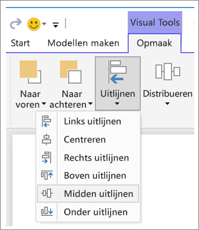

**Afbeelding 3: visuele elementen uitlijnen in Power BI Desktop**

In Power BI Online en Power BI Desktop kunt u het formaat en de positie van visuele elementen nauwkeurig regelen via het tabblad **Algemeen** in het opmaakvenster voor alle visuele elementen:

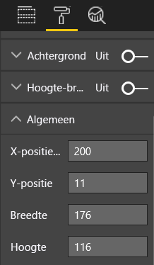

**Afbeelding 4: de exacte positie voor het visuele element instellen**

In ons voorbeeld van de rapportpagina (afbeelding 2) zijn de twee kaarten en de lange rand uitgelijnd op **positie 200 van de x-as**.

#### Aanpassen aan de ruimte
Gebruik de ruimte zo optimaal mogelijk.  Als u weet hoe het rapport wordt bekeken/weergegeven, kunt u het ontwerp daarop afstemmen. Verminder de lege ruimte zodat het canvas wordt opgevuld.  Probeer het gebruik van schuifbalken voor afzonderlijke visuele elementen zo veel mogelijk te vermijden.  Vul de ruimte, maar laat de visuele elementen voldoende vrij.

##### Het formaat van de pagina aanpassen
Door het formaat van de pagina te verkleinen, worden de afzonderlijke elementen groter ten opzichte van de gehele pagina. U kunt dit doen door de selectie van visuele elementen op de pagina uit te schakelen en het tabblad **Paginaformaat** in het opmaakvenster te gebruiken.  

Hieronder wordt een rapportpagina weergegeven met het paginaformaat 4:3 en vervolgens met het paginaformaat 16:9. U ziet dat de opmaak veel beter tot zijn recht komt bij het paginaformaat 16:9. Er is zelfs zo veel ruimte dat de schuifbalk van het tweede visuele element kan worden verwijderd.

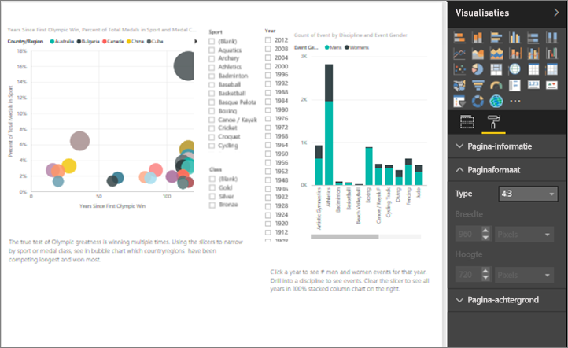

**Afbeelding 5a: het rapport met het paginaformaat 4:3**

**Afbeelding 5b: het rapport met het paginaformaat 16:9**

Wordt uw rapport weergegeven in de verhouding 4:3, 16:9 of met een andere hoogte-breedteverhouding? Op kleine of grote schermen? Of in alle mogelijke beeldverhoudingen en -formaten?  Houd hier bij het ontwerpen rekening mee.

Ons voorbeeld van een rapportpagina ziet er nogal overvol uit. Zorg ervoor dat er geen visueel element is geselecteerd en open het opmaakvenster door het pictogram met de verfroller te selecteren. Vouw **Paginaformaat** uit en wijzig **Hoogte** in 900.

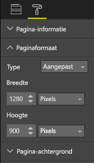

**Afbeelding 6: de paginahoogte vergroten**

#### Een pagina overzichtelijker maken
Het is moeilijk om in een oogopslag inzicht te krijgen in een rommelige rapportpagina en dit kan de gebruikers afschrikken.  Verwijder alle overbodige rapportelementen. Voeg geen 'toeters en bellen' toe als de duidelijkheid of navigatie daar niet bij gebaat is. De informatie op uw rapportpagina moet duidelijk, snel en samenhangend overkomen.

Edward Tufte noemt het 'data to ink ratio' (verhouding van de kerninformatie tot het afgedrukte geheel) in zijn boek *The Visual Display of Quantitative Information*.  Het komt er in feite op neer dat u alle onbelangrijke informatie verwijdert.

Doordat u overbodige elementen verwijdert, wordt er meer ruimte vrijgemaakt op de rapportpagina en beschikt u over meer ruimte om de aanbevolen procedures toe te passen die hierboven in het gedeelte 'Uitlijning, volgorde en nabijheid' zijn besproken.

Ons voorbeeld ziet er hier al een stuk beter uit. We hebben veel overbodige elementen verwijderd en vormen toegevoegd om elementen te groeperen.  De achtergrondafbeelding is verwijderd, de overbodige pijl en het tekstvak zijn weggelaten, één visueel element is verplaatst naar een andere pagina in het rapport, enzovoort. We hebben ook de pagina langer gemaakt zodat er meer ruimte tussen de rapportelementen ontstaat.

**Afbeelding 7: ons voorbeeld van een rommelig rapport is overzichtelijk gemaakt**

### Een boodschap in een oogwenk overbrengen
Een rapport is goed ontworpen als een gebruiker zonder voorkennis en zonder uitleg van een ander snel begrijpt welke boodschap met het rapport wordt overgebracht. Gebruikers moeten in een oogopslag kunnen zien waar de pagina over gaat en wat er met de grafieken/tabellen wordt uitgedrukt.   

Wanneer gebruikers uw rapport bekijken, moet hun aandacht worden getrokken door het element waar ze volgens u moeten beginnen. Vervolgens zullen ze dan het rapport van links naar en rechts en van boven naar beneden doornemen.  U kunt deze standaardnavigatie door een rapport aanpassen door visuele aanwijzingen, zoals tekstvaklabels, vormen, randen en kleur toe te voegen of de grootte te wijzigen.  

#### Tekstvakken
Soms zijn titels bij visualisaties alleen niet voldoende om de boodschap over te brengen.  Voeg tekstvakken toe om informatie te verstrekken aan de gebruikers die uw rapporten bekijken.  In tekstvakken kan een beschrijving worden gegeven van de rapportpagina, een groep visuele elementen of een afzonderlijk visueel element. Met tekstvakken kunnen resultaten worden uitgelegd of een visueel element, onderdelen in het visuele element of relaties tussen visuele elementen nader worden gedefinieerd. U kunt met tekstvakken de aandacht trekken op basis van verschillende criteria die in het tekstvak worden gebruikt.

Selecteer in de Power BI-service op de bovenste menubalk de optie **Tekstvak**. (Selecteer in Power BI Desktop de optie **Tekstvak** in het gebied **Invoegen** van het lint.)

**Afbeelding 8: een tekstvak toevoegen**

Typ de betreffende tekst in het lege vak en gebruik vervolgens de onderstaande besturingselementen om het lettertype, de grootte en de uitlijning in te stellen. Gebruik de grepen om het formaat van het vak aan te passen.

**Afbeelding 9: het tekstvak opmaken**

Overdrijf het echter niet! Te veel tekst in een rapport leidt de aandacht af, wat ten koste gaat van de visuele elementen. Als u van mening bent dat er heel veel tekst nodig is om de rapportpagina begrijpbaar te maken, moet u opnieuw beginnen met het ontwerp.  Kunt u een ander visueel element gebruiken dat meer voor zichzelf spreekt? Kunt u de systeemeigen titels van het visuele element aanpassen zodat het begrijpelijker is?   

#### Tekst
Maak een stijlgids voor de tekst en pas deze toe op alle pagina's van uw rapport. Kies slechts enkele lettertypen, tekstgrootten en kleuren.  Pas deze stijlgids niet alleen toe op tekstelementen, maar ook op de lettertypen die u hebt gekozen voor de visualisaties (zie hieronder het gedeelte 'Titels en labels die deel uitmaken van de visualisaties'). Stel regels in voor het gebruik van onder andere een vet, cursief of groter lettertype of bepaalde kleuren.  Vermijd het gebruik van woorden met uitsluitend hoofdletters of onderstreepte woorden.

#### Vormen
Vormen kunnen ook bijdragen aan een duidelijker ontwerp en een betere navigatie. Gebruik vormen om gerelateerde gegevens te groeperen en belangrijke gegevens te markeren. Gebruik pijlen om de gebruiker in een bepaalde richting te leiden. Dankzij vormen weten gebruikers waar ze in het rapport moeten beginnen en hoe ze het moeten interpreteren. Dit wordt in het ontwerpen vaak aangeduid als *contrast*.

**Afbeelding 10a: vormen in de Power BI-service**

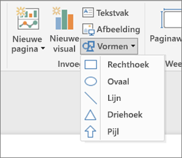

**Afbeelding 10b: vormen in Power BI Desktop**

Hoe ziet onze voorbeeldpagina er nu uit?  In afbeelding 11 ziet u een overzichtelijker, minder rommelige pagina met een consistent gebruik van lettertypen en kleuren.  De paginatitel in de linkerbovenhoek duidt het onderwerp van de pagina aan.

**Afbeelding 11: het rapportvoorbeeld waarop de tekstrichtlijnen zijn toegepast en waaraan een titel is toegevoegd**

In ons voorbeeld is er een titel voor de rapportpagina toegevoegd in de linkerbovenhoek. Dat is de eerste plek in een rapport waar gebruikers naar kijken. De tekengrootte is 28 en het lettertype is Segoe Bold zodat de titel opvalt en zich onderscheidt van de rest van de pagina.  Onze tekststijlgids schrijft voor dat er geen achtergronden, zwarte titels, legenda's en labels worden gebruikt en dat is, indien mogelijk, op alle visuele elementen op de pagina toegepast (de assen van de combinatiegrafiek en de labels kunnen niet worden bewerkt).  En verder:

* Kaarten: **Categorielabel** uitgeschakeld, **Titel** ingeschakeld en ingesteld op 12pt, zwart en gecentreerd.
* Titels voor visuele elementen: als deze zijn ingeschakeld, stelt u deze in op 12pt en links uitgelijnd.
* Slicers: **Koptekst** is uitgeschakeld, **Titel** is ingeschakeld. Houd **Items** > **Tekst** op grijs en 10 pt.
* Spreidings- en kolomdiagrammen: zwart lettertype voor de x- en y-as en de titels voor beide assen, indien aanwezig.

#### Kleur
Gebruik kleur voor de consistentie.  Kleur wordt hieronder nader besproken in het gedeelte 'De beginselen van het ontwerpen van een visueel element'. Hier willen we er alleen op wijzen dat u een bewuste keuze voor een kleur moet maken, zodat deze de gebruikers er niet van weerhoudt om snel inzicht te krijgen in het rapport.  Wanneer u te veel heldere kleuren gebruikt, trekt dit te veel de aandacht. In dit gedeelte wordt meer beschreven wat u niet moet doen met een kleur.

#### Achtergrond
Gebruik bij het instellen van een achtergrond voor de rapportpagina's kleuren die het rapport niet overschaduwen, niet vloeken met andere kleuren op de pagina of in het algemeen geen pijn doen aan de ogen. Houd er rekening mee dat sommige kleuren een inherente betekenis hebben.  In de VS wordt bijvoorbeeld rood in een rapport doorgaans als negatief geïnterpreteerd.

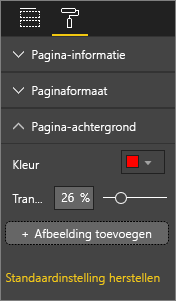

**Afbeelding 12: de achtergrond van een rapport instellen**

U maakt geen kunstwerk, maar een functioneel rapport. Kies een kleur waardoor het rapport beter leesbaar wordt en die de rapportelementen goed uit de verf laat komen.  

Uit een studie over het gebruik van kleur en visualisaties in webpagina's is gebleken dat een groter contrast tussen kleuren zorgt voor een sneller begrip (*The effect of text and background colour on visual search of Web pages** en **Determining Users’ Perception of Web Page Visual Complexity and Aesthetic Characteristics*.)

We hebben een aantal aanbevolen procedures voor het gebruik van kleur toegepast op ons voorbeeldrapport (afbeelding 20 en 21) dat hieronder wordt weergegeven. Het meest opmerkelijke is dat we de achtergrondkleur hebben gewijzigd in zwart.  Het geel was te fel en zorgde voor overbelaste ogen.  Ook in het diagram Aantal keer atletennaam op jaar en soort medaille is het gele gedeelte van de balken opgegaan in de gele achtergrond.  Door een zwarte (of witte) achtergrond te gebruiken, wordt het contrast optimaal en komt de focus op de visuele elementen te liggen.

Hier volgen de andere stappen die we hebben uitgevoerd om het voorbeeldrapport te verbeteren:

**Paginatitel**

Toen we de achtergrond zwart hebben gemaakt, verdween de titel omdat in het tekstvak alleen een zwart lettertype kan worden gebruikt.   U kunt dit oplossen door een tekstvaktitel toe te voegen.  Selecteer het tekstvak, verwijder de tekst en selecteer op het tabblad Visualisaties de optie **Titel** en schakel deze in. Klik op de pijl om de opties voor **Titel** uit te vouwen, typ **Olympische Zomerspelen** in het veld **Titeltekst** en selecteer wit voor **Tekstkleur**.

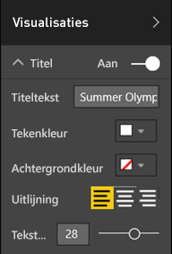

**Afbeelding 13: een paginatitel toevoegen**

**Kaarten**

Voor de visuele elementen in de vorm van een kaart, opent u het opmaakvenster (het pictogram met de verfroller) en schakelt u **Achtergrond** in. Selecteer de kleur wit met een transparantie van 0%. Schakel vervolgens **Titel** in, selecteer de kleur wit als **Tekstkleur** en de kleur zwart als **Achtergrondkleur**.

**Slicers**

Tot nu toe hadden de twee slicers een verschillende opmaak, hetgeen normaal gesproken niet hoort in een goed ontwerp. Wijzig de achtergrondkleur voor beide slicers in de kleur zeeblauw.  Zeeblauw is een goede keuze omdat het deel uitmaakt van het kleurenpalet van de pagina: de kleur wordt gebruikt in de choropletenkaart, de structuurkaart en het kolomdiagram.

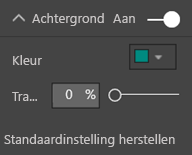

**Afbeelding 14: de achtergrondkleur voor de slicers wijzigen**

Voeg een dunne witte rand toe.

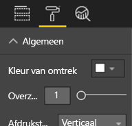

**Afbeelding 15: een rand toevoegen aan de slicer**

Het grijze lettertype is moeilijk te zien tegen een zeeblauwe achtergrond. Wijzig de kleur voor **Items** in wit.

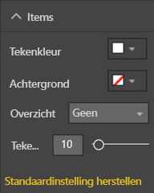

**Afbeelding 16: de tekstkleur voor de slicers wijzigen**

Wijzig ten slotte onder **Titel** de optie **Tekstkleur** in wit en stel **Achtergrondkleur** in op zwart.

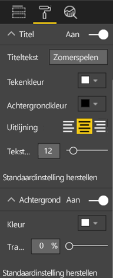

**Afbeelding 17: de slicertitel opmaken**

**Rechthoek**

De rechthoek is ook opgegaan in de zwarte achtergrond.  Als u dit wilt oplossen, selecteert u de vorm en schakelt u in het deelvenster **Vorm opmaken** de optie **Achtergrond** in.

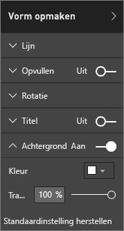

**Afbeelding 18: de vorm opmaken**

**Kolomdiagrammen, bellendiagram, choropletenkaart en structuurkaart**

Voeg een witte achtergrond toe aan de resterende visuele elementen op de rapportpagina. Vouw in het opmaakvenster de optie **Lijn** uit en stel **Lijnkleur** in op wit en **Dikte** in op 3.

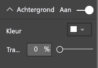

**Afbeelding 19: een witte achtergrond toevoegen aan de resterende visualisaties**

**Afbeelding 20: rapportvoorbeeld waarop de aanbevolen procedures voor het gebruik van kleur zijn toegepast (zwarte achtergrond)**

**Afbeelding 21: rapportvoorbeeld waarop de aanbevolen procedures voor het gebruik van kleur zijn toegepast (witte achtergrond)**
 

### Vormgeving
Een groot aantal aspecten van vormgeving is hierboven al beschreven: de uitlijning, de kleur, de verschillende lettertypen en de overzichtelijkheid.  Maar er zijn nog een aantal aanbevolen procedures voor het ontwerpen van rapporten die we hier moeten bespreken en die betrekking hebben op de algemene vormgeving van het rapport.  

Het doel van een rapport is uiteindelijk om in een bedrijfsbehoefte te voorzien, niet om een mooi plaatje te presenteren.  Een bepaalde mate van aantrekkelijkheid is echter vereist omdat dit van belang is bij een eerste indruk. De consultant Tony Bodoh uit Nashville legt uit: "De emoties zijn de eerste halve seconde bepalend en daarna neemt de logica het over".  Gebruikers reageren in eerste instantie op een emotioneel niveau op de rapportpagina voordat ze die nader bekijken. Als uw pagina er ongeordend, verwarrend en onprofessioneel uitziet, is het mogelijk dat de gebruiker de boodschap van uw rapport niet meekrijgt.

TDI-blogger en analist voor TechTarget Wayne Eckerson maakt een goede vergelijking.  Het ontwerpen van een rapport is vergelijkbaar met het inrichten van een kamer.  In de loop van de tijd koopt u een vaas, bank, bijzettafel en een schilderij.  Afzonderlijk bevallen al deze elementen u. Maar hoewel elke afzonderlijke keuze begrijpelijk is, passen de spullen niet bij elkaar of concurreren ze om aandacht.

U moet het volgende doen:

* Een algemeen thema of gemeenschappelijke opmaak voor het rapport bedenken en deze toepassen op alle pagina's van het rapport
* Aparte afbeeldingen en andere illustraties gebruiken die de boodschap ondersteunen en hier niet de aandacht van afleiden
* En alle aanbevolen procedures toepassen die we tot nu toe hebben besproken.

## Beginselen voor het ontwerpen van visuele elementen
We hebben de beginselen voor het ontwerpen van rapporten besproken en gezien hoe rapportelementen zo kunnen worden geordend dat de gebruiker gemakkelijk en snel inzicht krijgt in het rapport.  Nu zullen we de beginselen voor het ontwerpen van de visuele elementen zelf bespreken.  In het volgende gedeelte gaan we nader in op de afzonderlijke visuele elementen en bespreken we de aanbevolen procedures voor een aantal van de meest gebruikte typen.

In dit gedeelte laten we ons voorbeeldrapport even met rust en gebruiken we andere voorbeelden.  Nadat we de beginselen voor het ontwerpen van visuele elementen hebben doorgenomen, keren we weer terug naar ons voorbeeld van de rapportpagina en passen we het geleerde toe (met stapsgewijze instructies).  

### Planning: kies het juiste visuele element
Net zoals het belangrijk is dat u uw rapport plant voordat u het maakt, moet u dit ook doen voor elk visueel element.  Vraag uzelf af welke boodschap u wilt overbrengen met het visuele element? En bedenk vervolgens met welk visueel element u de boodschap het beste kunt overbrengen. U kunt de voortgang in een verkoopcyclus weergeven in een staafdiagram, maar misschien wordt deze beter overgebracht via een watervalgrafiek of trechterdiagram. Lees als ondersteuning hiervoor het laatste gedeelte van het document 'Typen visuele elementen en aanbevolen procedures' waarin de aanbevolen procedures voor de meest gebruikte typen worden beschreven.  Het is goed mogelijk dat het eerste visuele element dat u kiest uiteindelijk niet de beste optie is.  Probeer meerdere visuele elementen uit om te zien welke het beste werkt.

U moet het verschil kennen tussen categorische en kwantitatieve gegevens en weten welke typen visuele elementen het meest geschikt zijn voor de verschillende typen gegevens. Kwantitatieve gegevens worden vaak aangeduid als metingen en zijn meestal numeriek. Categorische gegevens worden vaak aangeduid als dimensies en kunnen worden geclassificeerd. Dit wordt hieronder nader besproken in 'De juiste meting kiezen'.

Laat u niet verleiden om mooie of ingewikkelde typen visuele elementen te gebruiken met als enig doel het maken van een indrukwekkend rapport. Zoek gewoon de eenvoudigste optie om uw boodschap over te brengen. Met horizontale staafdiagrammen en eenvoudige lijndiagrammen kan informatie snel worden overgebracht.  Gebruikers zijn ermee bekend en de informatie kan gemakkelijk worden afgelezen en geïnterpreteerd.  Een bijkomend voordeel is dat de meeste mensen van links naar rechts en van boven naar beneden lezen. Deze twee diagramtypen kunnen daarom snel worden gescand en begrepen.

Moet er bij het visuele element worden gescrold om de boodschap te begrijpen? Zorg er, indien mogelijk, voor dat er niet hoeft te worden gescrold.  Maak gebruik van filters en hiërarchieën/inzoomen. Als daarmee de schuifbalk niet overbodig wordt gemaakt, kunt u een ander type visueel element kiezen. Als scrollen onontkoombaar is, is horizontaal scrollen gebruiksvriendelijker dan verticaal scrollen.

Zelfs wanneer u het ideale visuele element voor de boodschap kiest, moet dit mogelijk op andere manieren worden ondersteund om de boodschap goed over te brengen.  Daarvoor kunt u labels, titels, menu's, kleur en grootte gebruiken. Deze ontwerpelementen komen verderop in het gedeelte 'Ontwerpelementen' ter sprake.

### Kies de juiste meetgegevens
Is de boodschap die door het visuele element wordt overgebracht boeiend? Is dat belangrijk?  Maak visuele elementen niet alleen om visuele elementen te maken. Misschien had u gehoopt dat u met de gegevens een interessante boodschap kon overbrengen, maar is dat niet het geval. Begin gewoon overnieuw en zoek naar een interessantere boodschap. Het is ook mogelijk dat er niets mankeert aan de boodschap, maar dat deze op een andere manier moet worden gemeten.

Stel bijvoorbeeld dat u het succes van uw verkoopmanagers wilt meten. Welke meetgegevens zou u hiervoor gebruiken?  Kunt u dit het beste meten door te kijken naar de totale verkoop of de totale winst, de groei gedurende het voorgaande jaar of de prestaties ten opzichte van een gestelde target? Verkoopster Sandra boekt misschien de meeste winst, en als u de totale winst per verkoper in een staafdiagram zou weergeven, zou Sandra met kop en schouders uitsteken boven de andere verkopers.  Maar als Sandra hoge verkoopkosten (reiskosten, verzendkosten, productiekosten, enzovoort) heeft, wordt niet de volledige boodschap overgebracht als we alleen naar de verkoopcijfers kijken.

#### De realiteit weerspiegelen/niet de realiteit verdraaien
Het is mogelijk om een visueel element te maken dat geen juist beeld geeft van de werkelijkheid. Er is een website waarop liefhebbers van gegevensanalyses 'slechte' visuele elementen delen. Uit de reacties komt naar voren dat men is teleurgesteld in het bedrijf dat het visuele element heeft gemaakt en gedistribueerd.  Dit wekt de indruk bij het publiek dat het bedrijf niet kan worden vertrouwd.

Maak dus visuele elementen die de realiteit niet opzettelijk verdraaien en niet zodanig zijn bewerkt dat ze de boodschap overbrengen die u graag wilt vertellen.  Hier volgt een voorbeeld:

**Afbeelding 22: een diagram met een verdraaide realiteit**

In dit voorbeeld lijkt het of er een groot verschil is tussen de vier bedrijven en dat CorpB veel succesvoller is dan de andere drie bedrijven.  Zoals u ziet, begint de x-as echter niet bij nul en vallen de verschillen tussen de bedrijven waarschijnlijk binnen de foutmarge.  Hieronder worden dezelfde gegevens weergegeven met een x-as die bij nul begint.

**Afbeelding 23: realistisch diagram**

Gebruikers verwachten vaak dat de x-as bij nul begint en gaan hier dan ook vanuit. Als u de x-as niet bij nul laat beginnen, zorg er dan voor dat de resultaten niet worden verdraaid. U kunt ook een visuele hint of tekstvak toevoegen waarmee u aangeeft dat u afwijkt van de norm.  

### Ontwerpelementen
Wanneer u een type en meting hebt geselecteerd en het visuele element hebt gemaakt, kunt u de weergave afstemmen om een zo optimaal mogelijk resultaat te bereiken.  In deze sectie wordt het volgende besproken:

* Opmaak, ruimte en grootte
* Tekstelementen: labels, aantekeningen, menu's en titels
* Sorteren
* Visuele interactie
* Kleur

#### Visuele elementen aanpassen zodat optimaal gebruik wordt gemaakt van de ruimte
Als u meerdere diagrammen in een rapport wilt opnemen, komt de boodschap van het rapport het beste tot zijn recht als u voor een optimale data-ink ratio zorgt. Zoals hierboven werd vermeld, bedacht Edward Tufte de term data-ink ratio: het doel is om zoveel mogelijk markeringen uit een diagram te verwijderen zonder dat de gebruiker hierdoor wordt belemmerd om de gegevens te interpreteren.

In de eerste reeks grafieken hieronder worden overbodige labels (jan 2014, apr 2014 enzovoort) en titels (op datum) op de as weergegeven. Voor de titels van elke grafiek is ook aparte horizontale ruimte in elke grafiek nodig. Door de grafiektitels te verwijderen en de afzonderlijke aslabels in te schakelen, verwijderen we een aantal gegevens en wordt er beter gebruik gemaakt van de totale ruimte. We kunnen de aslabels voor de eerste twee grafieken verwijderen om de hoeveelheid niet-essentiële informatie nog verder te beperken en meer ruimte te gebruiken voor de kerninformatie.

Als u de aandacht wilt vestigen op bepaalde perioden, kunt u lijnen of rechthoeken achter alle grafieken trekken zodat de gebruiker wordt aangespoord om deze perioden met elkaar te vergelijken.

**Afbeelding 24: vóór**

**Afbeelding 25: na**

**Astitels in- en uitschakelen**

Selecteer het visuele element om het te activeren en open het opmaakvenster. Vouw de opties voor de **x-as** of **y-as** uit en sleep met de schuifregelaar voor **Titel** om deze in of uit te schakelen.

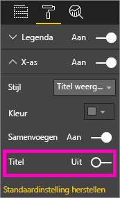

**Afbeelding 26: astitels in- en uitschakelen**

**Aslabels in- en uitschakelen**

Selecteer het visuele element om het te activeren en open het opmaakvenster. Naast de **x-as** en **y-as** worden schuifregelaars weergegeven.  Sleep met de schuifregelaar om de aslabels in- of uit te schakelen.

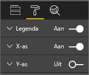

**Afbeelding 27: aslabels in- en uitschakelen**

> [!TIP]
> U kunt bijvoorbeeld de labels voor de y-as uitschakelen als u **Gegevenslabels** hebt ingeschakeld.
> 
> 

**Titels voor visuele elementen verwijderen**

Selecteer het visuele element om het te activeren en open het opmaakvenster. Zet de schuifregelaar voor **Titel** op Uit.

**Afbeelding 28: titels uit visuele elementen verwijderen**

Houd rekening met de wijze waarop gebruikers het rapport bekijken en zorg ervoor dat de visuele elementen en de tekst groot en donker genoeg zijn, zodat ze goed leesbaar zijn. Als de pagina een in verhouding groter visueel element bevat, gaan de gebruikers er mogelijk van uit dat dit het belangrijkste element is. Zorg ervoor dat er voldoende ruimte is tussen de visuele elementen zodat het rapport er niet rommelig uitziet en geen vragen oproept bij de gebruiker.  Lijn de visuele elementen uit zodat de gebruiker gemakkelijker door de pagina navigeert.

**Het formaat van een visueel element aanpassen**

Selecteer het visuele element om het te activeren. Pak een van de grepen en sleep hiermee om de grootte aan te passen.

**Afbeelding 29: het formaat van een visueel element aanpassen**

**Een visueel element verplaatsen**

Selecteer het visuele element om het te activeren. Houd de grijpbalk midden boven in het visuele element ingedrukt en sleep het visuele element naar de nieuwe locatie.

**Afbeelding 30: een visueel element verplaatsen**

#### Titels en labels die deel uitmaken van de visualisaties
Zorg ervoor dat titels en labels leesbaar zijn en voor zichzelf spreken. Tekst in titels en labels moet een optimale grootte hebben en in een kleur zijn die opvalt (zoals zwart in plaats van het standaardgrijs). Herinnert u zich nog onze stijlgids (zie het gedeelte 'Tekst' hierboven)? Beperk het aantal kleuren en formaten. Te veel verschillende tekengrootten en kleuren zorgen voor een drukke en verwarrende pagina.  U kunt bijvoorbeeld dezelfde tekstkleur en tekengrootte voor de titel van alle visuele elementen op een rapportpagina gebruiken en dezelfde uitlijning voor alle titels op een rapportpagina kiezen.  

**Het opmaakvenster**

Als u een van de onderstaande opmaakbewerkingen wilt uitvoeren, selecteert u het pictogram met de verfroller om het opmaakvenster te openen.

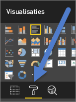

**Afbeelding 31: het opmaakvenster openen**

Selecteer vervolgens het visuele element dat u wilt aanpassen en zorg ervoor dat het is ingesteld op Aan. Voorbeelden van visuele elementen zijn: **X-as**, **Y-as**, **Titel**, **Gegevenslabels**, en **Legenda**. In het voorbeeld hieronder wordt het element **Titel** weergegeven.

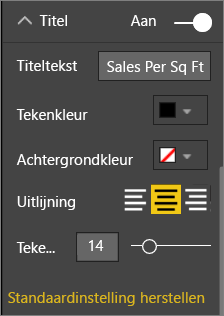

**Afbeelding 32: een titel van een visueel element opmaken**

**De tekengrootte instellen**

De tekengrootte kan worden aangepast voor titels en gegevenslabels, maar niet voor de x- en y-as of legenda's.  Probeer met name voor de gegevenslabels de optie **Weergave-eenheden** en het aantal voor **Aantal decimalen** uit om uw rapport met het optimale detailniveau weer te geven.   

**De tekstuitlijning instellen**

De opties voor de uitlijning van de titel zijn links, rechts en midden.  Kies een van de opties en pas dezelfde instelling toe op alle visuele elementen op de pagina.  

**De tekstpositie instellen**

De tekstpositie kan worden aangepast voor sommige y-assen en de legenda.   Pas uw keuze ook toe op de andere y-assen en eventuele andere legenda's op de pagina.

**De lengte van de titel en het label instellen**

Pas de lengte van de titels, astitels, gegevenslabels en legenda's aan. Als u een van de volgende elementen wilt weergeven, zorgt u er met het aanpassen van de lengte (samen met de tekengrootte) voor dat de tekst niet wordt afgekapt. Voor **Titel** en **Legenda** is de instelling **Titeltekst** en hier typt u de titel die in het visuele element wordt weergegeven. Voor **X-as** en **Y-as** is de instelling **Stijl** en u selecteert een optie uit een vervolgkeuzelijst. Voor **Gegevenslabels** zijn de instellingen **Weergave** en **Decimaal**. Selecteer in de vervolgkeuzelijst voor **Weergave** de eenheid: miljoenen, duizendtallen, geen, automatisch, enzovoort. Geef in het veld **Decimaal** aan hoeveel decimalen moeten worden weergegeven.

**De tekstkleur instellen**

De tekstkleur kan worden aangepast voor titels, assen en gegevenslabels.  

#### Titels en labels die geen deel uitmaken van de visualisaties
Eerder in dit document hebben we besproken hoe tekstvakken worden toegevoegd aan rapportpagina's. Soms zijn titels bij visualisaties alleen niet voldoende om de boodschap over te brengen.  Voeg tekstvakken toe om aanvullende informatie door te geven aan de lezers van uw rapporten.  
Door consistent te zijn in het gebruik van de lettertypen voor tekstvakken, grootten, kleuren en uitlijning, voorkomt u dat de rapportpagina vragen oproept bij de lezer of te druk overkomt. Als u de tekst in een tekstvak wilt aanpassen, selecteert u het tekstvak om het opmaakmenu weer te geven.

**Afbeelding 33: het lettertype dat wordt gebruikt in een tekstvak opmaken**

#### Sorteren
U kunt er eenvoudig voor zorgen dat een gebruiker beter inzicht krijgt in een rapport door de sortering van visuele elementen in te stellen. Wanneer u bijvoorbeeld staafdiagrammen in oplopende of aflopende volgorde sorteert op basis van de waarde die in de staven wordt vermeld, kunt u snel belangrijke aanvullende informatie overbrengen zonder meer ruimte te gebruiken.

Als u een grafiek wilt sorteren, selecteert u de beletseltekens (...) rechtsboven in de grafiek. U selecteert vervolgens **Sorteren** en kiest het veld waarop u wilt sorteren en of oplopend of aflopend moet worden gesorteerd. Zie [De sortering van een visueel element wijzigen](power-bi-report-change-sort.md) voor meer informatie.

#### Interactie en wisselwerking tussen diagrammen
Power BI beschikt over een zeer interessante functie waarmee u de wijze waarop interactie plaatsvindt tussen diagrammen kunt bewerken.  Gerelateerde gegevens in verschillende diagrammen worden standaard belicht: wanneer u een gegevenspunt selecteert, worden de gerelateerde gegevens in andere diagrammen belicht en worden niet-gerelateerde gegevens onbelicht. U kunt deze werking vervangen door een diagram als filter te gebruiken zodat ruimte op de pagina wordt bespaard. Als u dit wilt doen, selecteert u **Interacties tussen visuele elementen** op de menubalk.

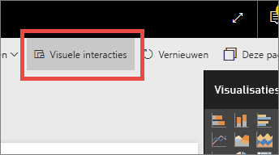

**Afbeelding 34: interacties tussen visuele elementen**

Geef vervolgens aan of er met het geselecteerde visuele element moet worden gefilterd, gerelateerde gegevens moeten worden belicht of niets moet worden gedaan. Niet alle visuele elementen kunnen worden belicht en voor die elementen is dan ook geen besturingselement voor het belichten beschikbaar. Zie [Interacties tussen visuele elementen in Power BI](service-reports-visual-interactions.md) voor meer informatie.

> [!TIP]
> Voor gebruikers die nog geen ervaring hebben met Power BI is deze functie voor klikken en interactie in rapporten misschien niet meteen duidelijk. Voeg tekstvakken toe om aan te geven waarop ze kunnen klikken om verbanden tussen gerelateerde gegevens weer te geven.
> 
> 

#### Het gebruik van kleuren in visuele elementen
Eerder in dit document hebben we besproken dat het belangrijk is om kleur met een doelbewust plan in een rapport te gebruiken. In dit gedeelte worden ook eerder beschreven thema's besproken, maar het gaat voornamelijk over het gebruik van kleuren in afzonderlijke visuele elementen. En dezelfde beginselen zijn van toepassing: gebruik kleur om de verschillende onderdelen van het rapport met elkaar te verbinden, belangrijke informatie te benadrukken en de gebruiker een beter inzicht te geven in het visuele element. Te veel verschillende kleuren leidt af en zorgt ervoor dat de lezers niet goed weten waar ze moeten kijken. De duidelijkheid van het rapport moet niet ten koste gaan van een mooie vormgeving. Voeg alleen kleur toe als dit zorgt voor meer duidelijkheid.

> [!TIP]
> Houd rekening met de gebruikers van het rapport en hoe zij kleuren interpreteren.  In de Verenigde Staten bijvoorbeeld heeft de kleur groen een positieve betekenis en de kleur rood een negatieve betekenis.
> 
> 

In dit onderwerp worden de volgende thema's besproken:

1. Kleur van de gegevens
2. Kleur van de gegevenslabels
3. Kleur voor de categorische waarden
4. Kleur voor de numerieke waarden

**Kleuren gebruiken om interessante gegevens te belichten**

De eenvoudigste manier om kleur te gebruiken, is door de kleur van een of meer gegevenspunten te wijzigen om hierop de aandacht te vestigen. In dit voorbeeld verandert de kleur op het moment dat de Olympische Spelen zijn overgegaan van een vierjarige cyclus in een tweejarige cyclus waarbij de Olympische Zomerspelen en Winterspelen elkaar afwisselen.

**Afbeelding 35: gebruik kleur om een boodschap over te brengen**

U kunt de kleuren van gegevenspunten wijzigen op het tabblad **Gegevenskleuren** in het opmaakvenster. Als u elk gegevenspunt afzonderlijk wilt aanpassen, moet **Alles weergeven** zijn ingesteld op Aan.

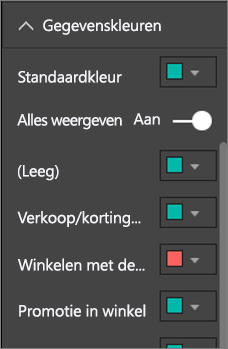

**Afbeelding 36: de kleuren van gegevenspunten instellen**

> [!NOTE]
> Er wordt door Power BI een standaardthema toegepast op de visuele elementen van uw rapport.  De themakleuren zijn geselecteerd op gevarieerdheid en contrastwerking. Als u andere kleuren wilt gebruiken dan de kleuren van het standaardthema, selecteert u **Aangepaste kleur**.
> 
> 

**Afbeelding 37: een aangepaste kleur kiezen**

In Power BI Desktop kunt u zelfs uitbijters of een gedeelte van een lijn belichten met behulp van een tweede reeks:

**Afbeelding 38: uitbijters grafisch weergeven met Power BI Desktop**

Waarden in de reeks 'Uitbijters' komen hier alleen voor waar de gemiddelde temperatuur van augustus lager is dan 60 (Fahrenheit). Dit is gedaan door een met DAX berekende kolom te maken aan de hand van de volgende formule:

Uitbijters = if(Editions[Temp]<60, Editions[Temp], BLANK())

In ons voorbeeld zijn er drie uitbijters: 1952, 1956 en 2000.

**Kleuren voor labels en titels**

Als u alle beschikbare opmaakopties bekijkt, komt u tot de ontdekking dat u op veel verschillende plaatsen kleur kunt toevoegen aan titels en legenda's. U kunt bijvoorbeeld de kleur van gegevenslabels en astitels wijzigen. Ga zorgvuldig te werk.  Over het algemeen is het verstandig om één kleur te gebruiken voor alle titels van visuele elementen.  Net als bij alle richtlijnen in dit document zijn er altijd situaties en redenen die een uitzondering rechtvaardigen. Als u echter besluit om een uitzondering te maken, doe dit dan vanwege een goede reden.

**Kleuren voor de categorische waarden**

Diagrammen met een gegevensreeks hebben doorgaans een categorische waarde in de legenda. Met elke kleur in de onderstaande legenda wordt bijvoorbeeld een andere categorie voor Land/Regio aangegeven.

**Afbeelding 39: de standaardkleuren zijn toegepast**

De kleuren die standaard in Power BI worden gebruikt, zijn gekozen omdat ze duidelijk van elkaar verschillen en de categorische waarden zo goed van elkaar te onderscheiden zijn. Soms vervangen gebruikers deze kleuren bijvoorbeeld door de bedrijfskleuren, maar dit kan tot problemen leiden.

**Afbeelding 40: de kleuren zijn toegepast als kleurschakeringen van één kleur**

Door slechts één kleurschakering te gebruiken en de intensiteit van de kleur te variëren, geeft dit visuele element een foutief beeld van de ordening tussen de categorieën. Het geeft de indruk dat de donkere bellen hoger of lager op een bepaalde schaal zijn geplaatst dan de lichtere kleurschakeringen. Afgezien van de alfabetische volgorde is er normaal gesproken geen inherente volgorde bij dit soort categorische waarden.
Als u de standaardkleuren wilt wijzigen, opent u het opmaakvenster en selecteert u **Gegevenskleuren**.

**Kleuren voor numerieke waarden**

Voor velden die een bepaalde inherente volgorde en een numerieke waarde hebben, kunt u gegevenspunten ook een kleur geven naargelang de waarde. Dit kan handig zijn om de verspreiding van waarden over de gegevens weer te geven en biedt ook de mogelijkheid om twee variabelen in één diagram weer te geven. Uit dit diagram blijkt bijvoorbeeld dat hoewel China de meeste medailles heeft behaald, Japan en Thailand aan de meeste Olympische Spelen hebben deelgenomen.

**Afbeelding 41: gegevenspunten een kleur geven op basis van de waarde**

Als u dit diagram wilt maken, geeft u een waarde op voor het veld Kleurintensiteit en past u die kleuren aan in het opmaakvenster.

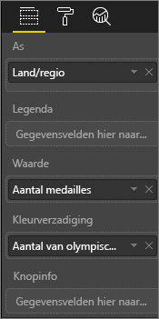

**Afbeelding 42: het veld Kleurintensiteit toevoegen**

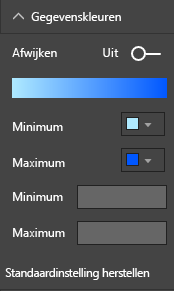

**Afbeelding 43: de kleuren die worden gebruikt voor de kleurintensiteit aanpassen**

Kleur kan ook worden gebruikt om verschillen ten opzichte van een centrale waarde te benadrukken. Positieve waarden worden dan bijvoorbeeld in het groen en negatieve waarden in het rood weergegeven. Houd rekening met culturele verschillen wanneer u kleuren toewijst aan positieve of negatieve waarden. Niet in alle culturen staat rood voor negatief en groen voor positief.

**Afbeelding 44: met kleur verschillen ten opzichte van een centrale waarde benadrukken**
 

### Beginselen voor het ontwerpen van visuele elementen, toegepast op een voorbeeld van een rapportpagina
Laten we nu eens de hierboven besproken beginselen voor het ontwerpen van visuele elementen toepassen op ons voorbeeldrapport.

Vóór

**Afbeelding 45: ons voorbeeldrapport (vóór)**

Na

**Afbeelding 46: ons voorbeeldrapport (na)**

#### Wat hebben we gedaan?
1. Slicer: de lege waarden zijn uit de slicers verwijderd door een filter op paginaniveau toe te voegen en alleen Goud, Zilver en Brons te selecteren. De instelling voor **Selectiebesturingselementen** is gewijzigd in Uit voor **Eén selecteren** en **Alles selecteren**.
2. Bellen: er zijn zo veel items in de legenda dat ze buiten het scherm vallen.  De legenda is verwijderd en **Categorielabels** is in plaats daarvan ingeschakeld. Gebruikers kunnen met de muisaanwijzer over de bellen bewegen om de details te bekijken. De titel is ingekort en 'op land/regio' is verwijderd omdat dat voor de hand ligt. De aslabels zijn ingeschakeld voor beide assen zodat het diagram gemakkelijker te begrijpen is.
3. Choropletenkaart: de instelling voor **Gegevenskleuren** is gewijzigd zodat de kaart meer opvalt. **Afwijken** is ingeschakeld en **Minimum** is ingesteld op roze en **Maximum** op rood.
4. Structuurkaart: filter verwijderd dat alleen voor de Verenigde Staten was ingesteld. Stel **Gegevenslabels** in op één decimaal. Het visuele element gebruikte het veld Klasse dat niet erg nuttig is omdat de waarde hiervoor bijna altijd 33% zal zijn (goud/zilver/brons).  We hebben een ander interessanter veld geselecteerd, namelijk Geslacht. We hebben Watersport gewijzigd in blauw en Atletiek in grijs uit ontwerpoverwegingen.
5. Bovenste staafdiagram: de titel is ingekort, de gegevenslabels zijn verwijderd en de legendatitel is uitgeschakeld. De woordvolgorde van de titel is gewijzigd zodat deze overeenkomt met het onderstaande diagram.
6. Onderste staafdiagram: gesorteerd op jaar en oplopend zodat het overeenkomt met het bovenstaande diagram. De kleuren zijn gewijzigd zodat deze overeenkomen met de klasse. De titel is gewijzigd. De legenda is uitgeschakeld zodat er meer ruimte is voor de gegevens. Gegevenslabels die niet in het rapport worden weergegeven (omdat het visuele element zo klein is dat de labels niet kunnen worden gelezen) zijn ingeschakeld. De gegevenslabels worden weergegeven wanneer het visuele element in de focusmodus wordt geopend. [Meer informatie over de focusmodus](service-focus-mode.md). Aantal evenementen (afzonderlijk) is toegevoegd aan **Tooltips**. Als u nu met de muisaanwijzer over een gestapelde kolom beweegt, wordt met de tooltips nu ook aangegeven hoeveel sportevenementen er dat jaar zijn gehouden.
7. Interacties tussen visuele elementen: interacties zijn uitgeschakeld voor beide kaarten omdat ik altijd wil dat hierop alle wedstrijden en sporten worden weergegeven.

## Typen visuele elementen en aanbevolen procedures
Power BI beschikt over veel eigen typen visuele elementen.  Als we de aangepaste visuele elementen van Microsoft en de Power BI-community hieraan toevoegen, zijn er in totaal te veel mogelijke visuele elementen om hier te beschrijven. Laten we in ieder geval de meest gebruikte eigen typen visuele elementen van Power BI bekijken.  

### Lijndiagrammen

Met lijndiagrammen kunnen gegevens gedurende een bepaalde periode goed worden weergegeven.  In lijndiagrammen kunnen gebruikers sneller pieken, dalen, cycli en patronen in gegevens waarnemen dan in bijvoorbeeld tabellen.  
In het volgende voorbeeld worden de trends weergegeven in het aantal uitgereikte medailles en het aantal atleten die deze medailles hebben gewonnen.  

**Afbeelding 47: lijndiagrammen**

#### Aanbevolen procedures
* Wanneer gebruikers van rapporten lijndiagrammen bekijken, valt hen als eerste de vorm van de curve op.  Dit houdt in dat uw diagram een x-as moet hebben die betekenis geeft aan de curve, zoals een x-as met een tijdsbestek of de verdeling over verschillende categorieën.  Als u categorische velden met betrekking tot bijvoorbeeld een product of geografie gebruikt voor de x-as, is het lijndiagram niet interessant omdat de curve geen betekenisvolle informatie uitdrukt.
* Als u meerdere diagrammen onder elkaar plaatst zoals hieronder, stelt u de x-assen op elkaar af zodat de gebruiker de gegevensreeksen gemakkelijker met elkaar kan vergelijken. Gebruik filters zodat hetzelfde waardebereik wordt weergegeven.  Als u bijvoorbeeld datumbereiken gebruikt, moet u dezelfde datumbereiken gebruiken.  Bijvoorbeeld 1896 tot 2012 in beide diagrammen.
* Maak optimaal gebruik van de ruimte.  Als de gegevens er zich voor lenen, stelt u het begin- en eindpunt in voor de y-as zodat er aan de bovenkant en onderkant van het diagram geen lege ruimte ontstaat, en de aandacht nog meer wordt gevestigd op de feitelijke gegevenspunten. Als u dit wilt doen, selecteert u het pictogram met de verfroller om het opmaakvenster te openen. Vouw het gebied voor **Y-as** uit en stel het **Begin**- en **Eind**-punt in.
  
  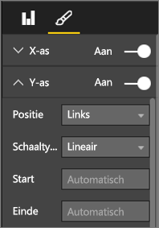
  
  **Afbeelding 48: het begin- en eindpunt instellen**
* Het is ook handig om het begin- en eindpunt handmatig in te stellen als u twee of meer diagrammen wilt vergelijken die op dezelfde pagina worden weergegeven en hetzelfde veld voor de y-as gebruiken.  Als we bijvoorbeeld het samengevoegde aantal voor evenementen bekijken, varieert het aantal voor het Verenigd Koninkrijk van 1 tot 70 en voor Australië van 1 tot 12 en worden voor de twee lijndiagrammen zeer verschillende y-assen weergegeven (afbeelding 49). Dit maakt het moeilijk om de twee diagrammen in één oogopslag te vergelijken. Stel daarom hetzelfde bereik in voor de y-assen van beide diagrammen (afbeelding 50).
  
  
  
  **Afbeelding 49: lijndiagrammen met verschillende y-assen**
  
  
  
  **Afbeelding 50: lijndiagrammen met dezelfde y-as**

Raadpleeg voor meer informatie:

* [De x- en y-as aanpassen](power-bi-visualization-customize-x-axis-and-y-axis.md)
* [Lijndiagrammen en onregelmatige intervallen](http://www.perceptualedge.com/articles/visual_business_intelligence/line_graphs_and_irregular_intervals.pdf)
* [Inleiding tot lijndiagrammen 101](http://www.columnfivemedia.com/data-visualization-101-line-charts)

### Staaf-/kolomdiagrammen

Waar lijndiagrammen standaard worden gebruikt om gegevens gedurende een bepaalde periode weer te geven, worden staafdiagrammen standaard gebruikt om een specifieke waarde in verschillende categorieën weer te geven.  Als u de balken op basis van de waarde sorteert, zijn de hoogste waarden en de verdeling over de verschillende categorieën snel en duidelijk zichtbaar.  Horizontale staafdiagrammen zijn geschikt als de categorieën lange labels hebben.  

**Afbeelding 51: horizontaal staafdiagram**

#### Aanbevolen procedures
* Gegevenslabels weergeven voor waarden.  Daarmee kunnen specifieke waarden gemakkelijker worden waargenomen. Als u dit wilt doen, opent u het opmaakvenster en zet u **Gegevenslabels** op Aan.
  
  
  
  **Afbeelding 52: gegevenslabels inschakelen**
* Het bovenstaande staafdiagram is heel handig om één waarde met vele andere waarden te vergelijken **op een bepaald tijdstip**.  In het bovenstaande lijndiagram wordt de trend gedurende een bepaalde periode weergegeven en in het staafdiagram de trend voor één categorie op een bepaald tijdstip.  In een oogopslag zien we in het staafdiagram dat Spanje met 25% een van de hoogste werkloosheidspercentages ter wereld heeft.
* Wanneer het hele staaf-/kolomdiagram niet in de betreffende ruimte past, worden in Power BI schuifbalken toegevoegd. Ontwerp, indien mogelijk en wanneer van toepassing, het visuele element en het rapport zo dat het hele diagram wordt weergegeven en de gebruiker een overzicht krijgt van de verdeling over alle categorieën.  Dit is in ons voorbeeld helaas niet mogelijk, gezien het grote aantal landen in de wereld.
  
  Een manier om de waarden in het diagram te beperken, is door een filter toe te passen. Voeg bijvoorbeeld een filter op het niveau van het visuele element toe, waarmee alleen de landen met een werkloosheidspercentage van meer dan 20% worden getoond.
* Er kan op staaf-/kolomdiagrammen worden ingezoomd (en weer worden uitgezoomd).  Dit is een goede manier om meer informatie in een visueel element te verpakken zonder dat dit meer ruimte in beslag neemt.  In het volgende voorbeeld ziet u een hiërarchie voor Regio's > Landen.  Als u dubbelklikt op een balk voor een regio, wordt er ingezoomd op de landen die deel uitmaken van deze regio.  Zie [Inzoomen in een visualisatie](power-bi-visualization-drill-down.md) voor meer informatie over inzoomen.
  
  
  
  **Afbeelding 53: inzoomen**

Raadpleeg voor meer informatie over staaf- en kolomdiagrammen:

* [Inleiding tot staafdiagrammen](http://blog.newscred.com/article/data-visualization-101-bar-charts/3c53044d4add7c31e79a3f80128771f4?page=thankyou)
* [Catalogus voor gegevensvisualisatie: staafdiagram](http://www.datavizcatalogue.com/methods/bar_chart.html#.VYV-hY3bLJw)
* [Catalogus voor gegevensvisualisatie: staafdiagram met meerdere verzamelingen](http://www.datavizcatalogue.com/methods/multiset_barchart.html#.VYV_gI3bLJw)

### Gestapelde staaf-/kolomdiagrammen

Voeg een andere dimensie toe aan uw staaf-/kolomdiagrammen door verschillende categorieën in de balk of kolom te stapelen.  Het diagram bevat nu informatie over een algemene trend (gebaseerd op de hoogte/lengte), maar het geeft nu ook de invloed van de categorieën op deze trend weer. In het onderstaande diagram valt te zien dat de algehele omzet van de belangrijkste voetbalteams in 2014 is gegroeid tot boven de zes miljard.

**Afbeelding 54: gestapeld kolomdiagram**

In dit gestapelde kolomdiagram is te zien dat de totale omzet in de loop van de tijd groeit en dat de categorieën Commercieel en Televisiegelden in dezelfde periode ook gestaag groeien, waardoor dus de totale omzet toeneemt.  Maar bij dit diagram is het niet eenvoudig om het effect te vergelijken dat elk van de drie categorieën op elkaar heeft. Hoe verhoudt bijvoorbeeld de groei van de categorie Commercieel zich tot de groei van Televisiegelden of Wedstrijddag?  Voor deze gegevens kan men beter een lijndiagram of een lijndiagram als aanvullend visueel element gebruiken.  

**Afbeelding 55: omzetting in een lijndiagram**

In dit lijndiagram is beter te zien hoe de commerciële omzet het meest is gegroeid, gevolgd door de televisiegelden en de wedstrijddagen.

#### Aanbevolen procedures
* Net als bij kolom-/staafdiagrammen kunt u kiezen uit horizontale of verticale weergave.   U kunt het beste een horizontale weergave kiezen als u lange labels gebruikt en een verticale weergave als u met tijdsbereiken werkt.  
* Gebruik geen gestapelde staaf-/kolomdiagrammen als u trends en andere veranderingspatronen gedurende een bepaalde periode wilt weergeven.  U kunt hiervoor beter andere diagrammen, zoals lijndiagrammen, gebruiken.
* U kunt de verdeling ook baseren op het totale volume of weergeven als een percentage van het totaal.  
* Zoals Few opmerkte *is het moeilijk om de segmenten van een gestapeld staafdiagram te vergelijken. Als de segmenten naast elkaar zouden zijn gerangschikt en alle vanaf dezelfde basislijn omhoog zouden groeien, zouden hun respectievelijke hoogten gemakkelijk kunnen worden vergeleken. Wanneer ze echter op elkaar zijn gestapeld, wordt dit een moeilijke opgave. En hoewel het redelijk eenvoudig is om te zien hoe de (opbrengst) van maand tot maand is gewijzigd, is het erg moeilijk te zien hoe de (opbrengst) in de andere (categorieën) is gewijzigd*.  
* Gestapelde diagrammen met 100%-balken zijn een goede keuze wanneer u percentages gebruikt die samen 100% zijn.  In het onderstaande voorbeeld ziet u de categorieverdeling per team.  Met de percentages wordt een relatieve verdeling weergegeven en kunnen we in een oogopslag patronen herkennen. De omzet van Everton bijvoorbeeld is voornamelijk afkomstig uit Televisiegelden (meer dan 70%), terwijl PSG slechts 20% van de omzet uit Televisiegelden haalt.  Bij een horizontale weergave is het gemakkelijker om de teamlabels in te passen en is het effect van het type omzet beter af te lezen.
  
  
  
  **Afbeelding 56: horizontaal gestapeld diagram**

Raadpleeg voor meer informatie over gestapelde diagrammen:

* [Catalogus voor gegevensvisualisatie: gestapelde staafdiagrammen](http://www.datavizcatalogue.com/methods/stacked_bar_graph.html#top)
* [Wanneer moet u gestapelde staafdiagrammen met 100%-balken gebruiken?](http://www.perceptualedge.com/blog/?p=2239)

### Gecombineerde staaf-/kolomdiagrammen

U kunt in Power BI kolom- en lijndiagrammen combineren tot een combinatiegrafiek. U kunt kiezen uit: een combinatie van een lijndiagram en gestapeld kolomdiagram en een combinatie van een lijndiagram en een gegroepeerd kolomdiagram. Bespaar kostbare ruimte voor uw rapport door twee afzonderlijke visuele elementen te combineren tot één.

De twee schermafbeeldingen hieronder geven de situatie vóór en na de combinatie weer.  Op de eerste pagina staan twee afzonderlijke visuele elementen: een kolomdiagram die de bevolking gedurende een bepaalde periode weergeeft en een lijndiagram waarin het BBP gedurende dezelfde periode wordt weergegeven. Deze diagrammen zijn geschikt voor een combinatiegrafiek omdat ze dezelfde x-as (jaar) en waarden (2002 tot 2012) hebben.  Waarom zou u deze diagrammen niet combineren om deze twee trends in één visueel element te vergelijken?  Als u deze twee diagrammen combineert, kunt u de gegevens beter vergelijken.

Op de nieuwe rapportpagina staat één visueel element: een lijndiagram en een gestapeld kolomdiagram. We hadden net zo goed een lijndiagram en een gegroepeerd kolomdiagram kunnen maken.  Het is nu gemakkelijker om een verband tussen de twee trends te herkennen.   U ziet dat tot en met 2008 de bevolking en het BBP een vergelijkbare trend volgen. Maar vanaf 2009 toen de bevolkingsgroei afvlakte, was het BBP veranderlijk.  

 **Afbeelding 57: als twee afzonderlijke diagrammen**

 **Afbeelding 58: als één combinatiegrafiek**

#### Aanbevolen procedures
U kunt het beste een combinatiegrafiek gebruiken wanneer beide visuele elementen ten minste één as gemeen hebben.

Let op de assen! Is uw combinatiegrafiek gemakkelijk te lezen en te interpreteren?  Of bevat het ongelijke bereiken en waarden? Als de schaal van de y-as voor het kolomdiagram bijvoorbeeld veel kleiner is dan de schaal van de y-as van het lijndiagram, levert de combinatiegrafiek geen zinvolle informatie op.  Kijk bijvoorbeeld naar de derde lijn (lichtblauw) onder in de grafiek.

   

   **Afbeelding 59: een mislukt lijndiagram**

Zo levert de combinatiegrafiek ook geen zinvolle informatie op als het kolomdiagram en het lijndiagram twee verschillende maten gebruiken en u geen twee assen maakt.  Bijvoorbeeld dollars tegenover een percentage. Zorg dat beide assen in de grafiek worden weergegeven zodat de gebruiker deze gemakkelijker begrijpt en voeg eventueel ook aslabels toe.

Als u dit wilt doen, opent u het opmaakvenster, vouwt u **Y-as** uit en zet u **Secundaire weergeven** op Aan (als dit nog niet is gebeurd). Deze instelling is soms moeilijk te vinden; vouw **Y-as (kolom)** uit en scrol omlaag totdat u **Secundaire weergeven** ziet. Zet ook **Titel** voor de y-as (kolom) op Aan en **Titel** voor de y-as (lijn) op Aan.

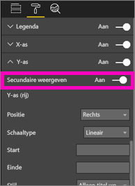

**Afbeelding 60: secundaire as weergeven**

**Afbeelding 61: in plaats daarvan een combinatiegrafiek maken**

* Maak gebruik van de voordelen die twee assen bieden. Het is een goede manier om meerdere maten met verschillende waardebereiken te vergelijken. Daarnaast kan de samenhang tussen twee maten worden getoond in één visueel element.

Raadpleeg voor meer informatie:

* [Zelfstudie: combinatiegrafieken in Power BI](power-bi-visualization-combo-chart.md)
* [Het gevaar van twee assen met verschillende maten in visuele elementen](http://www.perceptualedge.com/articles/visual_business_intelligence/dual-scaled_axes.pdf)

### Spreidingsdiagram

Soms werken we met veel variabelen die we graag in één beeld willen vangen en een spreidingsdiagram geeft zo'n volledig beeld.  Met spreidingsdiagrammen worden verbanden tussen twee (spreiding) of drie (bellen) kwantitatieve maten weergegeven.  Een spreidingsdiagram heeft altijd twee waardeassen, waarbij een reeks numerieke gegevens op een horizontale as en een andere reeks numerieke waarden op de verticale as wordt weergegeven. In het diagram worden punten weergegeven op het snijpunt van een numerieke x- en y-waarde, waarbij deze waarden in één gegevenspunt worden gecombineerd. Deze gegevenspunten kunnen, afhankelijk van de gegevens, gelijkmatig of ongelijkmatig over de horizontale as zijn verdeeld.

Bij een bellendiagram worden de gegevenspunten vervangen door bellen. De grootte van de bellen geven de gegevens een extra dimensie.

In het onderstaande bellendiagram dat betrekking heeft op Zuid-Amerika worden het BBP per inwoner (y-as), de som van het BBP (x-as) en de bevolking per Zuid-Amerikaans land vergeleken.  De grootte van de bellen geeft de totale bevolking van dat land aan. Brazilië heeft de grootste bevolking (belgrootte) en het grootste aandeel aan het BBP van Zuid-Amerika (het staat het verst op de x-as).  Het BBP per inwoner is voor Uruguay, Chili en Argentinië echter hoger dan voor Brazilië (en ze staan dus hoger boven op de y-as).

**Afbeelding 62: het BBP en de bevolking in Zuid-Amerika als een bellendiagram**

Als u een afspeelas toevoegt, kunt u Hans Rosling imiteren en vertellen hoe de ontwikkeling door de jaren heen is (https://www.youtube.com/watch?v=PbaDBJWCeD4). Als u een afspeelas wilt toevoegen, sleept u een Datum/tijd-veld naar de **afspeelas**.

#### Aanbevolen procedures
* Met spreidings- en beldiagrammen kunt u goed een bepaald verhaal vertellen. Ze zijn minder geschikt als het gaat om het verkennen van gegevens.  Dit is wat Stephen Few in de onderstaande alinea benadrukt *Het voordeel van deze benadering is dat je hiermee goed een verhaal kunt vertellen. Wanneer Rosling vertelt wat er gebeurt in het diagram als de bellen rondbewegen en van waarde veranderen en hij wijst op de dingen die hij ons wil laten zien, komen de gegevens tot leven. Animaties van bellendiagrammen zijn echter veel minder effectief als het gaat om het verkennen en begrijpen van gegevens die op zichzelf staan. Ik denk niet dat Rosling deze methode gebruikt om verhalen te ontdekken, maar eerder om deze te vertellen wanneer ze eenmaal bekend zijn. We kunnen niet op meer dan één bel tegelijk letten terwijl ze rondbewegen, zodat we de animatie keer op keer moeten afspelen om een idee te krijgen van wat er precies gebeurt. We kunnen sporen toevoegen aan de geselecteerde bellen, zodat kan worden nagegaan welk pad ze hebben afgelegd. Als er echter sporen worden gebruikt voor meer dan een paar bellen, wordt het diagram snel onoverzichtelijk. Waar ik eigenlijk op wil wijzen, is dat deze methode niet de beste manier is om deze gegevens weer te geven als u ze wilt verkennen en analyseren.*
* Voeg labels toe voor de x- en y-as om het verhaal te vertellen.  Vooral bij bellendiagrammen spelen er veel aspecten mee en vormen labels een goede toelichting op het visuele element.
* Voeg gegevenslabels toe zodat het visuele element gemakkelijker kan worden geïnterpreteerd.  Wanneer de legenda, vooral bij bellendiagrammen, veel items bevat, kan het moeilijk zijn om onderscheid te maken tussen vergelijkbare kleuren.  In het bovenstaande visuele element lijken de kleuren voor Suriname, Colombia en Ecuador erg op elkaar.
* Hebt u een spreidingsdiagram gemaakt en wordt daarin slechts één gegevenspunt weergegeven waarin alle waarden op de x- en y-as worden samengevoegd? Of worden in het diagram alle waarden langs een horizontale of verticale lijn weergegeven?  Als u dit wilt oplossen, voegt u een veld toe aan het gebied **Details** om aan te geven hoe de waarden moeten worden gegroepeerd. Het veld moet uniek zijn voor elk punt dat moet worden weergegeven. Raadpleeg de [zelfstudie voor Power BI- spreidingsdiagrammen en -beldiagrammen](power-bi-visualization-scatter.md) voor meer informatie.

### Structuurkaartdiagrammen

Structuurkaarten zijn met name handig om een goed overzicht te geven van de relatieve grootte van de verschillende onderdelen die deel uitmaken van een groter geheel. Dit geldt vooral wanneer u ze in categorieën kunt indelen.  Telkens wanneer ik inzicht wil krijgen in een nieuw onderwerp, biedt een kaartstructuur met de belangrijkste onderdelen nuttige informatie over de algehele verdeling.

In het eerste diagram hieronder ziet u direct dat Brazilië goed is voor ongeveer de helft van het BBP van Zuid-Amerika en dat Venezuela en Argentinië ongeveer hetzelfde BBP hebben.

Als u over een bredere context wilt beschikken en toch nog wilt weten wat de impact is van de belangrijkste landen, kunt u hiërarchieën van visuele elementen maken waarbij de categorieleden (landen) in regio's zijn genest. De tweede structuurkaart laat ons voornamelijk zien wat de relatieve grootte van de regio's is en welke afzonderlijke landen in elke regio het grootste aandeel leveren. We kunnen constateren dat er drie grote regio's (Europa, Azië en Noord-Amerika) zijn en in die regio's zijn de belangrijke landen goed te herkennen.

De belangrijkste beperking van een structuurkaart is dat de kleinere categorieleden moeilijker zijn te vergelijken.  Met het diagram kan een goed overzicht worden gegeven. Een kolom- en staafdiagram geven echter een nauwkeuriger beeld van de relatieve grootte van de verschillende onderdelen.
  De eerste structuurkaart geeft bijvoorbeeld een algemeen beeld van de omvang van het BBP voor de verschillende landen. Het is echter moeilijk om de specifieke verschillen tussen de landen vast te stellen, met name voor de kleinere blokken zonder label. U kunt voor dit soort gegevens, waarbij de onderdelen van één groep worden vergeleken beter een staaf- of kolomdiagram gebruiken.

**Afbeelding 63: vergelijking van het BBP in Zuid-Amerika weergegeven als een structuurkaart**

In de volgende afbeelding is nog een gegevensniveau toegevoegd, namelijk de regio, en kunnen we zien welk aandeel de regio's hebben in het wereldwijde BBP en wat de verhoudingen zijn binnen de regio's. Houd er rekening mee dat wanneer u dit met maten doet die niet kunnen worden opgeteld (zoals gemiddelden), de som van de gegevens mogelijk niet de werkelijke waarde op het samenvoegingsniveau weergeeft.

**Afbeelding 64: BBP per regio en land weergegeven als een structuurkaart**

Klik op de onderstaande koppelingen voor meer informatie over structuurkaarten.

* [Overzicht van structuurkaarten](http://www.perceptualedge.com/articles/b-eye/treemaps.pdf)
* [Catalogus voor gegevensvisualisatie: structuurkaarten](http://www.datavizcatalogue.com/methods/treemap.html#.VYhylI3bL7Y)

### Andere diagrammen
#### Ring- of cirkeldiagrammen

Over het algemeen kunnen met staaf-, kolom- en lijndiagrammen wel de meeste situaties worden weergegeven. Het is bekend dat gebruikers van rapporten moeite hebben met het interpreteren van ring- en cirkeldiagrammen en dat deze diagrammen vaak de gegevens kunnen verdraaien. Gebruik deze diagrammen zo min mogelijk. Stephen Few heeft een interessant verslag geschreven over de geschiedenis en gevaren in [Save the Pies for Dessert]([www.percetualedge.com/articles/08-21-07.pdf](http://www.perceptualedge.com/articles/08-21-07.pdf)

Hij legt uit dat cirkeldiagrammen wel nuttig zijn om de verhouding van een onderdeel tot het geheel weer te geven. Maar zelfs in dat geval maakt het weinig verschil of u daarvoor bijvoorbeeld een gestapeld staafdiagram met 100%-balken gebruikt.

Een ander grappig artikel (met animatie) over cirkeldiagrammen vindt u op de [Darkhorse Analytics-website](http://www.darkhorseanalytics.com/blog/salvaging-the-pie).

Of lees het artikel [Why Tufte is flat-out wrong about pie charts](http://speakingppt.com/2013/03/18/why-tufte-is-flat-out-wrong-about-pie-charts/) waarin het standpunt van Tufte wordt bestreden.

#### Radiale meters en KPI's

Radiale meters kunnen goed worden gebruikt als visueel element waarin prestaties worden weergegeven ten opzichte van een gesteld doel en worden vaak gebruikt in dashboards voor leidinggevenden. Deze meters schieten echter op twee punten tekort. Net als bij cirkeldiagrammen is het moeilijk om de hoek van het gekleurde gedeelte ten opzichte van de volledige 180 graden boog of de doellijn te interpreteren. De radiale meter neemt ook veel ruimte in beslag om slechts één waarde weer te geven.

Een goed alternatief is een eenvoudig visueel element dat een KPI weergeeft

Met KPI's worden de waarde, de status, het doel, de afwijking van het doel en de trend weergegeven in dezelfde hoeveelheid ruimte. De groene kleur verandert in rood als het doel niet wordt behaald en geel als een tussenliggend doel wordt behaald. Het is veel eenvoudiger af te lezen en te interpreteren dan de meter.

Raadpleeg voor meer informatie:

* [Zelfstudie: diagrammen met een radiale meter in Power BI](power-bi-visualization-radial-gauge-charts.md)
* [Zelfstudie: KPI's in Power BI](power-bi-visualization-kpi.md)

## Conclusie
Het moment is nu aangebroken om zelf deze aanbevolen procedures toe te passen.  Houd contact en deel uw eigen aanbevelingen met ons. Bent u het niet eens met onze aanbevelingen of hebt u een goede reden gevonden om een uitzondering te maken?  We horen het graag van u.  

### Aanbevolen boeken
Er zijn tegenwoordig veel goede boeken beschikbaar waarmee medewerkers kennis kunnen opdoen over de verschillende methoden voor visueel ontwerpen. *Information Dashboard Design* van Stephen Few is een verplicht nummer. In twee andere boeken, *Show Me the Numbers* en *Now You See It* gaat hij uitgebreider op het onderwerp in. Few en anderen hebben zich laten inspireren door Edward R. Tufte. Zijn boek *The Visual Display of Quantitative Information* wordt beschouwd als een klassieker op dit gebied. Tufte heeft ook *Visual Explanations*, *Envisioning Information* en *Beautiful Evidence* geschreven. U kunt ook het nieuwe boek van Andy Kirk *Data Visualization: A Handbook for Data Driven Design* raadplegen. Andere auteurs die worden aanbevolen, zijn: Lachlan James, William McKnight, Boris Evelson (Forrester) en Darkhorse Analytics.

Hebt u nog vragen? [Misschien dat de Power BI-community het antwoord weet](http://community.powerbi.com/)

